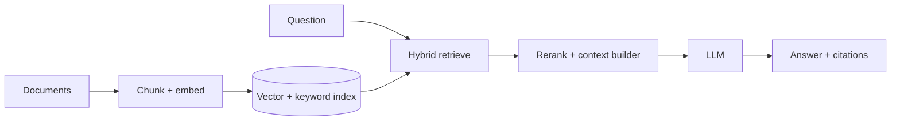

RAG 的出发点很简单：模型 context window 装不下全部知识，所以先找相关证据，再把少量证据交给模型。它不是“加一个 vector database”就结束。

如果只有三页文档，直接放进 prompt 更简单。只有 corpus 超过 context、内容频繁更新或需要引用来源时，retrieval 才值得它的复杂度。

> 对应实验：[打开 RAG System Lab](https://lab.zichaoyang.com/system-design/rag-system/)。改变 chunk size、top-k、context window、freshness 和 rerank 开关。

## 需求边界（Requirements）

功能上 ingest/version 文档、权限检索、生成带引用答案和删除更新。非功能上优先 groundedness、ACL correctness、index freshness 与端到端 latency；检索失败时允许拒答，不允许跨租户泄漏。

## 0. 先搭“全文塞 Prompt”的 MVP Scaffold

如果只有几十页，先把有权限的全文直接放 prompt，要求模型只能依据资料回答并输出引用段落。这个 baseline 验证问题、答案格式和评估集。Corpus 超过 context 后，第二版再加最简单的段落切分、embedding 和 top-k cosine search。

搭建顺序：文档 ingest 与版本；文本抽取；按标题/段落 chunk；生成 embedding；保存 chunk、vector 和 ACL；query embed；top-k；组 prompt；输出 chunk citation。先离线评估 50 到 100 个真实问题，再加 reranker。

## 1. API：回答必须携带证据

```http
POST /v1/rag/answers
{"tenantId":"t-1","question":"退款多久？","conversationId":"c-8","topK":8}

200 OK
{"answer":"...","citations":[{"documentId":"d-7","version":4,"chunkId":"ch-19"}],
 "retrievalVersion":"index-22","modelVersion":"llm-8"}
```

Ingestion API 创建 document version 并异步返回 indexing state。删除和 ACL 变化必须进入 index lifecycle。

## 2. 数据模型（Data Model）

```text
Document(document_id, tenant_id, version, object_url, acl_version, state, updated_at)
Chunk(chunk_id PK, document_id, version, ordinal, text, token_count, metadata)
Embedding(chunk_id, embedding_model_version, vector, index_partition)
IndexManifest(index_version, corpus_snapshot, embedding_version, created_at)
AnswerTrace(request_id, query, retrieved_chunk_ids, scores, citations, model_version)
```

Chunk 与 embedding 都绑定 document version；新版本发布后旧 chunk 要 tombstone，不能同时参与检索。

## 3. 单机端到端流程

Ingest worker 抽取文本、切 chunk、批量 embed、写本地向量索引并原子发布 manifest。Query 先鉴权得到 allowed namespace，embed question，取 top-k，按 token budget 组 context，调用 LLM，验证 citation 只引用提供 chunk。失败可返回检索结果而非编造答案。

## 4. 容量估算：chunk 决定 index 规模

1000 万文档、平均 50 个 chunk，共 5 亿 vector。768 维 FP16 每个约 1.5KB，纯 vector 约 750GB，ANN graph、metadata 和副本后可达数 TB。1000 QPS、每次 top-100 初检会产生大量 distance work，必须分片、近似索引和 cache。

## 5. Latency Budget：retrieval 与 generation 分开

总 p99 3 秒可分 query embed 50ms、hybrid retrieve 100ms、rerank 200ms、prompt assembly 50ms、LLM TTFT 1 秒，其余用于 decode。若 reranker 超时，降级使用初检 top-k；检索失败时不要无证据继续生成。

## 6. Correctness and Reliability

ACL filter 在 retrieval 前或索引内执行，不能事后让 LLM 自律。Index manifest 原子发布，旧版本可回滚。Ingestion task 按 document version 幂等。Answer trace 保存实际证据和版本，支持离线 replay。删除事件传播有 SLA 并定期扫描 index 漂移。

## 7. Trade-offs：召回、上下文和成本

- 小 chunk 精确但缺上下文且数量多；大 chunk 上下文完整却引入噪声。
- top-k 大提高 recall，却挤占 context 并增加 rerank/LLM 成本。
- Hybrid search 提高专名召回，但维护两套 index 和融合分数。
- 强 freshness 需要 streaming index；batch snapshot 更稳定、便于回滚。

## 概念阶梯

- **Chunking**：把文档切成可检索单元。太大引入无关内容，太小丢失上下文并增加 vector 数量。
- **Embedding / ANN**：把 query 和 chunk 映射到向量，用近似最近邻快速找语义相似内容。
- **Hybrid search**：组合 dense vector 与关键词/BM25，弥补专有名词、编号和精确短语上的召回缺口。
- **Reranking**：用更贵的模型对初步 top-k 精排，先宽召回、再窄判断。

## 两条路径



Ingestion 必须保留 document/chunk/version/ACL metadata。Query 时先做租户和权限过滤，再 retrieval；不能先取到无权内容再要求模型“不要泄漏”。

## 质量为什么经常失败

- 没召回正确证据，生成模型再强也无法回答。
- 召回了证据但 chunk 缺上下文，需要 parent section 或邻接 chunk 扩展。
- top-k 太大挤满 context，相关信息反而被噪声淹没。
- 文档更新后旧 chunk 未删除，答案引用过期版本。

评估要分层：retrieval recall、reranker quality、citation correctness、answer groundedness。只看最终回答分数无法定位坏在何处。

## 面试表达

> I would treat RAG as two systems: an ingestion plane that produces versioned, permission-aware indexes, and an online plane that retrieves, reranks, assembles evidence, and generates cited answers.

Deep dive 可以选 chunking、hybrid retrieval、freshness、multi-tenancy 或 evaluation。先证明 retrieval 必要，再选 vector store。
