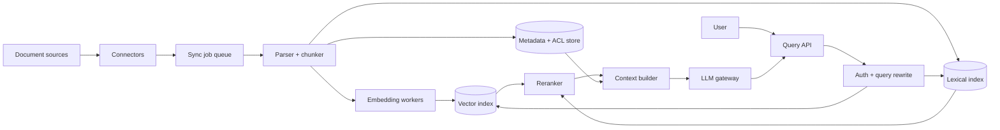

RAG 经常被画成一条很顺的箭头：文档切块、做 embedding、存进向量库；用户提问时找 top-k，塞给 LLM，得到答案。

这张图没有错，却避开了真正困难的部分。向量库返回了 5 段文字，不代表它们包含答案；包含答案，不代表版本是新的；版本是新的，也不代表当前用户有权限看。最后，模型还能用流畅的语言把不完整证据讲得像确定事实。

所以 RAG 的核心不是“给 LLM 加一个数据库”，而是：**怎样在一个明确的时效和权限边界内找到足够好的证据，并让答案忠实、可追溯地依赖这些证据。**

> 配套实验：[打开 RAG System Lab](https://lab.zichaoyang.com/system-design/rag-system/)。先只调 `chunk size` 和 `top-k`，观察检索结果，再打开 rerank；不要把所有优化一次性打开。

## 一个看似正确的错误答案

公司差旅政策原来写着：

```text
酒店每晚报销上限为 200 美元。
```

昨天政策更新为：

```text
纽约、旧金山的酒店每晚报销上限为 300 美元，其他城市仍为 200 美元。
```

用户问：“旧金山出差，酒店能报多少？”系统检索到了旧版本，并回答“200 美元”。这不是 hallucination：模型完全忠实于它拿到的证据，但系统仍然给了错误答案。

这个例子说明 RAG 至少有四层正确性：

1. **检索正确性**：有没有找到真正相关的段落；
2. **版本正确性**：找到的是不是当前有效版本；
3. **权限正确性**：用户有没有资格读取这段证据；
4. **生成忠实度**：答案有没有超出证据能支持的范围。

只评估最后一句话“听起来好不好”，无法定位问题在哪一层。

## 先把几个词讲清楚

**Chunk**

从原文切出来、作为检索单位的一段内容。Chunk 太短会丢上下文，太长会混入无关信息，并挤占模型 context。

**Embedding**

把文本映射成向量，使语义相近的文本在向量空间里更接近。Embedding retrieval 擅长找到“意思相近但用词不同”的内容。

**Lexical retrieval**

根据词项匹配检索，例如 BM25。它对订单号、错误码、人名、精确产品名称更可靠。向量检索和关键词检索解决的不是同一种问题。

**Reranker**

第一阶段快速拿几十个候选，第二阶段用更贵的模型逐对判断“问题和这段证据有多相关”，重新排序后只保留少数内容。

**Grounding**

让答案受检索证据约束，并能指出具体来源。Grounded 不等于绝对正确，但至少能检查答案依据了什么。

## 先定义产品语义

本文设计一个企业知识问答系统：

1. 管理员接入文档源，并观察同步状态；
2. 用户提问，系统返回流式答案和段落级引用；
3. 检索遵守源系统权限和文档版本；
4. 文档更新后，在约定 freshness 内可被查询；
5. 系统能离线评估 retrieval 与 answer quality。

第一版先支持文本型文档和单轮问答。不展开 OCR、复杂表格、多模态、网页操作 Agent 和长期聊天记忆。

关键非功能目标可以这样定：

- query p95 在 2–3 秒内开始返回答案；
- 文档更新后 5 分钟内进入可检索状态；
- 无权限内容绝不能因 embedding 相似而泄露；
- 找不到可靠证据时明确说“不知道”；
- 每个答案可追溯到 document version 和 chunk offsets。

## 第一版不要急着上向量库：先做可验证的关键词检索

为了看清数据链路，第一版可以只接一个文档目录，用 SQLite/Postgres 保存文本，用全文索引做 BM25。

### 第一步：规范化文档

```text
Document(
  document_id,
  source_id,
  source_version,
  title,
  mime_type,
  acl_version,
  content_hash,
  indexed_at
)
```

每次同步先计算 `content_hash`。内容没变就不重复切块；内容变了就生成新 version，而不是原地覆盖旧 chunk 后留下半套索引。

### 第二步：按结构切块

不要机械地每 500 字截断。先保留标题、列表和段落边界：

```text
Chunk(
  chunk_id,
  document_id,
  source_version,
  ordinal,
  heading_path,
  text,
  start_offset,
  end_offset,
  token_count
)
```

`heading_path` 例如 `差旅政策 > 酒店 > 特殊城市`。它既帮助检索，也让引用更可读。

### 第三步：检索并把证据直接展示出来

第一版甚至可以不调用 LLM：用户输入问题，系统返回 top-5 chunk、分数、标题和版本。先人工检查几十个真实问题。如果检索层找不到正确证据，后面加再强的生成模型也只是把错误包装得更漂亮。

### 第四步：让 LLM 只基于证据回答

Prompt 应明确区分 instruction、user question 和 retrieved evidence，并要求引用 chunk ID：

```text
只根据 <evidence> 中的信息回答。
如果证据不足，请明确说无法从当前资料确认。
每个事实后附上支持它的 [chunk_id]。
```

服务端再验证输出中的引用是否真的来自本次授权后的候选集。不要让模型自行编一个看似合理的 URL。

## 查询 API：把答案、证据和版本一起返回

```http
POST /v1/answers
Accept: text/event-stream

{
  "question": "旧金山酒店每晚能报销多少？",
  "collectionIds": ["travel-policy"],
  "conversationId": null
}
```

```text
event: citation
data: {"citationId":"c1","documentId":"policy-9","version":"v17","chunkId":"ch-44"}

event: token
data: {"text":"旧金山的酒店报销上限为 300 美元 [c1]。"}

event: done
data: {"answerId":"a-8","retrievalTraceId":"rt-31"}
```

文档接入是另一条异步 API：

```http
POST /v1/sources
POST /v1/sources/source-3/syncs
GET  /v1/sources/source-3/syncs/sync-91
```

用户查询不应等待一次完整同步。Source sync 产生可观察的 job，记录读取、解析、切块、embedding 和发布分别完成到哪里。

## 增加向量检索：它补关键词，不是替代关键词

当用户问“出差住店标准”，文档写的是“住宿报销上限”，精确词项可能不重合。此时加入 embedding retrieval。

索引记录需要绑定模型版本：

```text
ChunkEmbedding(
  chunk_id,
  source_version,
  embedding_model_version,
  vector,
  created_at
)
```

换 embedding model 不能悄悄覆盖一半数据。新旧向量空间不可直接比较，应构建新 index generation，完成后原子切换读流量。

查询时同时跑两路：

```text
BM25 top 50
        \
         -> merge + dedup -> rerank -> top 5 context
        /
ANN top 50
```

这叫 hybrid retrieval。合并时可以用 reciprocal rank fusion，不必假设两种分数在同一尺度：

$$
RRF(d) = \sum_r \frac{1}{k + rank_r(d)}
$$

这里最重要的不是公式，而是承认：精确词项和语义相似各自有盲区。错误码 `ORA-12154`、订单号和 API 名称通常更依赖 lexical match；自然语言改写更适合 embedding。

## Chunk size 为什么没有一个万能值

考虑这段政策：

```text
酒店上限为 200 美元。
例外：纽约和旧金山为 300 美元。
```

如果切块刚好把“例外”切到另一块，第一块会得到错误但看似完整的答案。把所有内容都做成超长 chunk 又会带来三个问题：

- 一个 chunk 混入多个主题，embedding 变得模糊；
- reranker 和 LLM 要处理更多无关 token；
- top-k 相同的情况下，context 覆盖的独立证据更少。

更稳的策略是先按文档结构切，再设置 token 上限和少量 overlap。表格、代码和 FAQ 需要不同 splitter。Chunk 配置应版本化，并通过 evaluation set 比较，而不是靠“500 tokens 看起来差不多”。

## 高层架构：写路径和读路径要能独立演化



写路径负责 freshness、版本和 index generation；读路径负责低延迟、权限和质量。二者通过“已发布 generation”连接。

最危险的发布方式是逐 chunk 原地更新：查询可能同时拿到新旧版本。更稳的做法是把一个 source version 的所有 artifacts 写入 staging，验证数量与 ACL 后，再把 active generation 指针切过去。

## 权限过滤必须发生在生成之前

有三种常见做法：

1. 查询时先算用户可见 document IDs，再把它们作为 index filter；
2. 按安全域建立独立索引；
3. 先粗召回，再在 rerank 前逐条授权过滤。

第三种如果 top-50 中 49 条都无权访问，过滤后可能没有足够候选；也会让检索基础设施接触不该暴露的 metadata。通常应尽可能把 coarse ACL filter 下推到检索层，最后再做一次 authoritative check。

ACL 更新和内容更新一样需要 freshness SLO。员工被移出项目后，旧 index 不能继续放行五分钟。权限撤销往往比内容新增需要更快的传播路径。

## 容量估算：离线成本看文档，在线成本看候选和 token

假设有 1 亿个 chunk，每个 embedding 为 1,536 维、FP16：

```text
100M × 1,536 × 2 bytes ≈ 307 GB raw vectors
```

还没算 ANN graph、metadata、replica 和索引构建临时空间。这个数量级说明索引要分片，且 embedding model 升级需要额外一整代容量。

若每天 1% 文档变化，相当于每天重算约 100 万 chunk。Embedding worker 是异步吞吐问题，应该按 backlog age 扩缩，不应占用查询 worker。

在线高峰 2,000 queries/s，每次两路各召回 50 个候选，再 rerank 100 对 query-document：

```text
2,000 × 100 = 200,000 rerank pairs/s
```

Reranker 很可能比 ANN 查询更贵。Top-k 不是一个 UI 小旋钮，它直接影响 rerank 成本和最终送给 LLM 的 context tokens。

## 延迟预算：先检索，再生成，任何一段都可能主导

一份示例 p95 预算：

| 阶段 | 预算 |
|---|---:|
| 鉴权与 query normalization | 40 ms |
| Lexical + vector retrieval | 100 ms |
| ACL filter + rerank | 180 ms |
| Context build | 30 ms |
| LLM 首 token | 1,200 ms |
| 网络与余量 | 150 ms |
| **TTFT 合计** | **1,700 ms** |

如果 rerank timeout，可以降级到 hybrid rank；如果 vector index 暂时不可用，可以回退 BM25。但不能为了可用性绕过 ACL，也不能拿旧 index 却不告诉调用方 freshness 已降级。

## 评估：把 Retrieval 和 Generation 分开测

准备一套由真实用户问题演化出来的 evaluation set。每个样本至少包含：

```text
question
relevant_document_versions
relevant_chunk_ranges
acceptable_answer_facts
forbidden_or_unsupported_claims
user_acl_context
```

检索层看：

- Recall@k：正确证据是否出现在前 k 个候选；
- MRR / nDCG：正确证据排得是否足够靠前；
- ACL correctness：无权内容是否始终被排除；
- freshness lag：新版本多久可检索。

生成层看：

- 答案事实是否被引用证据支持；
- 引用是否指向真正支持该句的 chunk；
- 证据不足时是否拒绝猜测；
- 相同证据下，模型版本升级是否造成回归。

只做 end-to-end “judge model 打分”会让根因模糊。Recall 掉了应该修 retrieval；证据正确但答案乱说，才是 generation 或 prompt 的问题。

## 故障和一致性语义

**Connector 重复投递**

同步 job 按 `source_id + source_version` 幂等。Parser、chunker 和 embedding stage 都使用确定性 artifact key，重试不产生第二套可见数据。

**部分索引失败**

新 generation 未完成前不切 active pointer。旧 generation 继续提供服务，并暴露 freshness lag。

**文档删除**

删除或权限撤销进入高优先级 tombstone 流程。仅等待夜间全量重建，会造成不可接受的泄露窗口。

**LLM 超时**

系统仍可返回检索到的证据列表，或者明确提示生成失败。不要用无证据的缓存答案冒充本次查询结果。

**对话历史污染**

多轮问答中的 query rewrite 必须可观察。系统应保存原问题、改写问题和检索 trace，否则“为什么搜到了这个”无法排查。

## 关键取舍

**更大的 chunk** 保留上下文，但降低定位精度并增加 token 成本。

**更大的 top-k** 提高 recall，却增加 rerank 与 LLM context 噪声；更多证据不一定让答案更好。

**更强的 reranker** 改善排序，也增加延迟和 GPU 成本。应先证明召回集合里真的有正确答案。

**更新更快** 降低 stale answer，但会增加 connector、embedding 和 index publish 压力。删除与 ACL revoke 可以走比普通新增更快的通道。

**答案缓存** 降低生成成本，却很难正确包含用户 ACL、文档 generation、模型版本和对话上下文。Cache key 少一个维度，都可能返回越权或过期答案。

## 用 Lab 做三次有目的的实验

**实验一：Chunk size**

把 chunk 从小调大，观察索引项减少、单块 context 增多。然后用“正文 + 例外条款”问题判断何时切断了语义，何时又混入太多噪声。

**实验二：Top-k 与 rerank**

先关闭 rerank，增加 top-k，观察 recall 和 context cost。再打开 rerank，思考它解决的是“候选顺序”还是“候选根本没召回”。

**实验三：Freshness**

收紧 freshness 目标，观察 ingestion pipeline 压力。问自己：内容新增、内容删除和 ACL revoke 是否真的应该共享同一个优先级？

## 面试表达：不要从 Vector DB 开始

可以这样开场：

> The core problem is not putting embeddings into a vector database. It is retrieving authorized, current evidence with enough recall, then making the generated answer traceable to that evidence.

主线按这个顺序展开：

```text
one source + lexical retrieval
-> citations without generation
-> grounded generation
-> hybrid retrieval
-> reranking
-> versioned ingestion, ACL, evaluation and scale
```

讲完主链路后再问：

> I can go deeper into point-in-time index publishing, ACL filtering, retrieval evaluation, or the chunking and reranking trade-off.

这套顺序能证明你知道：RAG 的质量首先来自可验证的数据与检索，而不是来自一张画着 Vector DB 的架构图。

## 参考资料

- [Retrieval-Augmented Generation for Knowledge-Intensive NLP Tasks](https://arxiv.org/abs/2005.11401)
- [Dense Passage Retrieval for Open-Domain Question Answering](https://arxiv.org/abs/2004.04906)
- [BEIR: A Heterogeneous Benchmark for Zero-shot Evaluation of Information Retrieval Models](https://arxiv.org/abs/2104.08663)
- [Lost in the Middle: How Language Models Use Long Contexts](https://arxiv.org/abs/2307.03172)
