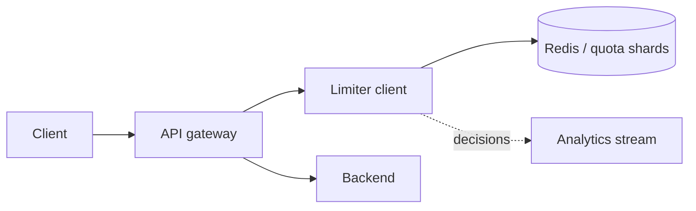

Rate Limiter 的核心不是背四种算法，而是：多个 server 同时处理同一个 key 时，如何在很小的 latency budget 内完成一次**原子的 check-and-update**。

假设 quota 是每分钟 100 次。两台 API server 各自只看到 60 次，于是都放行；全局实际已经 120 次。只要 decision maker 超过一个，本地 counter 就不再代表全局事实。

> 对应实验：[打开 Rate Limiter Lab](https://lab.zichaoyang.com/system-design/rate-limiter/)。增加 API server、hot-key 占比与 Region 数，再打开 strict global quota。

## 需求边界（Requirements）

功能上按 user/IP/API key 和 endpoint 执行 quota、返回 remaining/reset、支持策略变更。非功能上 limiter 必须在主请求的几毫秒预算内完成原子判断，并为不同风险 endpoint 定义明确的故障降级。

## 0. 先搭单机 MVP Scaffold

第一版只有一个 API process，进程内 `Map<key, Bucket>` 保存 token 数和上次补充时间。请求进入业务 handler 前调用 `allow(key, now)`；允许就扣一个 token，拒绝就返回 `429` 和 `Retry-After`。先不引入 Redis，因为还没有第二个 decision maker。

实现顺序：定义 quota policy，写纯函数更新 bucket，给并发访问加锁，接到 middleware，再补 TTL 清理长期不活跃 key。用 fake clock 测试窗口边界和 burst，避免依赖真实 sleep。

## 1. API：业务请求与策略管理分开

同步判断可以是库调用，也可以是内部 RPC：

```http
POST /internal/rate-limit/check
{"key":"user:42:upload","cost":1,"requestId":"r-9"}

200 OK
{"allowed":true,"remaining":17,"resetAt":"2026-07-13T08:01:00Z"}
```

Policy 管理走独立低频 API，例如 `PUT /v1/policies/upload-free-tier`。不要让每个请求临时读取配置数据库；gateway 持有带版本的本地 policy snapshot。

## 2. 数据模型（Data Model）

最小 token bucket state 是：

```text
LimiterState {
  enforcement_key,
  policy_version,
  tokens_remaining,
  last_refill_millis,
  expires_at
}
```

Redis 可用 hash 或紧凑字符串存储，key 设 TTL。Policy 则持久化 `capacity`、`refill_rate`、`fail_mode` 和适用 endpoint。状态是高频、可过期数据；policy 是低频、需审计数据，两者不要放进同一张热表。

## 3. 单机端到端流程

收到请求后先解析可信身份，构造 `user:42:upload`，读取 policy，用单调时钟计算补充 token，再原子判断和扣减。拒绝响应携带 quota headers。注意不能直接信客户端传来的 key，否则攻击者可以不停换 key 绕过限制。

## 4. 容量估算：先算 state，再算 QPS

假设峰值 100 万请求/秒、1000 万活跃 key、每份 state 含 Redis 开销约 150 bytes，则 limiter state 约 1.5GB，做副本后约 3GB；容量不难，真正难的是每秒 100 万次原子更新和 hot key 倾斜。若一个 key 占 10% 流量，单 shard 会收到 10 万次/秒。

这解释了为什么“加 Redis shard”只解决总吞吐，不自动解决攻击者制造的单 key 热点。

## 5. Latency Budget：限流不能成为主请求

若业务 API p99 目标 100ms，可给 limiter 1 到 3ms 同 region 网络预算。Redis 排队或跨 region 往返一旦达到 20ms，就已经不可接受。可用 local token lease 减少远程调用，但必须承认会短时超发。

## 6. Correctness and Reliability

共享 store 中 check-and-update 必须原子，Lua 或 server-side command 不能拆成 GET/SET。Policy 更新带版本，旧 state 发现版本变化时重置或迁移。Store 故障时按 endpoint 选择 fail-open/fail-closed，并限制 fallback 时间，防止故障恢复后形成 retry storm。

## 7. Trade-offs：准确不是免费的

- Fixed window 最便宜但有边界 burst；sliding log 准确但内存随请求数增长。
- Central quota 准确但增加网络依赖；local lease 低延迟但允许 bounded overshoot。
- Global quota 强约束跨 region；regional budget 保 availability，但需要异步再平衡。

## 算法先用直觉理解

- **Fixed window counter**：每分钟一个计数，便宜，但窗口边界前后可瞬间通过两倍流量。
- **Sliding window log**：保存每次请求时间，最准确但内存高。
- **Sliding window counter**：按相邻窗口加权近似，成本和准确性居中。
- **Token bucket**：token 按固定速率补充，请求消耗 token；既限制长期速率，也允许有限 burst。

算法选择来自产品语义。API 保护通常喜欢 token bucket；严格审计型配额可能需要更精确窗口。

## 主路径



Redis 中一次 Lua script 原子读取 bucket、按时间补 token、判断并扣减，再返回 `allowed`、`remaining` 和 `retry_after`。不能用独立 GET/SET，否则并发请求会在两步之间竞态。

## 架构如何演化

1. 单进程时本地内存是正确基线，延迟最低。
2. 多 server 时 state 移到共享原子 store，或由集中 quota service 持有。
3. p99 很紧时可给每个 gateway 租一小段 local token lease，减少远程调用；代价是短时超发。
4. 总 key 数增长时按 enforcement key 分片。
5. 一个攻击 key 仍会打热单 shard。Sharding 解决总量，不解决倾斜；需 local rejection cache、专属分区或更早的 edge block。

## 多 Region 最难的取舍

如果全球 quota 是 100，最准确的办法是每次请求都同步到同一权威点，但跨洋 latency 和 partition availability 很差。更实用的方法是给各 region 分配 token budget，异步再平衡；可能短时不精确，却保住本地延迟。

所以必须问：quota 是安全边界、计费边界，还是防止普通滥用？严格程度不同，架构不同。

## Store 故障时怎么办

**Fail open** 保可用但可能放过攻击；**fail closed** 保护资源但可能拒绝正常用户。登录、支付、公开内容 API 的选择可以不同。成熟系统按 endpoint 风险配置 fallback，而不是一个全局开关。

## 面试表达

> The hard part is not the counter algorithm itself. It is making the allow-or-deny update atomic across many servers while staying inside the request latency budget.

然后给出 `Gateway -> atomic quota store -> Backend`，解释算法、hot key 和 multi-region tradeoff。Kafka 可以记录 decision 做分析，但不能承担同步 allow/deny 路径。
