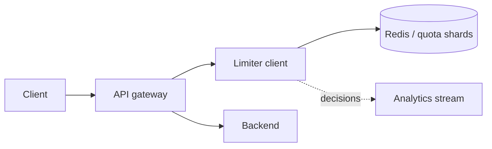

Rate Limiter 的核心不是背四种算法，而是：多个 server 同时处理同一个 key 时，如何在很小的 latency budget 内完成一次**原子的 check-and-update**。

假设 quota 是每分钟 100 次。两台 API server 各自只看到 60 次，于是都放行；全局实际已经 120 次。只要 decision maker 超过一个，本地 counter 就不再代表全局事实。

> 对应实验：[打开 Rate Limiter Lab](https://lab.zichaoyang.com/system-design/rate-limiter/)。增加 API server、hot-key 占比与 Region 数，再打开 strict global quota。

## 算法先用直觉理解

- **Fixed window counter**：每分钟一个计数，便宜，但窗口边界前后可瞬间通过两倍流量。
- **Sliding window log**：保存每次请求时间，最准确但内存高。
- **Sliding window counter**：按相邻窗口加权近似，成本和准确性居中。
- **Token bucket**：token 按固定速率补充，请求消耗 token；既限制长期速率，也允许有限 burst。

算法选择来自产品语义。API 保护通常喜欢 token bucket；严格审计型配额可能需要更精确窗口。

## 主路径

Redis 中一次 Lua script 原子读取 bucket、按时间补 token、判断并扣减，再返回 `allowed`、`remaining` 和 `retry_after`。不能用独立 GET/SET，否则并发请求会在两步之间竞态。

## 架构如何演化

1. 单进程时本地内存是正确基线，延迟最低。
2. 多 server 时 state 移到共享原子 store，或由集中 quota service 持有。
3. p99 很紧时可给每个 gateway 租一小段 local token lease，减少远程调用；代价是短时超发。
4. 总 key 数增长时按 enforcement key 分片。
5. 一个攻击 key 仍会打热单 shard。Sharding 解决总量，不解决倾斜；需 local rejection cache、专属分区或更早的 edge block。

## 多 Region 最难的取舍

如果全球 quota 是 100，最准确的办法是每次请求都同步到同一权威点，但跨洋 latency 和 partition availability 很差。更实用的方法是给各 region 分配 token budget，异步再平衡；可能短时不精确，却保住本地延迟。

所以必须问：quota 是安全边界、计费边界，还是防止普通滥用？严格程度不同，架构不同。

## Store 故障时怎么办

**Fail open** 保可用但可能放过攻击；**fail closed** 保护资源但可能拒绝正常用户。登录、支付、公开内容 API 的选择可以不同。成熟系统按 endpoint 风险配置 fallback，而不是一个全局开关。

## 面试表达

> The hard part is not the counter algorithm itself. It is making the allow-or-deny update atomic across many servers while staying inside the request latency budget.

然后给出 `Gateway -> atomic quota store -> Backend`，解释算法、hot key 和 multi-region tradeoff。Kafka 可以记录 decision 做分析，但不能承担同步 allow/deny 路径。
