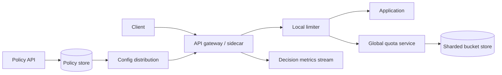

Rate limiter 的目标看起来很简单：一个用户一分钟最多请求 100 次，第 101 次拒绝。单进程里几行代码就能做到；一旦请求同时落到几十台 API server，问题就变成“这些机器怎样共享同一份额度”。

如果每台机器都允许 100 次，20 台服务器合起来就放行 2,000 次；如果每次都远程访问一个强一致计数器，限流服务又会进入所有 API 的延迟和故障路径。

这道题的核心是：**在额度准确性、请求延迟和系统可用性之间，选择一个符合业务风险的边界。**

> 配套实验：[打开 Rate Limiter Lab](https://lab.zichaoyang.com/system-design/rate-limiter/)。先保持单 API server，比较算法；再增加 server 和 hot-key，观察“准确计数”为什么会变成协调问题。

## 先用一个小例子看边界行为

规则是每分钟最多 10 次。用户在：

```text
12:00:59 发送 10 次
12:01:00 又发送 10 次
```

固定窗口计数器会全部放行，因为它们落在两个分钟桶里。用户在 1 秒内完成 20 次请求，却没有违反任一窗口的 `count <= 10`。

这不一定是 bug。若产品只关心“每个账单分钟最多 10 次”，固定窗口够用；若要平滑保护下游，就需要 token bucket、sliding window 或 GCRA。

先定义允许的 burst，再选算法。没有“所有系统都应该用滑动窗口”的答案。

## 四种常见算法，分别牺牲什么

**Fixed window counter**

Key 形如 `user:42:2026-07-13T12:01`，递增并设 TTL。实现最便宜，但窗口边界会产生双倍 burst。

**Sliding log**

保存每次请求时间，删除窗口外记录，再数剩余条目。最精确，却需要 $O(n)$ 存储和清理，不适合高额度 key。

**Sliding window counter**

用当前和前一个固定窗口加权近似。比 fixed window 平滑，成本远小于完整日志，但仍是近似。

**Token bucket**

桶以速率 $r$ 补充 token，容量 $b$ 控制 burst。请求消耗 token，不足则拒绝：

$$
tokens = \min(b, tokens_{old} + r \times \Delta t)
$$

它自然表达“长期每秒 10 次，但允许短时 burst 20 次”，很适合 API protection。

## 题目边界

本文设计一个多租户 API rate limiter：

1. 按 tenant、user、API、IP 或组合维度限流；
2. 支持 burst、持续速率和并发上限；
3. 返回是否允许、剩余额度和 retry 时间；
4. 规则可版本化、灰度和紧急覆盖；
5. 支持本地快速路径与全局配额；
6. 依赖故障时按 policy fail open 或 fail closed。

第一版不做 WAF、计费和完整 abuse detection。Rate limit 是其中一个确定性保护层。

非功能目标：

- 每次检查增加的 p99 最好低于 2–5ms；
- 限流服务故障不能无意拖垮全部 API；
- 热门 tenant 或攻击 IP 不应打爆单个 shard；
- 配额更新在明确时间内生效；
- 允许一定误差时，误差必须可估算；
- 安全写接口和低风险读接口可以有不同故障语义。

## 第一版：进程内 Token Bucket

先让一台 API server 正确工作：

```python
class TokenBucket:
    def __init__(self, capacity, refill_per_second):
        self.capacity = capacity
        self.refill_per_second = refill_per_second
        self.tokens = capacity
        self.last_refill = monotonic_time()

    def allow(self, cost=1):
        now = monotonic_time()
        elapsed = now - self.last_refill
        self.tokens = min(
            self.capacity,
            self.tokens + elapsed * self.refill_per_second,
        )
        self.last_refill = now

        if self.tokens < cost:
            return False

        self.tokens -= cost
        return True
```

使用 monotonic clock，避免系统时间回拨让 token 变多或变少。Bucket map 按 key 存在内存，并为长时间不活跃 key 做 TTL eviction。

Middleware 先解析 policy：

```text
key = tenant:acme + endpoint:/v1/search
capacity = 100
refill = 20 tokens/s
cost = 1
```

再返回标准响应：

```http
HTTP/1.1 429 Too Many Requests
Retry-After: 2
RateLimit-Limit: 20
RateLimit-Remaining: 0
RateLimit-Reset: 2
```

这一版的局限很明确：进程重启额度归零或归满，多台 server 各算各的。先接受它，才能知道下一步为什么需要共享状态。

## Policy 与 runtime state 分开存

```text
RateLimitPolicy(
  policy_id,
  version,
  scope,
  key_expression,
  algorithm,
  capacity,
  refill_rate,
  request_cost_expression,
  failure_mode,
  state,
  created_at
)

PolicyBinding(
  tenant_id,
  api_pattern,
  policy_id,
  policy_version,
  priority
)

BucketState(
  bucket_key,
  policy_version,
  tokens,
  last_refill_time,
  expires_at
)
```

Policy 存在配置数据库并发布到本地缓存；BucketState 是高频、短生命周期 runtime data。不要每次请求都查询配置数据库。

Key expression 和 priority 必须确定。例如用户级 100/s、tenant 级 10K/s、IP 级 20/s 同时存在时，是全部通过才放行，还是某些 override？规则冲突不能靠遍历顺序决定。

## 第二版：Redis 原子更新

多台 API server 共享 Redis bucket。一次检查必须原子完成：读取旧 token、按时间补充、判断、扣减和写回。

若代码分成 `GET -> 计算 -> SET`，两个请求可能同时读到 1 token，然后都放行。需要 Lua script、Redis Function 或支持 compare-and-swap 的存储。

伪逻辑：

```text
old_tokens, last_refill = GET key
new_tokens = min(capacity, old_tokens + elapsed * rate)

if new_tokens < cost:
    SAVE new_tokens, now
    return denied

SAVE new_tokens - cost, now
return allowed
```

Redis 使用 server time 或请求携带的时间？Server time 避免 API host clock skew，但集群迁移和多 Region 仍要处理时钟。单 Region 中让状态 owner 使用自己的时间最简单。

Key TTL 可以设为桶从空补满所需时间再加余量。长期不活跃 bucket 自然清理：

```text
ttl ≈ capacity / refill_rate + safety_margin
```

## 限流 API：库内调用还是独立服务

独立服务接口可以是：

```http
POST /v1/limits:check

{
  "descriptors":[
    {"key":"tenant","value":"acme"},
    {"key":"endpoint","value":"search"}
  ],
  "cost":1,
  "deadlineMs":5
}
```

```json
{
  "allowed":false,
  "limit":20,
  "remaining":0,
  "retryAfterMs":1500,
  "policyVersion":"search-default@4"
}
```

但每个业务请求多一次 RPC，会增加延迟和故障点。常见折中是 sidecar / local library 做本地 check，后台与 global quota service 协调。Low-QPS 强语义 policy 可以远程原子检查，超高 QPS protection 则采用本地额度租约。

## 高层架构：配置慢慢发，额度快速判



配置面负责 policy authoring、validation、version 和 rollout；数据面只做快速 key extraction 与额度判断。

配置发布失败时继续使用 last-known-good policy。不要因为 control plane 暂时不可用，把所有 limit 关闭或所有请求拒绝。

## Hot key：严格全局额度天然会集中

一个超级 tenant 的所有请求更新同一 Redis key，单 key 的原子串行吞吐会成为上限。仅增加 Redis shards 没用，因为这一个 key 仍在一个 shard。

解决办法取决于准确度要求。

**本地额度租约**

Global service 一次给每个 gateway 发一小块 token：

```text
global bucket 10,000 tokens
-> gateway A lease 200
-> gateway B lease 200
```

Gateway 在内存快速消耗，用完再申请。这样远程 QPS 从“每请求一次”降为“每批 token 一次”。

代价是误差：Gateway 崩溃时未用 token 暂时丢失；多个 gateway 手里同时持有额度，会让撤销和规则更新延迟。Lease 越大，性能越好，准确性越差。

**分片计数**

把一个 hot key 拆成多个子 key，再估计总量。适合统计保护，不适合严格计费或金融额度，因为并发下可能超放。

## 多层限流：边缘保护、租户公平和下游容量

实际系统常有三层：

1. Edge/IP limit：挡明显攻击，允许近似、本地处理；
2. Tenant/user limit：保障公平和合同额度；
3. Service concurrency limit：保护数据库、GPU 或第三方 provider。

第三层不一定按时间窗口。若下游最多同时处理 100 个昂贵任务，应使用 concurrency semaphore：开始时 acquire，完成或 lease 到期时 release。

不要用“每秒 100 次”代替并发限制。请求从 10ms 变成 10s 后，同样 QPS 会产生 1,000 倍在途工作。

## 容量估算：每个业务请求会产生多少次限流检查

假设入口 1M requests/s，每请求检查 IP、user、tenant 三个维度：

```text
1M × 3 = 3M limit decisions/s
```

如果每次都远程原子更新，quota backend 就要承受 3M ops/s，并进入用户 p99。

使用每次租 100 tokens 的本地 lease，平均远程操作可降约两个数量级：

```text
3M / 100 = 30K lease requests/s
```

实际还受 burst、gateway 数和额度分布影响。估算的目的，是决定 remote-per-request 是否现实。

状态量取决于活跃 key，不是注册用户总数。假设高峰 50M active buckets、每条含 key 和 metadata 约 100 bytes：

```text
50M × 100B = 5GB raw state
```

加副本和内存开销可达几十 GB，按 bucket hash 分片即可；hot key 仍要单独解决。

## 多 Region：先决定“全局 100”到底有多严格

若 tenant 的合同是全球严格 100 requests/s，所有 Region 必须协调同一额度，跨洋 RTT 会进入请求路径，或需要额度预分配。

三种选择：

**Region 独立额度**

每个 Region 100/s，总量可能放大。可用性和 latency 最好，适合 abuse protection。

**静态拆分**

全球 100，按流量给 US 60、EU 40。不会超全局，但流量突变时一个 Region 用完、另一个仍闲置。

**动态租约**

Global allocator 定期把额度租给 Region。能重新平衡，但存在 lease 未归还和短时误差。

面试里要明确误差窗口，例如“Region 故障时最多超放 2 秒、5%”。只说 eventual consistency 太模糊。

## Fail open 还是 Fail closed

Rate limiter 自己故障时：

- 登录尝试、密码重置、昂贵写操作通常偏 fail closed；
- 普通内容读取为了可用性可能 fail open，同时启用本地 emergency limit；
- 第三方付费 API 可以使用本地保守上限，避免成本失控。

Failure mode 属于 policy，并按 endpoint 定义。一个全局开关无法覆盖所有风险。

还要区分 limiter timeout 与明确 denied。Timeout 返回 `503` 或降级，不应伪装成用户超过配额的 `429`，否则运营和客户端都会误判。

## 故障与正确性

**Bucket store 重启**

若状态丢失后默认满桶，会产生一次大 burst；默认空桶会误拒所有用户。可以从持久化恢复、使用保守 partial fill，或靠本地 emergency policy 过渡。

**重复 lease 请求**

Lease allocation 用稳定 request ID 幂等。响应丢失后重试不能再发一份额度。

**Gateway 崩溃**

未消费 lease 在 expiry 后回到全局可用。不要依赖 gateway 主动归还。

**配置错误**

Policy 先 shadow，只记录“本来会拒绝”，再 canary。发布有 sanity check，例如新规则不能瞬间拒绝 90% production traffic，除非紧急 override。

**时钟回拨**

本地 bucket 使用 monotonic clock；集中 bucket 由单一 state owner 计算 refill。不能信任任意客户端传来的 wall clock。

## 观测

- Allowed、denied、shadow-denied 和 error，按 policy/key dimension；
- Check p50/p95/p99、store latency、timeout；
- Hot key、shard load、Lua/function 执行时间；
- Local lease size、utilization、waste、expiry；
- Config version、传播 lag、fallback-to-last-good；
- Fail-open/fail-closed 次数；
- Downstream saturation 与 limiter decision 的关联。

高拒绝率未必是 limiter 故障，可能是攻击或上游 retry storm。必须能从 policy、tenant、endpoint 和 source Region 切片。

## 关键取舍

**Fixed window** 最便宜，但允许边界 burst；**sliding log** 最精确，但状态最重；**token bucket** 自然表达 burst 与持续速率。

**每请求全局检查** 更准确，却增加 latency、成本和单点故障面。

**更大的本地 lease** 降低协调 QPS，却扩大超放、撤销延迟和崩溃浪费。

**Fail open** 保护业务可用性，但可能伤害安全和成本；**fail closed** 相反。

**全局严格配额** 需要跨 Region 协调；若业务只是防滥用，Region-local 近似往往更合理。

## 用 Lab 观察协调成本

**实验一：比较窗口算法**

在窗口边界制造 burst，观察 fixed window。再用 token bucket 明确写出允许的 capacity 与 refill。

**实验二：增加 API server**

先让每台 server 本地计数，计算总超放；再切共享状态，观察新增的 p99 和依赖。

**实验三：制造 Hot key 和多 Region**

一个 tenant 占大部分流量时，增加 shard 不会解决单 key。尝试 local lease，并明确可接受误差。

## 面试表达：先问“额度要多准”

可以这样开场：

> I would first clarify whether the limit is strict billing or approximate abuse protection, because that determines how much coordination is justified. I would start with a token bucket in one process, then move the bucket state to an atomic owner when requests span servers.

自然演化：

```text
local token bucket
-> atomic shared bucket
-> sharded quota store
-> local token leases for hot paths
-> explicit multi-region error bounds
```

最后给深入方向：

> I can go deeper into token-bucket math, atomic Redis updates, hot-key leases, or fail-open and multi-region semantics.

这样讲，rate limiter 不再是一张 Redis 架构图，而是一组可量化的一致性与可用性选择。

## 参考资料

- [RFC 6585: Additional HTTP Status Codes](https://www.rfc-editor.org/rfc/rfc6585)
- [Redis Scripting and Functions](https://redis.io/docs/latest/develop/programmability/)
- [Envoy Global Rate Limit Service](https://www.envoyproxy.io/docs/envoy/latest/configuration/http/http_filters/rate_limit_filter)
- [Generic Cell Rate Algorithm](https://en.wikipedia.org/wiki/Generic_cell_rate_algorithm)
