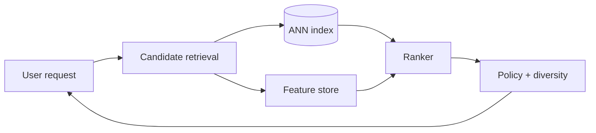

推荐系统的核心不是选一个最复杂的模型，而是在几千万甚至几十亿 item 中，如何在几十毫秒内找出一小批值得精排的候选。

如果 catalog 有 1 亿个视频，给每个视频跑一次 ranking model 不可能。系统必须先用廉价 retrieval 从 1 亿缩到几百，再用昂贵 ranker 排出几十个结果。这就是多阶段漏斗。

> 对应实验：[打开 Recommendation System Lab](https://lab.zichaoyang.com/system-design/recommendation-system/)。逐步打开 two-tower ANN、real-time feature，并收紧 ranking latency。

## 需求边界（Requirements）

功能上为指定 surface 返回候选、记录曝光反馈并支持实验；首版不追求全产品统一模型。非功能上 p99 约 100ms、模型故障可降级、删除/安全过滤强制正确，并同时优化长期质量和 serving 成本。

## 0. 先搭 Popularity Baseline MVP Scaffold

第一版不训练模型。每天按最近 24 小时的有效观看数生成 `global_top_100` 和 `category_top_100`；在线 API 根据用户选择的类别合并、过滤已看和不可用 item，返回前 20。这个 baseline 可运行、可解释，也是后续模型必须在线击败的对照组。

第二步再加简单 item-to-item co-visitation：用户刚看完 A，就从离线统计的 `A -> related items` 取候选。只有 baseline 的质量和延迟被量化后，才值得上 embedding。

## 1. API：返回结果也要记录 provenance

```http
POST /v1/recommendations
{"userId":"u-42","surface":"home","limit":20,"context":{"sessionId":"s-8"}}

200 OK
{"requestId":"r-9","items":[{"itemId":"v-7","source":"ann","score":0.82}],"modelVersion":"ranker-18"}
```

曝光日志必须携带 request/model/candidate source，之后的点击才能正确归因到一次推荐实验。

## 2. 数据模型（Data Model）

```text
Interaction(event_id, user_id, item_id, type, occurred_at, request_id, position)
Item(item_id PK, status, category, creator_id, metadata_version)
CandidateList(key, item_ids, generated_at, version)
Embedding(entity_id, model_version, vector, updated_at)
RecommendationLog(request_id PK, user_id, model_version, experiment, item_ids)
```

Online response 不是 source of truth，但必须可追踪。训练样本从曝光与后续行为 join，不能只收集点击，否则没有负例与 position bias 信息。

## 3. 单机端到端流程

MVP 启动时加载 popularity/co-visitation 列表。请求读取用户近期已看集合，组合多个候选源，dedup/filter，按手工权重排序，记录曝光并返回。先测 candidate coverage、CTR、watch time 和 p99，再把某一阶段替换成模型。

## 4. 容量估算：漏斗每一层都要算

假设 1 亿 DAU、每人每天 20 次请求，平均约 23k QPS，峰值 5 倍约 116k QPS。Catalog 10 亿 item，768 维 FP16 embedding 约 1.5KB，仅 item vector 就约 1.5TB，必须 ANN 分片。每请求 retrieve 1000 个、rank 500 个，每秒会产生约 5800 万 candidate scoring，ranker 才是主要计算账。

## 5. Latency Budget：100ms 的多阶段漏斗

可分配 retrieval 20ms、feature fetch 20ms、ranking 35ms、policy/filter 10ms、网络与余量 15ms。每段都要 deadline propagation；feature store 超时时使用 cached/default feature 或降级 popularity，不能让整页空白。

## 6. Correctness and Reliability

候选 index、feature 和 model 都带版本，日志记录实际使用版本。模型服务故障时回退到规则榜单。训练使用 point-in-time feature，避免未来泄漏。内容删除和政策过滤必须在最终返回前同步执行，即使旧 ANN index 仍包含该 item。

## 7. Trade-offs：先扩大 recall，再花钱排序

- 更多 candidate 提高 recall，却线性增加 feature/ranking 成本。
- 实时 feature 更贴近 session，但引入 stream 延迟和状态恢复。
- 大 ranker 质量高但 p99/成本高，可用轻模型粗排再重模型精排。
- Exploitation 提高短期指标，exploration 帮助新 item 与长期学习。

## 概念阶梯

- **Candidate generation / retrieval**：追求 recall，快速找出可能相关的几百个 item。
- **Ranking**：对小候选集使用更多 user-item feature，追求顺序质量。
- **Two-tower**：user tower 与 item tower 分别生成 embedding，在线做近似最近邻检索。
- **Feature store**：向 ranker 提供一致、低延迟、可复用的特征。

## 在线路径



Popularity baseline 很重要：它是冷启动 fallback，也是复杂模型必须击败的下限。之后可以加入 collaborative filtering，再在 catalog 变大时引入 two-tower ANN。模型复杂度要由离线指标和线上 A/B test 证明。

## 训练与 serving 如何连接

用户曝光、点击、观看时长进入事件流。训练 pipeline 生成样本和 embedding；item embedding 批量写 ANN index，user/session feature 写 online store。这里最危险的是 training-serving skew：训练时使用的定义、时间边界和默认值必须与在线一致。

实时特征能反映“用户刚看完篮球视频”，但引入 streaming 状态和更紧的 freshness SLA。不是所有特征都值得实时化；只把确实改善在线指标的信号放进 hot path。

## 常见难点

- 优化点击率可能制造 clickbait，目标应包含长期满意度和约束。
- 新用户与新 item 没有历史，需要 popularity、内容特征和探索流量。
- ANN index 新鲜度、feature lookup、ranker 三段共享一个 latency budget。
- 多样性、安全过滤和库存约束通常在 ranking 后做 policy rerank。

## 面试表达

> I would use a multi-stage funnel: broad and cheap retrieval for recall, followed by a smaller feature-rich ranking stage for precision.

先画漏斗，再讲训练反馈环。让面试官选择 retrieval、feature freshness、cold start 或 experimentation，而不是从模型名开始背。
