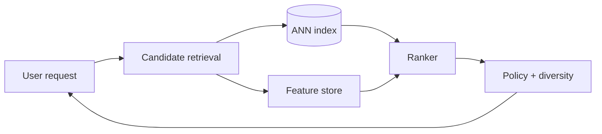

推荐系统的核心不是选一个最复杂的模型，而是在几千万甚至几十亿 item 中，如何在几十毫秒内找出一小批值得精排的候选。

如果 catalog 有 1 亿个视频，给每个视频跑一次 ranking model 不可能。系统必须先用廉价 retrieval 从 1 亿缩到几百，再用昂贵 ranker 排出几十个结果。这就是多阶段漏斗。

> 对应实验：[打开 Recommendation System Lab](https://lab.zichaoyang.com/system-design/recommendation-system/)。逐步打开 two-tower ANN、real-time feature，并收紧 ranking latency。

## 概念阶梯

- **Candidate generation / retrieval**：追求 recall，快速找出可能相关的几百个 item。
- **Ranking**：对小候选集使用更多 user-item feature，追求顺序质量。
- **Two-tower**：user tower 与 item tower 分别生成 embedding，在线做近似最近邻检索。
- **Feature store**：向 ranker 提供一致、低延迟、可复用的特征。

## 在线路径

Popularity baseline 很重要：它是冷启动 fallback，也是复杂模型必须击败的下限。之后可以加入 collaborative filtering，再在 catalog 变大时引入 two-tower ANN。模型复杂度要由离线指标和线上 A/B test 证明。

## 训练与 serving 如何连接

用户曝光、点击、观看时长进入事件流。训练 pipeline 生成样本和 embedding；item embedding 批量写 ANN index，user/session feature 写 online store。这里最危险的是 training-serving skew：训练时使用的定义、时间边界和默认值必须与在线一致。

实时特征能反映“用户刚看完篮球视频”，但引入 streaming 状态和更紧的 freshness SLA。不是所有特征都值得实时化；只把确实改善在线指标的信号放进 hot path。

## 常见难点

- 优化点击率可能制造 clickbait，目标应包含长期满意度和约束。
- 新用户与新 item 没有历史，需要 popularity、内容特征和探索流量。
- ANN index 新鲜度、feature lookup、ranker 三段共享一个 latency budget。
- 多样性、安全过滤和库存约束通常在 ranking 后做 policy rerank。

## 面试表达

> I would use a multi-stage funnel: broad and cheap retrieval for recall, followed by a smaller feature-rich ranking stage for precision.

先画漏斗，再讲训练反馈环。让面试官选择 retrieval、feature freshness、cold start 或 experimentation，而不是从模型名开始背。
