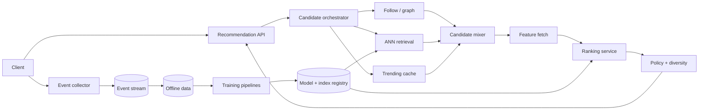

推荐系统经常被一句话概括成“拿用户 embedding 去向量库找相似 item，再用模型排序”。这句话跳过了最关键的问题：系统为什么会看到这些候选、模型的训练反馈从哪里来，以及推荐本身怎样改变下一轮数据。

用户只会点击我们展示过的内容。一个 item 从未被召回，就永远没有曝光和点击；模型又会把“没有点击”误解成“不喜欢”。推荐系统因此不是一个静态预测 API，而是一条会改变自身数据分布的闭环。

这道题的核心是：**怎样从海量内容中快速找出一个有希望的候选集，在严格延迟内精排，同时持续收集无偏、可解释的反馈。**

> 配套实验：[打开 Recommendation System Lab](https://lab.zichaoyang.com/system-design/recommendation-system/)。先关闭 two-tower 和实时特征，从热门榜开始；随后一次只打开一层，观察每层解决什么问题。

## 为什么不能直接给一亿条内容逐一打分

假设平台有 1 亿个视频，ranking model 对一个 `(user, video)` 评分需要 0.1ms。单请求逐一评分就是：

```text
100,000,000 × 0.1ms = 10,000 seconds
```

即使向量化和 GPU 能快很多，也不可能在 200ms 内完成。系统必须分层：

```text
1 亿 items
-> 数千个 candidates
-> 数百个 ranked items
-> 20 个最终展示结果
```

第一层追求 recall：别漏掉可能喜欢的内容。第二层追求精度和业务约束。把这两层混成一个“推荐模型”，就无法讨论真实的延迟和容量。

## 先把几个词讲清楚

**Candidate generation / retrieval**

从全量 corpus 快速召回几百到几千个候选。来源可以是热门、关注关系、协同过滤、内容相似或 embedding ANN。

**Ranking**

用更丰富的 user、item 和 context feature 给候选打分，预测点击、观看时长、购买、满意度或多目标价值。

**Two-tower model**

一个 tower 把用户编码成向量，另一个把 item 编码成向量。二者相似度可以用 ANN index 快速检索，因此适合 candidate generation。

**Impression**

某个 item 实际被展示给用户。没有 impression，缺少点击不能当作负样本。

**Exploration**

有控制地给新内容或不确定候选一些曝光，避免系统永远只展示已知热门 item，并为未来学习收集信息。

## 题目边界

本文设计首页 feed 推荐：

1. 客户端请求一页个性化内容；
2. 系统合并多个候选源并去重；
3. Ranking 在 latency budget 内排序；
4. 应用过滤、多样性、频控和业务规则；
5. 记录 impression、click、dwell 等反馈；
6. 离线训练并安全发布 retrieval/ranking model。

第一版不设计内容上传、搜索、广告竞价和完整 feature store。它们是相邻系统。

非功能要求：

- 首页推荐 p99 例如 200ms；
- 无效、越权、已删除内容不能因缓存继续展示；
- 训练与 serving feature/version 可追溯；
- 过载时能降级到热门或关注 feed；
- 反馈事件可去重，并区分曝光和未曝光；
- 质量指标包含长期满意度，不能只优化短期点击。

## 第一版：按地区和主题返回热门列表

不要从神经网络开始。先每小时离线统计：

```text
score(item)
= clicks_1h
+ 0.2 × views_1h
+ 2.0 × shares_1h
- freshness_decay
```

把每个 `(region, topic)` 的 top 1,000 写入缓存：

```text
TrendingList(
  region,
  topic,
  generation,
  item_ids,
  generated_at,
  expires_at
)
```

请求时读取列表，过滤已看、已删除和不适合当前用户的 item，返回前 20 个。

这个版本已经能验证三条重要链路：

1. 推荐响应给每次展示分配 `impression_id`；
2. 客户端准确回传“真的显示在屏幕上”的 impression，而不是仅下载；
3. Click、dwell 和 hide 能连接回 impression、item、rank 和 algorithm version。

没有可信 feedback，再复杂的模型也没有可靠训练数据。

## 推荐 API：Response 本身就是实验记录

```http
POST /v1/recommendations/home

{
  "userId":"u-9",
  "sessionId":"s-71",
  "limit":20,
  "context":{"locale":"zh-CN","device":"mobile"}
}
```

```json
{
  "requestId":"rec-81",
  "items":[
    {"itemId":"v-44","impressionToken":"signed-token","rank":1}
  ],
  "algorithmVersion":"home-ranker@27",
  "nextPageToken":"..."
}
```

反馈：

```http
POST /v1/recommendation-events

{
  "eventId":"evt-99",
  "type":"IMPRESSION",
  "impressionToken":"signed-token",
  "eventTime":"2026-07-13T17:00:00Z"
}
```

Token 绑定 user、item、request、rank 和 algorithm version，防止客户端随意伪造训练事件。事件仍按 `event_id` 去重。

## 数据模型：先保存“系统展示了什么”

```text
RecommendationRequest(
  request_id,
  user_id,
  session_id,
  context_hash,
  algorithm_version,
  created_at
)

Impression(
  impression_id,
  request_id,
  user_id,
  item_id,
  rank,
  candidate_sources,
  retrieval_scores,
  ranking_score,
  experiment_ids,
  event_time
)

EngagementEvent(
  event_id,
  impression_id,
  event_type,
  value,
  event_time,
  received_at
)

ItemMetadata(
  item_id,
  creator_id,
  topic,
  language,
  state,
  safety_labels,
  published_at
)
```

高吞吐 impression 不同步写 OLTP 主库，而是进入事件流和离线存储。Request 热路径只需生成稳定 token；事件 pipeline 负责去重和持久化。

## 第二版：增加多个候选源

热门榜不够个性化。可以并行请求：

- Follow graph：关注创作者的新内容；
- Item-to-item：与最近看过内容相似；
- Collaborative：相似用户喜欢的内容；
- Trending：地区和主题热门；
- Exploration：新内容和低曝光候选。

每个 source 返回 `(item_id, source_score, reason)`。Mixer 去重并设置 quota，例如：

```text
follow 300
similar-item 500
collaborative 500
trending 100
exploration 50
```

Quota 不只是性能参数。没有 source budget，某个高分 source 可能占满全部候选，系统失去多样性和发现能力。

候选源超时应独立降级。Follow graph 挂了，不应让整个首页 2 秒后失败；在 deadline 内合并已经返回的来源，并记录 missing source。

## Two-tower + ANN：把语义召回扩到大 corpus

Item tower 离线生成 item embedding，写入版本化 ANN index。User tower 根据近期行为和 profile 生成 user embedding；可在线计算，也可预计算后叠加实时 session 信号。

```text
EmbeddingIndex(
  index_name,
  generation,
  model_version,
  embedding_dimension,
  item_snapshot,
  state,
  built_at
)
```

模型升级时构建新 generation，完成 recall/latency 验证后原子切换。不能让半数 item 用旧向量、半数用新向量，因为它们未必在同一空间。

ANN 用近似换速度。关键指标不是只有 query latency，还要比较 exact nearest neighbor 小样本上的 recall@k。Index 参数调得更快，可能把真正相关候选漏掉；ranking model 无法挽救从未进入候选集的 item。

## Ranking：目标通常不止一个

Ranking model 可以预测：

```text
P(click)
expected_watch_time
P(like)
P(hide)
P(long_term_return)
```

最终分数由业务目标组合：

$$
score = w_1 P(click) + w_2 E[watch] + w_3 P(like) - w_4 P(hide)
$$

权重不是纯模型参数。若只最大化 watch time，系统可能偏向耸动、重复或低质量内容。还需要内容安全、创作者公平、新鲜度和用户控制等约束。

Ranking feature 分三类：

- User：长期兴趣、订阅、活跃度；
- Item：主题、质量、年龄、全局反馈；
- Cross/context：用户与 item 交互历史、当前 session、时间、设备。

昂贵 cross feature 只对几百个候选计算，不对 1 亿 corpus 计算，这正是两阶段架构的价值。

## Post-ranking：最高分不等于最好的一页

Rank 后还要：

- 删除越权、已下架和年龄限制内容；
- 限制同一创作者连续出现；
- 控制已看内容和重复主题；
- 插入探索候选；
- 应用曝光频控；
- 做多样性重排。

这一步应记录 reason code。若某 item rank 很高却没展示，排障需要知道是 safety filter、creator cap 还是 dedup，而不是把责任归给模型。

## 高层架构：在线推荐与离线学习形成闭环



Online path 严格受 deadline 约束；training path 可以慢，但必须保留 impression-to-label lineage。Feature store 连接二者，确保同一 feature 的时间语义一致。

## 容量估算：候选放大会主导内部 QPS

假设首页高峰 50K requests/s，每次 5 个候选源：

```text
50K × 5 = 250K candidate-source calls/s
```

每个请求合并 1,500 candidates，再为 500 个候选取 ranking feature：

```text
50K × 500 = 25M user-item feature rows/s
```

Feature batch API 和紧凑数据布局非常关键。逐 item RPC 会形成灾难性的 fan-out。

若最终返回 20 个 item：

```text
50K × 20 = 1M possible impressions/s
```

客户端真正曝光比例可能较低，但事件 collector 仍要承受百万级吞吐和重试。按 event ID 去重，按 user 或 impression 分区。

ANN index 假设 1 亿 items、每个 256 维 FP16：

```text
100M × 256 × 2 bytes ≈ 51.2GB raw vectors
```

加图索引、metadata 和 replicas 后更大，但可以在内存集群分片。热门 query cache 有用，但个性化 user embedding 导致 cache key 高基数，命中率不能想当然。

## 延迟预算：并行候选，串行精排

200ms p99 示例：

| 阶段 | 预算 |
|---|---:|
| Gateway、context、实验分桶 | 10 ms |
| 候选源并行召回 | 45 ms |
| Merge、dedup | 10 ms |
| Feature batch fetch | 35 ms |
| Ranking | 35 ms |
| Policy、多样性、序列化 | 25 ms |
| 网络与余量 | 40 ms |

每个候选源拿到独立但受总 deadline 限制的 timeout。不能因为一个次要 source 慢就拖住整页。

过载时的降级顺序可以是：关闭昂贵 cross feature、减少 rank candidates、跳过某个 source、使用轻量 ranker，最终回退 cached trending。每级降级都记录 algorithm version，便于分析质量变化。

## Feedback loop 和偏差

训练样本必须从 Impression 开始：

```text
displayed + clicked       -> positive signal
displayed + skipped       -> possible negative
not displayed             -> unknown, not negative
```

当前位置也会影响点击。Rank 1 比 Rank 20 更容易被点击，不一定因为内容更好。可用随机小流量、inverse propensity weighting 或专门实验估计 position bias。

探索流量给新 item 基本曝光。它会轻微牺牲当前预测收益，却避免系统永远困在热门内容里，并产生更有信息量的训练数据。

模型发布后要看长期指标：用户留存、hide/report、内容多样性和创作者生态。短期 CTR 上涨不一定是产品改善。

## 故障与正确性

**候选源超时**

在 deadline 内使用其余来源，按 source budget 补足；响应记录 missing source。不要等待全成功。

**ANN generation 不完整**

新 index 未通过 item count、recall 和 checksum 前不发布。旧 generation 继续服务。

**删除内容仍在缓存**

下架和安全禁用走高优先级 invalidation；最终 post-filter 再查 authoritative state。推荐缓存不能成为删除漏洞。

**重复事件**

Collector 按 event ID 幂等，Streaming 聚合按 impression 去重。客户端离线重传不能制造虚假点击。

**模型服务故障**

切轻量 ranker 或 trending fallback。不要让 recommendation API 因单个 ML dependency 完全不可用。

## 关键指标

系统：端到端与分阶段 p99、candidate-source timeout、feature latency、rank throughput、fallback rate。

召回：每 source candidate count、overlap、offline recall@k、ANN recall/latency。

排序：AUC/NDCG 仅作离线参考；线上看 CTR、watch、conversion、hide/report 和校准。

生态：catalog coverage、新 item 首次曝光时间、主题/创作者多样性、head-vs-tail exposure。

数据：impression/event 丢失、重复、label delay、feature freshness、experiment balance。

指标必须按 model、index generation、实验和 fallback path 切片，否则一次降级会污染整体分析。

## 关键取舍

**召回更多 candidates** 提高 recall，也线性增加 feature 与 ranking 成本。

**更复杂 ranker** 提升离线精度，却可能超出在线延迟；可以用 teacher 离线蒸馏轻量 student。

**更实时的 feature** 适应 session 兴趣，也增加 streaming 写入和抖动。

**更多探索** 改善长期学习和新内容机会，却降低短期确定收益。

**更强 personalization** 提高相关性，也可能造成过滤泡泡、隐私风险和 cache 失效。

**Fan-out 预计算** 能让读取更快，但用户兴趣和 catalog 变化快时写放大很高；多数推荐系统更偏在线召回与 ranking，只缓存可复用部分。

## 用 Lab 逐层打开系统

**实验一：热门榜基线**

不打开 two-tower，先确认高可用基线和 feedback 事件。问自己个性化模型故障时是否能回到这里。

**实验二：Two-tower ANN**

扩大 corpus，观察 exact scoring 不可行。打开 ANN 后同时看 latency 和 recall，不要只看快了多少。

**实验三：实时特征与 latency**

加入 session feature 并收紧 ranking budget。决定哪些 feature 值得进入在线路径，哪些可以离线预计算。

## 面试表达：先解释为什么需要两阶段

可以这样开场：

> We cannot score every user-item pair in a hundred-million-item corpus. I would first retrieve a few thousand high-recall candidates from several independent sources, then spend richer features and a more expensive model on only a few hundred of them.

自然演化顺序：

```text
trending baseline + trustworthy impressions
-> multiple candidate sources
-> two-tower ANN retrieval
-> feature fetch + ranking
-> policy and diversity
-> exploration, retraining and safe release
```

最后给深入入口：

> I can go deeper into ANN indexing, ranking latency, feedback bias and exploration, or feature freshness.

这条叙事既讲清在线架构，也没有忘记推荐系统真正长期运行所依赖的数据闭环。

## 参考资料

- [Deep Neural Networks for YouTube Recommendations](https://research.google/pubs/deep-neural-networks-for-youtube-recommendations/)
- [Deep Learning Recommendation Model for Personalization and Recommendation Systems](https://arxiv.org/abs/1906.00091)
- [Recommending What Video to Watch Next: A Multitask Ranking System](https://research.google/pubs/recommending-what-video-to-watch-next-a-multitask-ranking-system/)
- [HNSW: Efficient and Robust Approximate Nearest Neighbor Search](https://arxiv.org/abs/1603.09320)
