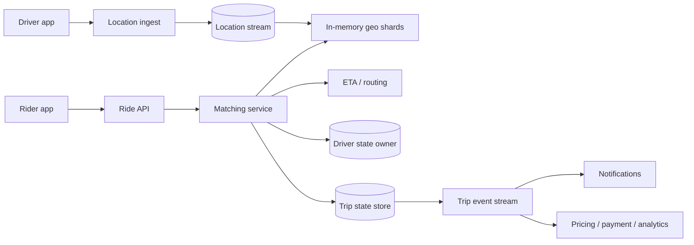

叫车系统最直观的功能是“找到离乘客最近的司机”。真正难的地方有两个：数十万司机每几秒都在移动，位置数据是一条持续写入的 firehose；当两个乘客同时看中同一位司机时，系统又必须保证只有一个人成功匹配。

这道题因此同时包含一份允许短暂过期的地理索引，和一份必须严格转换的行程状态机。

核心问题是：**怎样用近似、新鲜的位置快速找候选，再用原子 claim 把一个司机分配给且只分配给一段行程。**

> 配套实验：[打开 Ride Sharing Lab](https://lab.zichaoyang.com/system-design/ride-sharing/)。先提高司机数和 GPS 频率，观察写路径；再扩大搜索半径和 cell 密度，观察查询 fan-out。

## 最近的司机不一定能被你叫到

乘客 A 和 B 同时发起请求。Geo index 都返回司机 D1：

```text
A candidates: D1, D2, D3
B candidates: D1, D4, D5
```

如果两个 matcher 只是读取 `D1.status = AVAILABLE`，随后各自更新，可能都认为匹配成功。

必须有一个原子状态转换：

```sql
UPDATE drivers
SET status = 'RESERVED', reservation_id = :ride_id
WHERE driver_id = 'D1'
  AND status = 'AVAILABLE'
  AND version = :expected_version;
```

只有一方更新 1 行，另一方继续尝试 D2/D4。

Geo 查询只产生候选，不拥有司机。**Matching 的正确性边界在 claim，不在 nearest-neighbor 算法。**

## 先把三种状态分开

**Location state**

司机最近一次坐标、heading、speed 和 timestamp。它高频、易逝，丢掉一两次更新通常可以接受。

**Availability state**

司机是否可接单、正在被预留或已有行程。它比位置更新频率低，但需要强语义。

**Trip state**

一次行程从 requested、matching、assigned、arriving、in-progress 到 completed/cancelled 的持久状态机。

不要把三者都写进同一行并让 GPS 每 2 秒更新。高频位置写会与关键状态转换争锁，也让数据库承受不必要历史。

## 题目边界

核心功能：

1. Driver 上线并持续上报位置；
2. Rider 输入起终点，获得 ETA/价格预估；
3. 创建 ride request，匹配可用司机；
4. Driver 接受/拒绝或预留超时；
5. 持久化 trip 状态与事件；
6. 支持取消、重试和重新匹配；
7. 按地理区域计算基础 surge。

第一版不展开支付、地图路线引擎、司机身份审核和完整 ML dispatch。ETA/route 作为外部服务。

非功能目标：

- 正常城市内数秒完成匹配；
- 位置 ingest 可承受高频写并容忍少量乱序；
- 一个司机同一时间最多属于一个 active reservation/trip；
- Trip 状态可审计、可恢复；
- 城市/Region 可独立扩展和隔离故障；
- 位置属于敏感数据，有短 retention 与访问控制。

## 第一版：一个城市、一张位置表、网格搜索

先用 Postgres + 地理扩展，或简单经纬度网格。司机位置：

```text
DriverLocation(
  driver_id,
  latitude,
  longitude,
  location_timestamp,
  received_at,
  cell_id
)

DriverState(
  driver_id,
  status,
  reservation_id,
  active_trip_id,
  version,
  updated_at
)
```

位置上报 API：

```http
PUT /v1/drivers/d-9/location

{
  "latitude":37.789,
  "longitude":-122.401,
  "heading":90,
  "sequence":881,
  "recordedAt":"2026-07-13T17:00:00Z"
}
```

同一 device session 用 sequence 去掉重复和倒序 update。Server 仍保存 event time 与 received time，位置过旧时不参与匹配。

Ride API：

```http
POST /v1/rides
Idempotency-Key: rider-session-77

{
  "riderId":"u-42",
  "pickup":{"lat":37.789,"lng":-122.401},
  "destination":{"lat":37.771,"lng":-122.417},
  "product":"STANDARD",
  "quoteId":"q-19"
}
```

返回异步 ride 状态：

```json
{"rideId":"r-88","state":"MATCHING"}
```

Client 通过 WebSocket/SSE 订阅状态。不要让一个 HTTP 请求同步等待几十秒匹配。

## 最小 Matching 算法

把地球表面映射成 cell。第一轮查 pickup 所在 cell；候选不足时向相邻环扩展：

```text
ring 0: current cell
ring 1: 8 neighbors
ring 2: outer cells
...
```

对候选先过滤：

- Driver state 是 AVAILABLE；
- Location age 小于阈值，例如 10 秒；
- 支持请求车型；
- 不在 break/offline；
- 当前城市/zone 可服务。

再按粗距离或 ETA 排序，逐个原子 reserve。Reservation 有短 TTL，例如 15 秒；司机拒绝或超时后释放并尝试下一批。

仅按直线距离可能选到河对岸或高速路反方向。第一轮用 geo distance 快速召回，前 10–20 个再调用 route/ETA service 精排。

## Trip 状态机

```text
REQUESTED
-> MATCHING
-> DRIVER_RESERVED
-> DRIVER_ACCEPTED
-> DRIVER_ARRIVING
-> IN_PROGRESS
-> COMPLETED

MATCHING -> NO_DRIVER
DRIVER_RESERVED -> MATCHING (reject/timeout)
any pre-completion state -> CANCELLED
```

```text
Trip(
  trip_id,
  rider_id,
  driver_id,
  city_id,
  state,
  state_version,
  pickup,
  destination,
  quote_id,
  created_at,
  updated_at
)

TripEvent(
  trip_id,
  sequence,
  event_type,
  actor_type,
  actor_id,
  payload,
  created_at
)
```

State transition 用 `(trip_id, expected_state, state_version)` CAS。TripEvent 与 current state 同一事务写入，支持审计、通知和下游支付。

DriverState 和 Trip 的关键转换也要原子协调。第一版放同一城市数据库事务中最简单；拆服务后使用单 owner 或 saga + reservation lease，不能用最终一致消息随便填。

## 为什么 Location 要进内存 Geo Index

假设 1M 在线司机，每 3 秒上报：

```text
1M / 3 ≈ 333K location updates/s
```

每次都同步写关系数据库和磁盘索引，成本高且旧坐标几秒后就没用。可以让 location gateways 写 partitioned stream，Geo workers 按 cell/driver 更新内存 index：

```text
cell_id -> set(driver_id, lat, lng, timestamp, attributes)
driver_id -> current_cell, latest_sequence
```

司机跨 cell 时从旧 set 移除、加入新 set。Periodic snapshot 或 event log 用于 worker 恢复；短暂丢失可让 driver 重新上报填充。

Authoritative Driver availability 仍在 state store。Geo index 可缓存 status 以快速过滤，但 claim 必须访问 owner。

## 高层架构



Location path 追求吞吐和 freshness；Trip/Driver state path 追求原子性和审计。二者通过 driver ID、timestamp 和 claim 相交。

Matching worker 本身无状态，可按 city/cell 路由。一次 ride 由一个 matching coordinator/lease 推进，防止两个 worker 同时为同一 ride 预留不同司机。

## Geo 分片和边界问题

按 city 再按 cell 分片自然，因为叫车通常不会跨城市找司机。Cell 边界附近的乘客必须查询相邻 shard。

粗 cell：每个 cell 候选太多，filter/ETA 贵；细 cell：搜索半径覆盖很多 cells，RPC fan-out 大。可以使用多层索引：先细 cell，候选不足逐层扩大。

Geohash 前缀便于 KV range；S2/H3 等层次 cell 提供更一致的邻接和多分辨率。面试不必实现球面几何，但要指出极区、日期线和不规则道路意味着“经纬度方框”只是粗召回。

Geo shard ownership 带 epoch。迁移时位置更新可双写短窗口，新 owner warm 后切 query，避免 index 突然空。

## Matching 策略：最近只是一个起点

真实 score 可能组合：

```text
pickup ETA
driver acceptance probability
driver idle time / fairness
trip direction and destination
surge zone balance
driver/rider preferences
```

Dispatch 可以批量匹配多个 rider/driver，求更优全局分配，但会增加等待和算法复杂度。低流量时逐 ride greedy 足够；高密度机场/活动区域才可能值得批量优化。

无论模型多复杂，最终 driver claim 都用确定性 reservation。ML 排序不能替代并发控制。

## Surge Pricing：放在 Matching 热路径之外

按 zone 窗口聚合：

```text
demand = unmatched ride requests
supply = available drivers
ratio = demand / max(supply, epsilon)
```

Pricing engine 每几十秒更新 zone multiplier，并平滑、限幅、防止边界跳变。Quote API 返回：

```text
Quote(
  quote_id,
  rider_id,
  product,
  pickup_zone,
  estimated_price,
  surge_multiplier,
  expires_at,
  pricing_version
)
```

创建 Ride 时引用未过期 quote，不能在匹配后偷偷改变用户价格。Surge 更新可以最终一致，Trip/支付使用锁定 quote。

## 容量估算

假设全球 10M 在线司机，每 4 秒上报：

```text
10M / 4 = 2.5M location updates/s
```

每条压缩后 100 bytes，原始 ingest 约 250MB/s，加协议、复制更高。

Geo index 每司机 200 bytes：

```text
10M × 200B = 2GB raw active state
```

单份并不大，但按城市/故障域复制，并要承受高更新率。

高峰 100K ride requests/s，每次粗召回 200 drivers、前 20 做 ETA：

```text
20M candidate records/s
2M ETA evaluations/s
```

ETA 很可能成为贵的下游。先直线距离/历史 cell ETA 筛到小集合，再实时 route。

Trip state 写入远低于 GPS，但每个 ride 有 10+ transitions/events，需要强一致容量和热点城市隔离。

## 延迟预算：匹配是多轮异步过程

第一轮候选与 reservation 可目标：

| 阶段 | p99 预算 |
|---|---:|
| Ride 创建与持久化 | 100 ms |
| Geo 候选查询 | 100 ms |
| ETA/score | 300 ms |
| Driver claim | 100 ms |
| Driver push | 500 ms |

司机是否接受可能要数秒，因此 API 返回 MATCHING 并流式状态，而不是假装整个过程 200ms 完成。

如果第一位拒绝，下一轮应复用仍新鲜的候选，必要时扩大半径。整个 ride 有总 matching deadline，超过后返回 NO_DRIVER 或建议其他 product。

## 多城市与多 Region

City 是天然 partition：位置、driver state、trip owner、pricing 和 matching 都尽量本地化。Global control plane 管配置与部署，不进入每次 match。

跨城市旅行的 destination 不意味着匹配要跨 city 找司机；pickup 决定 owner。司机驶出城市时通过边界 handoff 更新 home/active region。

Region 故障时，正在进行的 Trip 状态比新匹配优先恢复。备用 Region 从 replicated trip event 恢复 owner；Location index 让 app 重新上报快速重建。短时间暂停新匹配比双重分配司机更安全。

## 故障与正确性

**Location 乱序**

按 driver session sequence 和 event time 接受更新。旧包不能把司机拉回几公里外。Session 重启有新 epoch。

**Geo worker 崩溃**

从 stream checkpoint/snapshot 恢复，同时司机继续心跳填充。匹配排除超过 freshness threshold 的位置。

**Matcher 在 reserve 后崩溃**

Reservation 记录 ride ID 和 TTL。新 matcher 查询 Trip/Driver state 接管；TTL 过期后自动释放，但先确认 trip 未进入 accepted。

**Driver 同时接受两个请求**

Driver state CAS 只允许当前 reservation 对应 ride 转 ACCEPTED。旧 push 的接受请求会被拒绝。

**Push 丢失**

Driver app 重连后查询 active reservation。Push 只是提示，状态 store 是事实来源。

**取消与接受 race**

Trip owner 按 state/version 原子决定一个顺序。若取消先 commit，接受失败；反之进入取消已匹配 trip 的明确补偿流程。

## 隐私与 Retention

实时位置只供匹配、ETA 和安全用途，访问按角色审计。Active index 保存最新点，历史轨迹进入受限存储并按短 retention/法律要求处理。

API 不把精确司机坐标暴露给未匹配 rider；可显示模糊位置。匹配后才按产品需要共享。

日志避免记录完整经纬度和用户 ID 的自由文本组合。调试采样也要脱敏。

## 观测

- Location ingest QPS、lag、out-of-order、driver freshness；
- Geo query p99、cells scanned、candidates、hot cell；
- Match time、rounds、radius expansion、no-driver rate；
- Driver reservation success/conflict/timeout/accept；
- ETA service latency、cache hit、fallback；
- Trip state invalid transition、stuck state、cancel race；
- Surge zone ratio、quote expiry、price anomalies；
- 按 city/product/time 的供需与失败。

全局平均匹配 3 秒没有意义。机场、恶劣天气和演唱会散场的 hot zones 才是系统真正压力测试。

## 关键取舍

**更高 GPS 频率** 提高位置新鲜度，却增加电量、网络和 ingest；低速/静止司机可自适应降频。

**更小 cell** 减少单 cell 候选，却增加搜索 fan-out 和边界处理。

**更大搜索半径** 提高找到司机概率，也增加 query/ETA 成本和 pickup 时间。

**更长 reservation TTL** 给司机更多反应时间，却锁住 supply；太短会在司机点击时已过期。

**批量全局 matching** 可能提高总体效率，却增加用户等待和实现复杂度；greedy 更低延迟。

**位置最终一致** 通常可接受，Driver/Trip claim 则必须强语义。不要给两种状态统一一致性等级。

## 用 Lab 找到真正瓶颈

**实验一：提高司机数和 GPS 频率**

观察 ingest writes 先增长，而 ride request 不变。把位置从 trip OLTP 中拆出来。

**实验二：提高 Cell 密度和搜索半径**

观察候选、跨 shard 和 ETA 调用的乘法效应。使用分层 ring 搜索。

**实验三：增加城市/Region**

按 pickup city 分片，设计故障时 trip owner 切换。位置可重建，已分配司机不能重复。

## 面试表达：候选是近似，Claim 必须原子

可以这样开场：

> I would separate high-frequency, ephemeral driver locations from durable driver and trip state. A geo index gives us fresh approximate candidates, but the actual match is an atomic reservation against the driver-state owner so two riders cannot claim the same driver.

演化顺序：

```text
single-city location table
-> cell-based geo lookup
-> atomic driver reservation
-> streaming in-memory geo index
-> ETA ranking and reservation retries
-> city sharding, surge and regional recovery
```

最后给深入入口：

> I can go deeper into geospatial indexing, reservation races, location-stream scale, or city partitioning and failover.

这条主线把“找附近司机”和“真正占有司机”分开，能避免把地理搜索误讲成全部系统设计。

## 参考资料

- [Uber H3: Hexagonal Hierarchical Geospatial Indexing System](https://h3geo.org/docs/)
- [Google S2 Geometry](https://s2geometry.io/)
- [Uber Engineering: H3](https://www.uber.com/blog/h3/)
- [TAO: Facebook's Distributed Data Store for the Social Graph](https://www.usenix.org/conference/atc13/technical-sessions/presentation/bronson)
