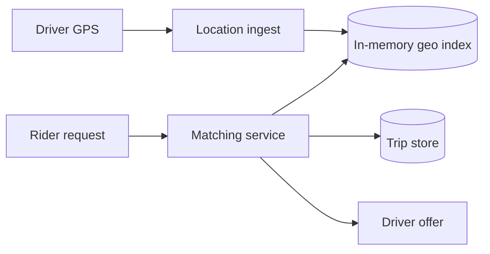

Ride Sharing 的难点不是创建订单，而是同时处理两种很不对称的 workload：司机不断上报 GPS，乘客偶尔发起一次要求几十毫秒返回的 nearest-driver 查询。

如果 100 万司机每 3 秒上报一次位置，就是约 33 万次写入/秒。把每次 GPS 都先写关系数据库，再做经纬度范围查询，会让 durable store 承担一个它不擅长的 hot path。

> 对应实验：[打开 Ride Sharing Lab](https://lab.zichaoyang.com/system-design/ride-sharing/)。提高司机数、GPS 频率、cell 密度和搜索半径，观察真正瓶颈。

## 概念阶梯

- **Geo cell**：把地图切成 geohash、S2 或 quadtree cell，附近搜索从“扫全世界”变成“查当前及相邻 cell”。
- **Location index**：只保存在线司机最新位置的内存结构，可重建、低延迟、写频繁。
- **Trip state machine**：`requested -> offered -> accepted -> picked_up -> completed` 的 durable 状态，不能和易逝 GPS 混在一起。

## 主链路

Matching service 查询附近候选，再结合 ETA、司机状态和过滤规则排序。对候选司机发 offer 时要用 lease 或条件写，避免两个乘客同时抢到同一司机。

## 为什么按城市分片

叫车天然是本地问题。旧金山乘客不需要扫描纽约司机。按城市或运营 region 切分，可以让 location index、matching 和 trip store 就近运行，也限制故障范围。热点机场再细分 cell 或复制只读索引，不能只靠“更多全局 shard”。

## 常见难点

- GPS 是有噪声且可能乱序的。每次更新携带 timestamp/sequence，旧位置不能覆盖新位置。
- driver disconnect 后，旧位置必须 TTL 过期，否则会匹配到幽灵司机。
- 扩大搜索半径会增加候选与 ETA 调用量，应分圈渐进搜索，而不是一次扫巨大区域。
- surge pricing 是区域供需聚合的旁路系统，不应阻塞每次位置更新。

## 面试表达

> The write-heavy path is driver location ingestion, while the latency-sensitive path is nearest-driver lookup. I would keep fresh locations in a regional in-memory geo index and store trip state durably in a separate state machine.

高层图后可深入 geo indexing、double assignment、location freshness 或 surge。重点是区分 ephemeral location 与 durable trip。
