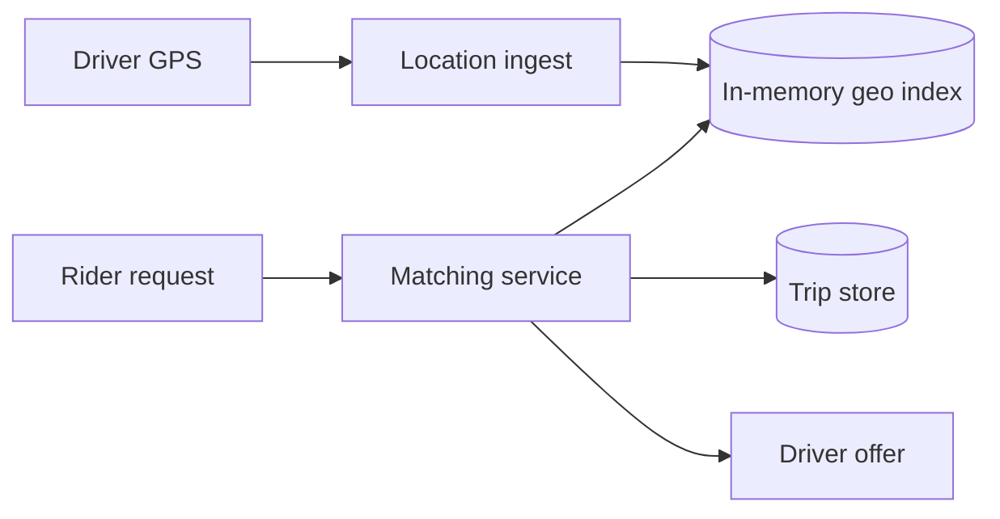

Ride Sharing 的难点不是创建订单，而是同时处理两种很不对称的 workload：司机不断上报 GPS，乘客偶尔发起一次要求几十毫秒返回的 nearest-driver 查询。

如果 100 万司机每 3 秒上报一次位置，就是约 33 万次写入/秒。把每次 GPS 都先写关系数据库，再做经纬度范围查询，会让 durable store 承担一个它不擅长的 hot path。

> 对应实验：[打开 Ride Sharing Lab](https://lab.zichaoyang.com/system-design/ride-sharing/)。提高司机数、GPS 频率、cell 密度和搜索半径，观察真正瓶颈。

## 需求边界（Requirements）

功能上支持司机位置、乘客叫车、offer、接受与行程状态；定价和导航后置。非功能上匹配 p99 约 500ms，同一司机不能被双重分配，位置可短暂丢失但 trip state 必须 durable，故障范围应限制在城市/region。

## 0. 先搭一个城市内的 MVP Scaffold

第一版只服务一个城市：司机上线并每 5 秒发位置，乘客请求附近司机，系统按直线距离选择最近空闲司机，创建 trip。应用进程内维护司机位置 map，PostgreSQL 持久化司机、乘客和 trip。先不做 surge、路线 ETA 和跨城市。

关键是先实现 trip 状态机与司机占用的条件更新；如果两位乘客可以同时匹配同一司机，地理索引再快也没意义。

## 1. API：位置与行程分开

```http
PUT /v1/drivers/d-9/location
{"lat":37.77,"lng":-122.41,"sequence":188,"recordedAt":"..."}

POST /v1/rides
Idempotency-Key: rider-42-request-7
{"pickup":{"lat":37.78,"lng":-122.40},"destination":{...}}
```

位置 API 高频、last-write-wins；ride API 低频但要求幂等和 durable state。司机接受 offer 使用带 version 的条件写。

## 2. 数据模型（Data Model）

```text
Driver(driver_id PK, city_id, status, state_version)
DriverLocation(driver_id PK, cell_id, lat, lng, sequence, updated_at, expires_at)
Ride(ride_id PK, rider_id, driver_id, state, version, pickup, destination, created_at)
RideEvent(ride_id, sequence, type, payload, created_at)
Offer(offer_id PK, ride_id, driver_id, state, expires_at)
```

Location 是易逝派生状态，可从 GPS stream 重建；RideEvent 是审计与恢复依据。

## 3. 单机端到端流程

司机位置到达后丢弃旧 sequence，更新 map 和 cell membership。Ride request 查当前及邻近 cell，过滤 TTL 过期与非 available driver，按距离排序，创建短 lease offer。司机接受时事务性把 Driver 从 available 改为 assigned，并推进 Ride；条件失败就试下一个候选。

## 4. 容量估算：GPS firehose 远大于下单

100 万在线司机每 3 秒更新一次，约 333k writes/s；10 万 ride request/s 则每次要查多个 cell。每条位置状态按 200 bytes 约 200MB，内存不大，写入与索引更新才是压力。若机场 cell 有 5 万司机，单 cell scan 会击穿 latency。

## 5. Latency Budget：匹配要在几百毫秒内闭环

目标 p99 可设 500ms：请求验证 20ms，geo lookup 50ms，候选 ETA 150ms，offer/lease 200ms，余量 80ms。不要对所有候选调用精确路线服务；先按几何距离缩到小集合，再算 ETA。

## 6. Correctness and Reliability

GPS 更新按 sequence 防乱序，位置 TTL 防幽灵司机。Ride/Driver 状态使用 compare-and-swap，所有 transition 写事件。Offer 超时释放司机；matching worker crash 后由 lease recovery 继续。支付和行程状态通过 saga 关联，不做跨服务大事务。

## 7. Trade-offs：新鲜度、精度和局部性

- GPS 更频繁匹配更准，却增加电量、网络和 ingest。
- 小 geo cell 查询精准但跨 cell 扩圈多；大 cell 管理简单却产生密集热点。
- 精确 ETA 提升质量但昂贵；两阶段筛选把计算留给少量候选。

## 概念阶梯

- **Geo cell**：把地图切成 geohash、S2 或 quadtree cell，附近搜索从“扫全世界”变成“查当前及相邻 cell”。
- **Location index**：只保存在线司机最新位置的内存结构，可重建、低延迟、写频繁。
- **Trip state machine**：`requested -> offered -> accepted -> picked_up -> completed` 的 durable 状态，不能和易逝 GPS 混在一起。

## 主链路



Matching service 查询附近候选，再结合 ETA、司机状态和过滤规则排序。对候选司机发 offer 时要用 lease 或条件写，避免两个乘客同时抢到同一司机。

## 为什么按城市分片

叫车天然是本地问题。旧金山乘客不需要扫描纽约司机。按城市或运营 region 切分，可以让 location index、matching 和 trip store 就近运行，也限制故障范围。热点机场再细分 cell 或复制只读索引，不能只靠“更多全局 shard”。

## 常见难点

- GPS 是有噪声且可能乱序的。每次更新携带 timestamp/sequence，旧位置不能覆盖新位置。
- driver disconnect 后，旧位置必须 TTL 过期，否则会匹配到幽灵司机。
- 扩大搜索半径会增加候选与 ETA 调用量，应分圈渐进搜索，而不是一次扫巨大区域。
- surge pricing 是区域供需聚合的旁路系统，不应阻塞每次位置更新。

## 面试表达

> The write-heavy path is driver location ingestion, while the latency-sensitive path is nearest-driver lookup. I would keep fresh locations in a regional in-memory geo index and store trip state durably in a separate state machine.

高层图后可深入 geo indexing、double assignment、location freshness 或 surge。重点是区分 ephemeral location 与 durable trip。
