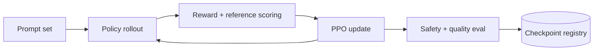

RLHF 的系统难点在于把数据收集、generation、scoring 和 training 串成可追踪闭环。PPO 路径尤其昂贵，因为 policy 不只训练，还要不断生成新 rollout。

> 对应实验：[打开 RLHF Pipeline Lab](https://lab.zichaoyang.com/system-design/rlhf-pipeline/)。改变 rollout 数、模型大小、PPO epoch，并切换 DPO，观察 pipeline 成本如何变化。

## 需求边界（Requirements）

功能上收集 preference、训练 reward/DPO/PPO、生成 rollout、评估和注册 policy。非功能上要求数据/模型 lineage、标注质量、可恢复训练和安全 gate；pipeline throughput 不能以 reward hacking 为代价。

## 0. 先搭 SFT + Preference 数据 MVP Scaffold

先完成一条离线链：固定 base model 和 prompt set，收集示范做 SFT；对同一 prompt 生成两个回答，匿名随机展示给标注员，记录 chosen/rejected；用这些 pair 先跑 DPO 或训练 reward model。先不闭合 PPO loop。

这个脚手架必须追踪每条回答来自哪个 policy version、sampling config 和 prompt version，并测 annotator agreement。否则后面 reward 变高也无法解释。

## 1. API：标注任务与训练 Run 分离

```http
POST /v1/preference-tasks
{"promptId":"p-7","responseIds":["r-a","r-b"],"rubricVersion":"safe-helpful-v3"}

POST /v1/alignment-runs
{"method":"dpo","policyVersion":"sft-18","preferenceDataset":"prefs-22","config":{}}
```

标注 API 防止把 response 顺序、模型名暴露给 annotator。Training API 异步返回 run ID。

## 2. 数据模型（Data Model）

```text
Prompt(prompt_id, source, text_hash, policy_scope, version)
Response(response_id, prompt_id, policy_version, sampling_config, text_object)
Preference(pair_id, chosen_id, rejected_id, annotator_id, rubric_version, confidence)
AlignmentRun(run_id, method, policy_version, dataset_version, reward_version, state)
Rollout(rollout_id, run_id, prompt_id, response_id, reward, kl, advantage)
Evaluation(run_id, suite_version, slice, metric, value)
```

Preference dataset immutable versioned；修正标注生成新版本，不原地覆盖。

## 3. 单机端到端流程

MVP 从固定 pair dataset 读取 chosen/rejected，加载 SFT policy 和 reference，执行 DPO loss，定期在 held-out prompt eval，输出 checkpoint。若走 reward model，则先训练 scorer 并验证 held-out ranking accuracy，再离线给样本打分。

## 4. 容量估算：PPO 的主要成本是生成

每 step 生成 100k rollout、平均 512 token，就是 5120 万 output token；每个还需 reward/reference forward，再做多轮 PPO epoch。若 generation 50k token/s，单 step 光 rollout 就约 17 分钟且未算打分训练。规模化首先扩 rollout inference，而不是盲目增加 trainer。

## 5. Latency Budget：这里优化 pipeline cycle time

关注 prompt queue age、rollout tokens/s、reward scoring throughput、trainer idle time 和一次 eval gate 时长。Generation、scoring、training 用 versioned dataset 解耦，避免任一阶段慢时整组 GPU 空等。

## 6. Correctness and Reliability

Run 绑定 policy、reference、reward、dataset 和 config。Rollout task 幂等并带 sampling seed。Checkpoint 可恢复 optimizer 与 dataloader。Eval gate 覆盖 safety、helpfulness、regression 和 reward hacking；未通过不得注册。人类标注 PII 与访问权限单独治理。

## 7. Trade-offs：PPO 与 DPO 的真实交换

- DPO pipeline 简单稳定，但只能学习已有 preference 分布。
- PPO 能在线探索并直接优化 reward，却耦合 generation、scoring、training，稳定性和成本更差。
- KL 强约束保守但限制改进；过弱容易 reward hacking。
- 更频繁 eval 降低风险，却减少有效训练吞吐。

## 概念阶梯

- **SFT**：先用高质量示范把 base model 训练成能遵循指令的 policy。
- **Preference pair**：对同一 prompt 的两个回答标记 chosen/rejected。
- **Reward model**：把人类比较学成标量分数，供 RL 优化。
- **KL penalty**：限制新 policy 偏离 reference model，防止为了高 reward 走向极端。
- **DPO**：直接从 preference pair 优化 policy，去掉在线 rollout-reward PPO loop。

## PPO 主环



Rollout generation 往往是瓶颈，因为每个 completion 都执行长序列 inference。可以独立扩展 rollout worker，并把生成结果作为 versioned dataset 交给 trainer，避免推理和训练资源互相阻塞。

## 为什么 DPO 更简单但不是免费午餐

DPO 去掉 reward model 在线打分和 PPO loop，工程稳定性更好。但它的学习边界受已有 preference 数据限制，无法像 online RL 那样持续探索新 response。选择取决于数据质量、计算预算和风险，而不是“新方法一定更好”。

## 常见难点

- Preference 数据要记录 policy version、prompt source 和 annotator agreement。
- Reward model 可能被 policy exploit，需要 held-out eval 与人工审查。
- Eval 不应只看平均 reward，还要覆盖 safety slice、regression 和 length bias。
- 每个 checkpoint 必须能追溯到数据、reward/reference/policy 版本与配置。

## 面试表达

> I would separate rollout generation, reward scoring, policy optimization, and gated evaluation so each stage can scale independently and remain reproducible.

先解释 loop，再谈集群。让面试官选择 PPO vs DPO、rollout throughput、reward hacking 或 evaluation gate。
