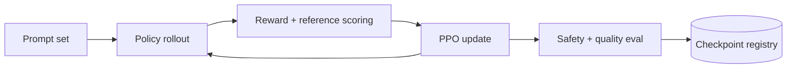

RLHF 的系统难点在于把数据收集、generation、scoring 和 training 串成可追踪闭环。PPO 路径尤其昂贵，因为 policy 不只训练，还要不断生成新 rollout。

> 对应实验：[打开 RLHF Pipeline Lab](https://lab.zichaoyang.com/system-design/rlhf-pipeline/)。改变 rollout 数、模型大小、PPO epoch，并切换 DPO，观察 pipeline 成本如何变化。

## 概念阶梯

- **SFT**：先用高质量示范把 base model 训练成能遵循指令的 policy。
- **Preference pair**：对同一 prompt 的两个回答标记 chosen/rejected。
- **Reward model**：把人类比较学成标量分数，供 RL 优化。
- **KL penalty**：限制新 policy 偏离 reference model，防止为了高 reward 走向极端。
- **DPO**：直接从 preference pair 优化 policy，去掉在线 rollout-reward PPO loop。

## PPO 主环

Rollout generation 往往是瓶颈，因为每个 completion 都执行长序列 inference。可以独立扩展 rollout worker，并把生成结果作为 versioned dataset 交给 trainer，避免推理和训练资源互相阻塞。

## 为什么 DPO 更简单但不是免费午餐

DPO 去掉 reward model 在线打分和 PPO loop，工程稳定性更好。但它的学习边界受已有 preference 数据限制，无法像 online RL 那样持续探索新 response。选择取决于数据质量、计算预算和风险，而不是“新方法一定更好”。

## 常见难点

- Preference 数据要记录 policy version、prompt source 和 annotator agreement。
- Reward model 可能被 policy exploit，需要 held-out eval 与人工审查。
- Eval 不应只看平均 reward，还要覆盖 safety slice、regression 和 length bias。
- 每个 checkpoint 必须能追溯到数据、reward/reference/policy 版本与配置。

## 面试表达

> I would separate rollout generation, reward scoring, policy optimization, and gated evaluation so each stage can scale independently and remain reproducible.

先解释 loop，再谈集群。让面试官选择 PPO vs DPO、rollout throughput、reward hacking 或 evaluation gate。
