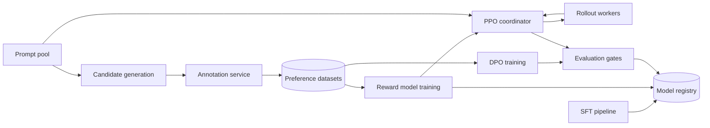

RLHF 经常被压缩成三个方框：先做监督微调，再训练 reward model，最后跑 PPO。这样背流程很容易，却不容易看出它为什么是一个系统设计问题。

真正的难点是数据和模型之间存在一条很长的版本链：哪一个 policy 生成了候选答案，哪一版标注规范让人类做了选择，reward model 看过哪些样本，optimizer 又从哪个 checkpoint 出发。只要其中一个版本对不上，训练仍然会跑完，但结果可能无法解释、无法复现，也无法安全发布。

所以这道题的核心是：**怎样把昂贵、异步、带有人类噪声的反馈，变成一条可追溯、可恢复、可评估的模型改进流水线。**

> 配套实验：[打开 RLHF Pipeline Lab](https://lab.zichaoyang.com/system-design/rlhf-pipeline/)。先用很小的 rollout 和单个 epoch 理解数据流，再比较 PPO 与 DPO，不要先把 GPU 数拉满。

## 从一条 preference pair 开始

给定 prompt：

```text
Explain why the sky appears blue to a 10-year-old.
```

Policy 生成两个候选答案 A 和 B。标注员根据“准确、清楚、不误导”的 rubric 选择 A：

```text
(prompt, chosen=A, rejected=B)
```

这条 pair 看起来简单，但系统必须回答：

- A、B 是哪一个 policy checkpoint、用什么 sampling 参数生成的？
- 两个答案是否因为展示顺序产生 position bias？
- 标注员看到的是哪一版 rubric？
- prompt 是否含有隐私信息，能否进入训练集？
- 这条样本属于 train、validation 还是 safety holdout？
- 若之后发现标注错误，哪些 reward model 和 policy 受过影响？

如果这些问题答不上来，系统拥有的不是训练数据，而是一堆无法治理的文本。

## 先把四个阶段讲清楚

**SFT（Supervised Fine-Tuning）**

用人工写出的高质量 `(prompt, response)` 教模型先学会基本指令跟随。它给后续对齐一个可用起点。

**Preference collection**

对同一个 prompt 生成多个候选，让人类或可靠的自动评估器比较哪一个更好。结果通常是 chosen/rejected pair，也可以是完整排序。

**Reward model**

学习一个函数，为 `(prompt, response)` 打出代表人类偏好的分数。它把离散比较变成可用于优化 policy 的训练信号。

**Policy optimization**

PPO 路线让当前 policy 生成 rollout，由 reward model 打分，再更新 policy，同时用 KL 约束它不要偏离 reference model 太远。DPO 则直接从 preference pair 优化 policy，不单独部署一个在线 reward scoring loop。

这两条路线不是“新方法一定替代旧方法”。它们对在线 rollout、实现复杂度、可控性和数据分布有不同要求。

## 题目边界和成功标准

本文平台支持：

1. 从指定 base model 运行 SFT；
2. 生成候选并分发人类偏好标注；
3. 构建版本化 preference dataset；
4. 训练 reward model；
5. 运行 PPO 或 DPO policy optimization；
6. 通过离线、人工和 safety evaluation 后注册模型。

不展开通用数据湖、底层 CUDA kernel 和在线推理平台。它们是依赖，但本文重点是对齐流水线的编排与 lineage。

非功能要求包括：

- 相同 code、data、config 和 base checkpoint 能重放一个 run；
- 任一 stage 失败后从 checkpoint 恢复，而不是从头烧 GPU；
- 训练数据、标注员身份和模型 artifact 有权限隔离；
- 任何进入生产的模型都能追溯到 evaluation 和审批；
- 数据删除或严重标注问题可以完成影响分析。

## 第一版：先做 SFT，不要一上来跑完整 RLHF

先准备一份小型、人工检查过的 JSONL：

```json
{"exampleId":"sft-1","prompt":"...","response":"...","source":"expert","license":"internal-v1"}
```

固定 dataset manifest：

```text
DatasetVersion(
  dataset_id,
  version,
  manifest_uri,
  content_hash,
  schema_version,
  filter_policy_version,
  created_at
)
```

训练 run 显式 pin 住所有输入：

```yaml
run_id: sft-run-17
base_checkpoint: base-7b@sha256:...
dataset: instruction-data@v3
code_revision: 3ac41e2
tokenizer_version: tok-v5
seed: 42
hyperparameters:
  learning_rate: 2e-5
  epochs: 2
  global_batch_size: 128
```

第一版的产物不只是 weights，还包括 config、metrics、日志、environment image 和 evaluation report。只有 weights 的训练结果无法复现。

## 第二版：搭出最小 preference collection

对一批固定 prompt，用同一个 policy checkpoint 生成两个候选。每个候选都保存 generation metadata：

```text
Candidate(
  candidate_id,
  prompt_id,
  policy_checkpoint,
  tokenizer_version,
  sampling_config,
  random_seed,
  response_text,
  safety_filter_version
)
```

标注任务随机交换 A/B 顺序，避免“左边更容易被选”的位置偏差：

```text
PreferenceLabel(
  task_id,
  prompt_id,
  chosen_candidate_id,
  rejected_candidate_id,
  rubric_version,
  annotator_id,
  display_order,
  reason_codes,
  created_at
)
```

不能只保存 `chosen_text` 和 `rejected_text`。候选 ID 是把标注结果连回 policy、sampling 和 prompt lineage 的关键。

最小标注工作流还要支持 `tie`、`both_bad` 和 `cannot_judge`。强迫标注员在两个都错误的答案中选一个，会把错误偏好写进数据。

## Reward model：先验证排序，不要只看 loss

Reward model 接收 prompt 和 response，输出一个标量。Pairwise 训练希望：

$$
r(x, y_{chosen}) > r(x, y_{rejected})
$$

常见 pairwise loss 可以写成：

$$
-\log \sigma(r_{chosen} - r_{rejected})
$$

但训练 loss 下降并不代表 reward 有用。至少要在未参与训练的 holdout 上看 pairwise accuracy，并按语言、主题、安全类别和答案长度切片。

Reward model 很容易学到捷径，例如“更长的答案分更高”或“特定格式分更高”。因此 evaluation 要包含长度匹配 pair、对抗样本和人工复核，而不是只有一个总准确率。

## PPO 路线：系统为什么复杂

PPO 阶段同时涉及四类模型状态：

- actor / policy：正在被更新的模型；
- reference model：用于计算 KL，通常固定；
- reward model：给 rollout 打分；
- critic / value model：估计回报，帮助 PPO 更新。

一轮简化数据流是：

```text
prompts
-> actor generates rollouts
-> reward model scores responses
-> reference computes KL penalty
-> critic estimates values
-> build advantages
-> PPO updates actor and critic
```

Rollout 必须绑定“生成时的 actor version”。如果 optimizer 已经更新了 actor，却拿旧 policy 生成的数据无限训练，分布会越来越 off-policy。

```text
Rollout(
  rollout_id,
  prompt_id,
  actor_checkpoint,
  reference_checkpoint,
  reward_model_checkpoint,
  tokens,
  token_log_probs,
  reward_components,
  created_at
)
```

为了吞吐，rollout generation 和 training 往往异步运行；为了算法稳定，又不能让 rollout 太旧。系统要给 rollout 设置 policy-lag 上限，超出后丢弃或降权。

## DPO 路线：少了在线 rollout，但没有少掉数据工程

DPO 直接使用 `(prompt, chosen, rejected)`，比较 policy 与 reference 对 chosen/rejected 的相对偏好。它不需要在训练环中部署独立 reward model 和 critic，因此系统更简单、稳定性通常更容易控制。

但 DPO 并没有消除以下问题：

- preference dataset 的质量与偏差；
- reference checkpoint 和 tokenizer 绑定；
- 样本去重、泄漏和 train/eval split；
- safety regression 与 release gate；
- 数据分布落后于当前模型能力。

选择 PPO 还是 DPO，应从“是否需要在线探索与显式 reward control”出发，而不是把 DPO 当成一个少写几个服务的快捷键。

## API 和运行对象

训练任务是长时间异步资源：

```http
POST /v1/alignment-runs

{
  "type": "dpo",
  "baseCheckpoint": "sft-7b@v12",
  "referenceCheckpoint": "sft-7b@v12",
  "dataset": "preference@v31",
  "config": "dpo-default@v4"
}
```

```http
202 Accepted

{"runId":"align-83","state":"queued"}
```

需要查询、取消和比较：

```http
GET    /v1/alignment-runs/align-83
DELETE /v1/alignment-runs/align-83
GET    /v1/alignment-runs/align-83/metrics
POST   /v1/alignment-runs/compare
```

标注平台 API 与训练 API 分开，因为它们的用户、权限和吞吐完全不同：

```http
POST /v1/annotation-batches
GET  /v1/annotation-tasks/next
POST /v1/annotation-tasks/task-9/labels
```

## 高层架构：把数据闭环画出来



中间层还有共享能力：dataset registry、artifact store、GPU scheduler、checkpoint service、experiment tracker 和 lineage catalog。它们不应该被复制进每个 stage 的脚本里。

Coordinator 只管理状态和依赖，不搬运 TB 级 checkpoint。训练 worker 通过 object storage 或高吞吐 checkpoint store 读写 artifact，control plane 保存 URI、hash 和状态。

## 容量估算：Rollout 往往比优化更贵

假设每天要收集 1,000 万个 prompt 的两个候选，每个候选平均 500 output tokens：

```text
10M × 2 × 500 = 10B generated tokens/day
```

平均约：

```text
10B / 86,400 ≈ 116K output tokens/s
```

这还没算 prompt prefill。它说明 candidate generation 本身就是一套大规模推理平台，需要 batching、KV 管理和模型版本固定。

若 PPO 每轮为 100 万 prompts 生成 1,000 tokens，就是 10 亿 rollout tokens/iteration。增加 `PPO epochs` 不会增加 rollout 数，却会增加同一批数据上的优化计算，并可能加剧 overfitting。

Checkpoint 也不能忽略。一个数百 GB 的模型每 30 分钟保存一次，100 个并发 run 会给存储带来持续的大吞吐和大量版本。需要 retention policy：保留 best、latest、milestone 和故障恢复点，不是永久保存每个 step。

## 资源调度：不同 stage 不能只按 GPU 数排队

Candidate generation 需要高吞吐 inference；reward model 和 DPO 是相对标准的 distributed training；PPO 同时运行 rollout 与 optimization，资源形态最复杂。

Job spec 至少声明：

```text
GPU type and count
expected duration
network topology requirement
checkpoint bandwidth
priority and preemption policy
gang scheduling requirement
```

分布式训练通常要求 gang scheduling：所需 worker 要么一起启动，要么都不启动。只分配一半 GPU 让它们空等，既不能训练又浪费资源。

低优先级实验可以被抢占，但前提是 checkpoint 时间小于可接受的重做窗口。若保存一次 checkpoint 要 20 分钟，“随时可抢占”只是纸面能力。

## 故障恢复和幂等

**Stage retry**

每个 stage 的输出 artifact key 由 input versions、code revision 和 config hash 决定。相同输入重试时复用完整产物，不能创建一个难以区分的新 dataset。

**Worker failure**

从最近一致 checkpoint 恢复 optimizer、scheduler、random state 和 data-loader position。只恢复 weights 会改变后续训练轨迹。

**部分 rollout 丢失**

Rollout batch 有 manifest 和 expected count。Coordinator 只在达到完整性条件后发布给 optimizer，或明确记录采样缺失；不能把静默缺失当正常数据。

**脏标注回滚**

通过 lineage 查询某个 annotation batch 影响的 dataset、reward model、policy 和 deployment。没有这条反向索引，就无法回答“哪些模型需要撤回”。

**取消**

先停止新 rollout 和新 optimizer step，再写最终 checkpoint、flush metrics，最后释放 gang。强杀所有进程会让 run 永远停在含糊的 `running`。

## 评估门禁：Reward 高不等于模型更好

每个候选 policy 至少经过：

- 固定任务集上的能力与格式评估；
- 人类 pairwise blind evaluation；
- safety、privacy 和 refusal regression；
- 多语言与长尾切片；
- 与当前生产模型的成本、latency 比较；
- reward hacking 检查。

Evaluation dataset 必须与训练数据去重，并固定版本。若每次 release 都换题，指标上涨可能只是测试集变简单。

发布不是“某个 reward 超过阈值就自动上线”。Registry 记录所有 gate、人工审批和已知风险；canary 只接小比例流量，并保留快速回滚到上一 immutable checkpoint 的能力。

## 关键指标

数据层：标注吞吐、inter-annotator agreement、tie/both-bad 比例、rubric version 分布、dataset freshness。

训练层：tokens/s、GPU utilization、policy lag、checkpoint 时间、worker failure、reward/advantage/KL 分布。

质量层：pairwise win rate、safety regression、能力切片、reward model holdout accuracy、长度与格式偏差。

成本层：每千 preference、每百万 rollout token、每次可发布 checkpoint 的总 GPU-hours。

不要只监控平均 reward。Reward 突然上升，可能是 policy 找到了 reward model 的漏洞。

## 关键取舍

**更多 rollout** 提供更丰富的当前 policy 数据，也直接增加最昂贵的生成成本。

**更多 PPO epoch** 提高样本复用，却可能让 policy 过度贴合一批旧 rollout。

**更频繁 checkpoint** 缩短故障重做，代价是训练暂停和存储吞吐。

**更快自动发布** 缩短迭代周期，也扩大 evaluation 漏洞进入生产的概率。Alignment 模型尤其需要明确的人类 gate。

**PPO** 能显式组合 reward、在线采样和约束，但系统复杂、训练更敏感；**DPO** 流水线更短，却更依赖高质量、代表当前使用场景的 preference data。

## 用 Lab 理解瓶颈怎么移动

**实验一：增加 rollout 数**

保持模型和 PPO epoch 不变，只增加 rollout。观察推理侧成本先膨胀，问自己是否有足够新信息值得这些 token。

**实验二：增加模型和 GPU**

观察瓶颈从单卡显存移动到互联与 checkpoint。更多 GPU 不一定线性缩短 wall-clock time。

**实验三：PPO 与 DPO**

切换两条路线，列出消失的组件和仍然存在的数据治理问题。重点不是谁“更先进”，而是哪条路线满足当前目标。

## 面试表达：把版本链说清楚

可以这样开场：

> I would treat RLHF as a versioned data-and-model pipeline. Every preference must trace back to the policy that generated its candidates, and every trained checkpoint must trace back to immutable data, code, configuration, and evaluation artifacts.

然后按真实演化顺序讲：

```text
SFT with pinned data
-> candidate generation
-> bias-aware annotation
-> reward-model validation
-> PPO or DPO
-> evaluation gates
-> registry and canary release
```

主链路完成后再深入：

> I can go deeper into rollout-policy lag, distributed checkpoint recovery, preference-data quality, or the PPO-versus-DPO trade-off.

这比只画 `SFT -> RM -> PPO` 多走了一步，但正是这一步把算法名词变成了可运营的系统。

## 参考资料

- [Training language models to follow instructions with human feedback](https://arxiv.org/abs/2203.02155)
- [Proximal Policy Optimization Algorithms](https://arxiv.org/abs/1707.06347)
- [Direct Preference Optimization: Your Language Model is Secretly a Reward Model](https://arxiv.org/abs/2305.18290)
- [DeepSpeed-Chat: Easy, Fast and Affordable RLHF Training](https://arxiv.org/abs/2308.01320)
