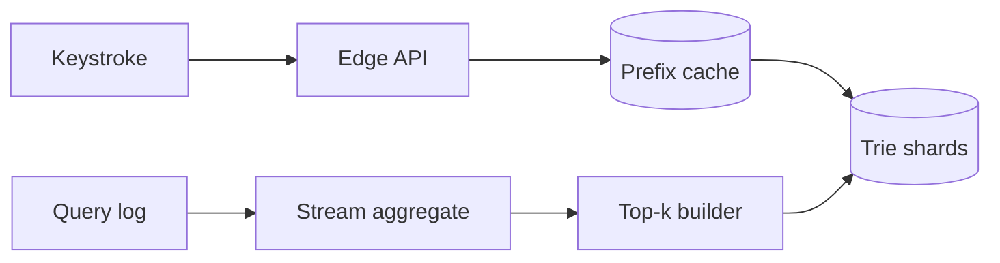

Autocomplete 看似在“搜索字符串”，实际上是在极紧的延迟预算里回答：**这个 prefix 对应的 top-k completion 是什么？**

用户输入 `ca`。如果系统临时扫描所有以 `ca` 开头的词，再按热度排序，每次按键都会重复做昂贵工作。更自然的办法是提前在 prefix 节点上保存 top-k，例如 `car, cat, camera`，查询只需沿着 `c -> a` 走两步。

> 对应实验：[打开 Search Autocomplete Lab](https://lab.zichaoyang.com/system-design/search-autocomplete/)。改变词表大小、热门 prefix 占比和更新新鲜度，观察读路径与更新 pipeline 的变化。

## 概念阶梯

- **Trie**：把共同 prefix 共享起来的树。查询成本与 prefix 长度相关，而不是词表总量。
- **Top-k materialization**：在每个节点预先保存最热门的 k 个候选，用额外空间换低延迟读取。
- **Freshness lag**：真实搜索趋势变化后，多久反映到候选中。它决定更新是小时级 batch 还是分钟级 stream。

## 读写两条路径

读路径必须短：normalize prefix、查 cache/trie、返回候选。统计、反作弊和 top-k 重建在异步写路径完成，不能塞进一次按键请求。

## 为什么不能只说“用 Trie”

单个内存 trie 解决的是算法，不是完整系统。词表超过单机内存后，可按 prefix range 分片；热门 prefix 的请求高度倾斜，需要复制热点 shard 或在 edge cache；趋势更新要求 query log 聚合并增量发布新版本。发布时采用 immutable snapshot 加版本切换，可以避免用户读到一半更新的数据结构。

个性化又会改变问题。共享 top-k 容易缓存，但 per-user ranking 依赖历史。常见做法是先取全局或地域候选，再用少量用户特征 rerank，而不是为每个用户维护一棵 trie。

## 常见难点

- 输入 `c` 的 QPS 远高于 `camera`，分片均匀不代表负载均匀。
- fuzzy matching 会扩大搜索空间，应作为有预算的 fallback，而不是每次默认执行。
- 热门趋势可能被机器人操纵，聚合 pipeline 需要去重、限频和质量过滤。
- 候选内容还要过安全和政策过滤，不能只按频率输出。

## 面试表达

> I would precompute top-k completions at trie nodes so lookup cost depends on prefix length, then separate the latency-critical read path from the asynchronous popularity pipeline.

主设计讲清 trie、cache、更新 pipeline 后，再深入 hot prefix、freshness 或 personalization。容量估算只需要证明每次按键会放大读 QPS，以及 materialized top-k 的内存成本。
