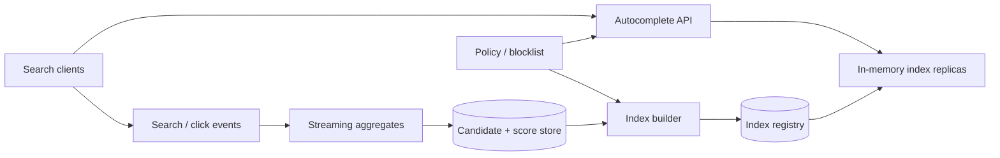

Autocomplete 的接口很小：用户输入几个字符，系统返回 5–10 个建议。但它运行在每一次键盘输入上；一次完整搜索可能触发 5–20 个请求，而且用户会直接感受到每个字符后的停顿。

更难的是建议并不只是“所有以 prefix 开头的字符串”。它还要考虑热度、新鲜度、语言、拼写、用户历史和安全过滤，同时不能让昨天的热门词永久占据第一名。

这道题的核心是：**把昂贵的候选统计和排序尽量提前计算，让在线路径只做一次有界 prefix lookup 与少量合并。**

> 配套实验：[打开 Search Autocomplete Lab](https://lab.zichaoyang.com/system-design/search-autocomplete/)。先调整词表大小和热门 prefix，观察在线查询；再收紧更新 freshness，观察写侧索引构建成本。

## 为什么数据库 `LIKE 'app%'` 很快会不够

第一版可以查询：

```sql
SELECT query, score
FROM suggestions
WHERE normalized_query LIKE 'app%'
ORDER BY score DESC
LIMIT 10;
```

有合适的前缀索引时，它不是完全不可用。但若 `app` 匹配 100 万个词条，数据库仍要在大范围中找 top 10；每次按键都做一次，热门前缀会反复扫描相同区间。

更有效的思路是：索引构建时就把每个 prefix 的 top-k 放在节点上。在线输入 `app`，直接读这个节点保存的 10 个 ID，不再遍历 100 万 descendants。

这把计算从 read time 移到了 index build time。

## 先讲清 Query、Prefix 和 Score

**Query candidate**

一个可以展示的完整建议，例如“apple watch”。它有原始文本、规范化文本、语言、类型和安全状态。

**Prefix**

用户已经输入的规范化字符串。Unicode、大小写、重音、全角半角和分词规则都会影响 prefix 匹配。

**Score**

候选的排序值，通常组合搜索次数、点击、时间衰减、质量和趋势。它不是只累加 lifetime count。

**Trie / FST**

Trie 按字符共享前缀；FST/DAWG 等压缩结构进一步共享后缀或编码权重。在线系统不一定要自己实现，但要理解查询为何是沿 prefix 走固定步数。

## 题目边界

核心功能：

1. 输入 prefix 返回 top 10 建议；
2. 按 locale、市场和内容类型过滤；
3. 热度按近期行为更新；
4. 支持用户历史的轻量个性化；
5. 过滤违法、成人、隐私和已删除候选；
6. 允许 typo/fuzzy suggestion；
7. 索引版本可灰度和回滚。

第一版不设计完整搜索结果排名和广告建议。Autocomplete 只产出查询/实体候选。

非功能目标：

- 服务端 p99 例如低于 20–30ms；
- 可用性高，故障时可以退回旧索引或本地热门；
- 热门 prefix 不形成单 shard 热点；
- 新趋势在几分钟内出现，违规词在更短时间内消失；
- 同一次键入的旧响应不能覆盖新 prefix；
- 用户历史和敏感 query 不泄露。

## 第一版：内存有序词表

从 10 万条候选开始，启动时加载：

```text
Suggestion(
  suggestion_id,
  display_text,
  normalized_text,
  locale,
  score,
  state
)
```

按 `normalized_text` 排序。查询 prefix 时用 binary search 找到下界，再向后扫描所有 prefix match，维护 top 10。

```python
def autocomplete(prefix, limit=10):
    normalized = normalize(prefix)
    start = lower_bound(sorted_suggestions, normalized)

    candidates = []
    for suggestion in sorted_suggestions[start:]:
        if not suggestion.normalized_text.startswith(normalized):
            break
        candidates.append(suggestion)

    return top_by_score(candidates, limit)
```

这版能验证 normalization、score 和 API，但热门短 prefix 扫描量大。下一步才引入 precomputed top-k。

## API：客户端的 Sequence 也很重要

```http
GET /v1/autocomplete?q=app&locale=en-US&limit=10&requestSequence=17
```

```json
{
  "normalizedPrefix":"app",
  "requestSequence":17,
  "suggestions":[
    {"text":"apple","type":"query","reason":"TRENDING"},
    {"text":"apple watch","type":"query","reason":"POPULAR"}
  ],
  "indexGeneration":"en-US@2026-07-13T17:00"
}
```

用户迅速输入 `a -> ap -> app`，网络可能让 `ap` 的响应最后到达。客户端只应用最新 sequence，避免 UI 倒退。

客户端应 debounce 约几十毫秒并取消旧请求，但服务端仍要能处理取消传播和大量短请求。Empty prefix 是否返回 trending 由产品决定。

## 第二版：Trie 节点保存 Top-k

```text
root
  └─ a [top: amazon, apple, airbnb]
      └─ p [top: apple, app store, apple watch]
          └─ p [top: apple, app store, apple watch]
```

构建时，对每个 suggestion 的每个 prefix 更新 top-k。查询复杂度大致是：

```text
O(prefix length + k)
```

而不是 O(prefix 下所有候选)。

内存问题：若 1 亿词条、平均 20 字符，朴素节点/指针会很大。可用：

- 压缩 radix tree，把单分支路径合并；
- 节点只存 suggestion ID 和量化 score；
- 高频短 prefix 存更大 top-k，长 prefix 更小；
- FST/DAWG 压缩重复结构；
- 按 locale 和首字符范围分片。

先 benchmark 数据分布，再选结构。Trie 是概念，不一定是最终内存布局。

## Score：热门、趋势与质量的组合

一个简单时间衰减分数：

$$
score(q) = \sum_i eventWeight_i \cdot e^{-\lambda \Delta t_i}
$$

Recent search/click 贡献更高，旧事件逐渐衰减。还可组合：

```text
long-term popularity
short-term trend
click-through / successful-search rate
editorial quality
spam penalty
freshness boost
```

不能直接把 raw search count 当建议。攻击者可刷词，且某些高频查询包含个人信息、色情或仇恨内容。进入索引前有 minimum support、anomaly detection、denylist 和人工治理。

Score pipeline 保存版本与解释，避免“为什么这个词排第一”无法回答。

## 更新 Pipeline：在线写 Trie 通常不是好主意

搜索/点击事件先进入流：



Builder 每几分钟生成 immutable index generation：

1. 读取候选与最新 score snapshot；
2. 应用 normalization、policy 和 locale；
3. 构建压缩 Trie/FST；
4. 验证节点数、top-k、禁止词和 golden queries；
5. 上传 artifact 和 checksum；
6. Replica 后台加载；
7. readiness 后原子切 pointer。

旧 generation 保留，发布异常可秒级回滚。不要在服务中的 Trie 上逐节点原地 mutation，容易让查询看到半更新结构。

## Trend 的分钟级 Freshness 怎么做

全量索引每分钟重建可能太贵。使用两层：

```text
base index: 每小时/每天完整构建
delta overlay: 最近几分钟热门或新候选
```

查询同时取 base top-k 和 delta top-k，去重后重排。Delta 小、更新频繁；下一次 base build 吸收它。

违规词删除走独立实时 denylist，在 API 返回前过滤，并异步从 base/delta 清理。安全删除不等待下一次小时构建。

Overlay 过大时 merge 成本上升，监控 delta size 和 oldest unmerged age。

## 个性化：本地历史优先，服务端只做轻量合并

用户历史可能有：

```text
recent successful queries
saved entities
locale / region
current product context
```

可让客户端在本地历史中 prefix match，再与服务器 global suggestions 合并。这样隐私更好、延迟低、离线可用。

服务端个性化适合跨设备历史，但请求必须鉴权，cache key 高基数。可以先取 global top 50，再对少量候选重排，而不是为每个用户建立独立 Trie。

历史 query 可能敏感。提供清除、retention 和“不保存”模式；日志不要记录 raw prefix 与 user ID 的永久组合。

## Typo / Fuzzy Autocomplete

用户输入 `appple`，精确 Trie 无结果。可在 prefix 足够长且精确候选少时触发 fuzzy：

- 编辑距离 1 的 Trie traversal；
- 拼写模型生成少量 corrected prefixes；
- Keyboard-neighbor 规则；
- Phonetic/语言特定纠错。

Fuzzy 成本比精确高，不能对每个单字符请求全量运行。设置最小长度、候选上限和时间预算，超时仍返回精确/热门结果。

Correction 要在 UI 明确，不能悄悄把品牌、人名改成另一个含义。

## 容量估算

假设 100M 日活，每人每天 10 次搜索，每次平均 8 个 prefix 请求：

```text
100M × 10 × 8 = 8B requests/day
≈ 92.6K QPS average
```

峰值 10 倍接近 1M QPS。Debounce、client cache 和 edge cache 对成本影响巨大。

假设 100M suggestions，每条文本+metadata 平均 100 bytes，raw 约 10GB；Trie/FST 和 top-k 可能几十 GB。按 locale/首字符分片，热门语言保持多个内存副本。

短 prefix 分布极度热点，例如 `a`、`s`。这些结果很小、变化不快，适合 CDN/local cache。按 prefix hash 分片会把一个 hot prefix 固定到一个 shard；复制热门 key 比继续分 shard 更有效。

事件侧搜索和点击可达数百万/s，但异步聚合，不进入 query path。

## 延迟预算

30ms 服务端 p99 示例：

| 阶段 | 预算 |
|---|---:|
| Gateway/normalize | 3 ms |
| Index lookup | 5 ms |
| Delta/personal merge | 5 ms |
| Policy filter | 3 ms |
| Serialize/network | 9 ms |
| 余量 | 5 ms |

跨洲 RTT 远高于 server compute，因此在多个 Region 部署只读 index replicas，并通过 edge/client cache 处理最热 prefix。Index generation 异步分发，不需要全球同步写。

客户端体验还取决于 debounce 与渲染。监控 keystroke-to-render，不只服务端 latency。

## Cache 与失效

Cache key 至少包含：

```text
normalized_prefix
locale/market
content_type
safe-search level
index generation
```

个性化结果不要混入共享 cache。可以 cache global candidates，再在用户层 merge。

Generation 放入 key 后，发布新索引不需要逐 key invalidation；新请求自然用新 namespace，旧 cache 按 TTL 回收。紧急 blocklist 在 cache 之后再次过滤，防止违规建议等 TTL。

Negative cache 对无结果长 prefix 有用，TTL 短；新趋势出现时不能被旧 negative 结果压太久。

## 故障与恢复

**新 Index 加载失败**

Replica 继续服务 last-known-good，报告 generation lag。不能卸载旧索引后才尝试新索引。

**Builder 生成错误 Top-k**

Golden query、禁止词和 score 分布 gate；Canary 少量 replicas/traffic。回滚 pointer。

**Streaming 更新延迟**

Base index 仍可用，趋势变旧。暴露 freshness 指标，不影响基本 autocomplete。

**Policy service 故障**

使用本地版本化 blocklist；高风险过滤 fail closed，不返回未知候选。Control plane 不在每次请求远程调用。

**热点 Prefix**

Local/edge cache、请求合并和 replica fan-out。不要把每个 `a` 都打到同一 index shard。

**客户端乱序响应**

Request sequence/cancel token；只渲染最新 prefix。

## 观测

- Keystroke-to-result、API p50/p95/p99；
- QPS、prefix length、locale、empty/no-result rate；
- Cache hit，按 prefix length/hotness；
- Index lookup、fuzzy trigger/timeout；
- Generation age、load duration、replica version skew；
- Delta overlay size、stream lag、trend freshness；
- Blocklist filter、policy incident；
- Suggestion impression/click/accept rate、后续搜索成功；
- Spam candidate 和 abnormal score growth。

点击率不是唯一质量指标。一个耸动建议点击高，却可能导致快速返回或投诉；应看 successful-search、dwell 和 negative feedback。

## 关键取舍

**节点保存更大 Top-k** 降低在线候选不足，也增加 index 内存和 build cost。

**更新更频繁** 捕捉趋势，却增加构建、分发和 version churn；base + delta 是常见折中。

**更强个性化** 提高相关性，也降低共享 cache、增加隐私与实验复杂度。

**Fuzzy matching** 减少拼写无结果，却增加 CPU 和误纠正。只在精确结果不足时触发。

**更长 prefix 才请求** 减少 QPS，但首批建议出现更晚；客户端 debounce 根据设备/网络调节。

## 用 Lab 观察读写两条压力

**实验一：扩大词表**

比较 `LIKE prefix%`、扫描有序数组和 Trie top-k。确认预计算解决的是候选范围，不只是换数据结构名。

**实验二：提高热门 Prefix 占比**

观察单 shard 热点。复制/cache 热 prefix，而不是只增加分片。

**实验三：收紧更新 Freshness**

看到 full rebuild 成本后加入 delta overlay。把紧急违规删除与普通热度更新分成两条通道。

## 面试表达：先把 Online 工作量压到有界

可以这样开场：

> I would precompute the top suggestions for each prefix in an immutable in-memory index, so the online path is bounded by prefix length and k rather than the number of descendants. Popularity and policy updates happen in a separate build pipeline.

演化顺序：

```text
sorted in-memory vocabulary
-> Trie nodes with top-k
-> immutable versioned index builds
-> base + realtime delta overlay
-> hot-prefix cache
-> personalization and bounded fuzzy matching
```

最后给深入入口：

> I can go deeper into Trie/FST memory layout, ranking freshness, hot-prefix caching, or personalization and typo handling.

这样讲，Autocomplete 的低延迟来自有意提前计算，而不是简单地“把数据库放进 Redis”。

## 参考资料

- [Efficient Neural Query Auto Completion](https://arxiv.org/abs/1808.02879)
- [Elasticsearch Completion Suggester](https://www.elastic.co/guide/en/elasticsearch/reference/current/search-suggesters.html#completion-suggester)
- [Finite-State Transducers in Language and Speech Processing](https://www.cs.nyu.edu/~mohri/pub/cl.pdf)
- [Unicode Standard Annex #15: Normalization Forms](https://unicode.org/reports/tr15/)
