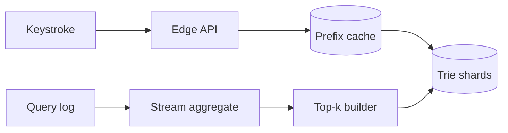

Autocomplete 看似在“搜索字符串”，实际上是在极紧的延迟预算里回答：**这个 prefix 对应的 top-k completion 是什么？**

用户输入 `ca`。如果系统临时扫描所有以 `ca` 开头的词，再按热度排序，每次按键都会重复做昂贵工作。更自然的办法是提前在 prefix 节点上保存 top-k，例如 `car, cat, camera`，查询只需沿着 `c -> a` 走两步。

> 对应实验：[打开 Search Autocomplete Lab](https://lab.zichaoyang.com/system-design/search-autocomplete/)。改变词表大小、热门 prefix 占比和更新新鲜度，观察读路径与更新 pipeline 的变化。

## 需求边界（Requirements）

功能上按 prefix/locale 返回安全的 top-k，支持趋势更新；个性化和 fuzzy search 后置。非功能上每次按键查询 p99 约 50ms、snapshot 可回滚、结果允许分钟级滞后，但政策删除必须快速生效。

## 0. 先搭一个内存 Trie MVP Scaffold

第一版离线读取一份 `query,count` 文件，构建内存 trie；每个节点保存 top 10 completion。HTTP server 只提供 prefix 查询。词频每天批量重建一次，构建成功后原子替换 snapshot。先不做个性化、拼写纠错和实时趋势。

搭建步骤：normalize query；插入 trie 并累计频次；自底向上算每个节点 top-k；序列化 snapshot；server 启动时加载；用 immutable pointer 热切换新版本。这个版本已经把在线查询从全词表扫描降到沿 prefix 走几步。

## 1. API：每次按键都可能调用

```http
GET /v1/autocomplete?prefix=ca&limit=10&locale=en-US

200 OK
{"suggestions":[{"text":"camera","score":9812}],"version":"2026-07-13-10"}
```

服务端限制 prefix 长度、limit 和字符集，空 prefix 可返回地域热门。响应带 snapshot version，便于排查不同 region 结果漂移。客户端应 debounce/cancel 旧请求，服务端仍要承受每次按键的最坏 QPS。

## 2. 数据模型（Data Model）

离线源数据可以是：

```text
QueryCount(query, locale, window_start, count, unique_users)
Suggestion(query, normalized_query, locale, score, safety_state)
TrieSnapshot(version, locale, object_url, checksum, created_at)
```

在线 trie 是派生 serving index，不是 source of truth。原始 query log 和聚合 count 可重放，snapshot 坏了可以重新构建。

## 3. 单机端到端流程

请求 normalize `ca`，从 root 走 `c -> a`，读取节点预计算 top-k，做安全过滤后返回。更新任务从 query log 聚合过去窗口，生成全新 trie，校验大小和 sample query，再原子替换。不要边接请求边原地修改整棵树。

## 4. 容量估算：按键会放大查询

假设 5000 万日搜索用户，每人每天 10 次搜索、每次平均输入 6 个字符，则约 30 亿 prefix query/天，平均 35k/s，峰值 5 倍约 175k/s。若 1 亿 distinct query、平均 20 bytes，原文约 2GB，但 trie node、top-k 和对象开销可能放大十倍以上，单机内存会成为边界。

## 5. Latency Budget：目标不是“快”，而是跟得上打字

端到端 p99 可设 50ms：网络/edge 20ms，API 5ms，cache/trie 5ms，安全过滤 5ms，余量 15ms。跨 region 回源通常已经超预算，因此 serving snapshot 要就近复制。实时更新可以分钟级，不应进入请求路径。

## 6. Correctness and Reliability

Snapshot 带 checksum 和版本，加载失败继续服务旧版本。发布先 canary 一个 replica，再逐步切换。Query log 至少一次投递会重复，聚合按 event ID 去重或接受有界误差；热门榜单还要过滤机器人和低质量 query。

## 7. Trade-offs：空间、新鲜度和个性化

- 每节点保存 top-k 读最快，但空间约随节点数乘 k 增长。
- Batch snapshot 稳定、易回滚但不够新鲜；增量 stream 更新更鲜活，却增加一致性和发布复杂度。
- 全局 top-k 易缓存；per-user rerank 更相关，但削弱共享 cache 命中率。

## 概念阶梯

- **Trie**：把共同 prefix 共享起来的树。查询成本与 prefix 长度相关，而不是词表总量。
- **Top-k materialization**：在每个节点预先保存最热门的 k 个候选，用额外空间换低延迟读取。
- **Freshness lag**：真实搜索趋势变化后，多久反映到候选中。它决定更新是小时级 batch 还是分钟级 stream。

## 读写两条路径



读路径必须短：normalize prefix、查 cache/trie、返回候选。统计、反作弊和 top-k 重建在异步写路径完成，不能塞进一次按键请求。

## 为什么不能只说“用 Trie”

单个内存 trie 解决的是算法，不是完整系统。词表超过单机内存后，可按 prefix range 分片；热门 prefix 的请求高度倾斜，需要复制热点 shard 或在 edge cache；趋势更新要求 query log 聚合并增量发布新版本。发布时采用 immutable snapshot 加版本切换，可以避免用户读到一半更新的数据结构。

个性化又会改变问题。共享 top-k 容易缓存，但 per-user ranking 依赖历史。常见做法是先取全局或地域候选，再用少量用户特征 rerank，而不是为每个用户维护一棵 trie。

## 常见难点

- 输入 `c` 的 QPS 远高于 `camera`，分片均匀不代表负载均匀。
- fuzzy matching 会扩大搜索空间，应作为有预算的 fallback，而不是每次默认执行。
- 热门趋势可能被机器人操纵，聚合 pipeline 需要去重、限频和质量过滤。
- 候选内容还要过安全和政策过滤，不能只按频率输出。

## 面试表达

> I would precompute top-k completions at trie nodes so lookup cost depends on prefix length, then separate the latency-critical read path from the asynchronous popularity pipeline.

主设计讲清 trie、cache、更新 pipeline 后，再深入 hot prefix、freshness 或 personalization。容量估算只需要证明每次按键会放大读 QPS，以及 materialized top-k 的内存成本。
