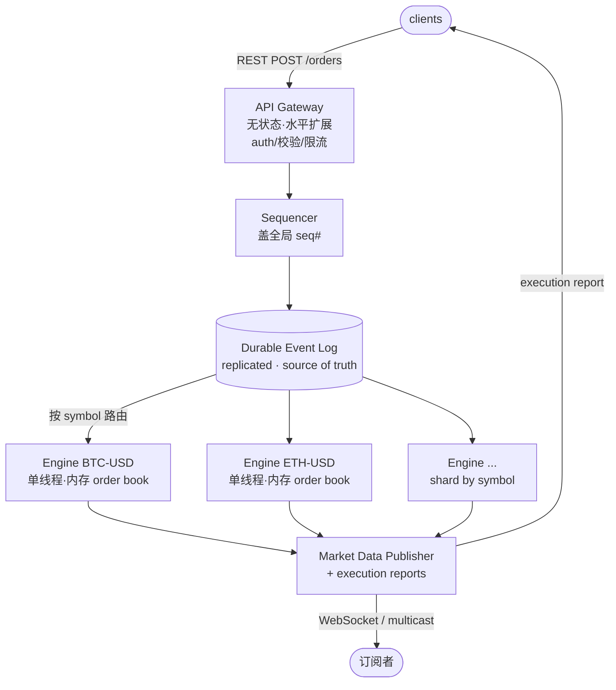

## 问题定位

面试里 "design a stock exchange" 通常有两个 flavor，先区分清楚：

| Flavor | 焦点 | 例子 |
|---|---|---|
| **Matching engine**（交易所核心撮合引擎） | low latency、fairness、determinism | "design a stock exchange" |
| **Brokerage app**（券商 App） | 用户账户、wallet、order routing | "design Robinhood" |

本篇聚焦**硬核的那一个：matching engine**。这也是面试官说 "stock exchange" 时通常默认的部分。

---

## 第一步：该问哪些 clarifying questions？

### 元原则：只问会「改变设计」的问题

真实世界的 requirements 无穷多，面试时间有限。新手常把 clarifying questions 当成背 checklist，问一堆不影响架构的细节（用什么语言？UI 怎么设计？）。

> **好提问的唯一标准：这个问题的答案，会不会 fork 我的架构或边界？**
> 会 → 值得问；不会 → 别浪费时间。

### 高杠杆问题（按优先级）

1. **Scope：核心撮合引擎 vs 整个券商？**
   要不要管 user account、wallet、funds check、KYC？
   → 主动把 brokerage 那一坨划到 *out of scope*，钉死边界。

2. **Latency & throughput 的量级？**（本题头号 NFR）
   目标是 microseconds 还是 ms？峰值多少 orders/sec？
   → "微秒级、几十万 QPS" 才会逼出 **in-memory / single-threaded per-symbol / event-sourced** 这种反直觉设计，而不是"加机器水平扩展"。

3. **支持哪些 order types？**
   只做 limit + market，还是要 stop-loss、stop-limit、iceberg？
   → 决定 order book 数据结构与撮合逻辑复杂度。建议提议先做 **limit + market** 的 MVP。

4. **撮合优先级规则？**
   price-time priority (FIFO) 还是 pro-rata？
   → 股票交易所几乎都是 price-time。它定义 order book 语义和"公平性"。

5. **多少 symbol？单只还是上千只？**
   → 决定 sharding 策略（按 symbol 分片，每个 symbol 一个独立引擎实例）。

6. **Durability / determinism / audit 要求？**
   订单能丢吗？crash 后要精确恢复吗？监管要求 deterministic replay 吗？
   → 决定是否需要 event sourcing + sequencer + replication。

### 低价值问题（别在开场问）

- 用什么编程语言 / 框架
- 前端 / UI 细节
- 具体的部署平台（AWS vs GCP）

这些不改变核心架构，留到实现细节再说。

---

## 第二步：锁定 Assumptions

面试里问完上面的问题，面试官给答案后，要**显式复述一遍 assumptions** 再开工：

- **Scope**：只做 matching engine，brokerage（account / wallet / KYC）完全 *out of scope*
- **Latency target**：**microseconds** → 逼出 in-memory / single-threaded per-symbol
- **Order types MVP**：limit + market（stop / iceberg 作为 extension）
- **撮合规则**：price-time priority (FIFO)
- **多 symbol** → 按 symbol sharding

### 关于 Latency 的三档（重要）

| 量级 | 现实手段 | 设计后果 |
|---|---|---|
| **nanoseconds** | FPGA / 硬件撮合、kernel bypass、co-location | 已是硬件领域，软件面试不会真要 ns |
| **microseconds** | in-memory、single-threaded per-symbol、热路径零网络/零磁盘/零锁 | 认真的软件交易所真实目标（如 **LMAX Disruptor**，low single-digit µs）。本题核心 |
| **milliseconds** | 可容忍一次 network hop，甚至 Redis / in-memory DB | 预算宽松，设计不刺激 |

> **µs 档铁律**：撮合 hot path 上不能有任何 network call、disk I/O、DB query、lock。引擎所需的一切都在进程内存，每个 symbol 一个 single thread。
>
> **Redis 的陷阱**：Redis 本身有一次 network round trip（约 0.1–1ms），只能进 ms 预算，进不了 µs 热路径。
>
> **为什么 single-threaded？** 不是因为"快"，而是单线程**消除了 lock 和非确定性**，顺带白拿 determinism（可重放）。多线程加锁反而更慢、更不可预测。

---

## 第三步：Functional / Non-functional Requirements

### Functional Requirements

- 接受 order：**limit order**（market order 先不做，原理类似）
- 撮合：买卖单匹配成交
- **cancel / modify**：撤单 / 改单（真实订单簿里撤单量极大，不能漏）
- 维护 order book，并对外提供 market data

### Non-functional Requirements

| NFR | 含义 | 为什么关键 |
|---|---|---|
| **Fairness** | price-time priority，严格 FIFO | 公平 = 合规 + 信任，有法律含义 |
| **Latency** | sub-millisecond | hot path 不能有 network / disk / lock |
| **Throughput** | 峰值几十万 orders/sec（开盘、剧烈波动时） | 与 latency 是**两回事**：低延迟 ≠ 扛得住高并发 |
| **Durability** | 一旦 accept 的 order 绝不能丢，哪怕引擎崩溃 | 丢单 = 丢钱 = 监管事故 → 逼出 event log + replication |
| **Consistency / Correctness** | 强一致：不 double-fill、不凭空造/灭钱 | 撮合是金融真相，**不可协商**，头号铁律 |
| **Availability / Fault tolerance** | 崩溃后快速 failover 到 replica，不丢状态、不乱序 | 但见下方取舍 |
| **Determinism / Replayability** | 相同输入序列 → 相同输出 | fairness / 恢复 / 审计 / 测试的共同基础 |
| **Auditability** | 完整 audit trail，可回放给监管 | 合规硬要求 |

### ⭐ Focus：选一条主线深挖

面试不是列清单。**只锁一个核心 FR + 3 个相关 NFR**，其余一句带过：

- **核心 FR**：撮合一个 limit order —— 新 order 与 order book 匹配，遵守 price-time priority。整个设计围绕"一个 order 进来发生什么"展开。
- **锁定的 3 个 NFR**：
  1. **Fairness**（price-time priority，即撮合的*正确性定义*）
  2. **Latency**（sub-ms → in-memory / single-threaded / 热路径无锁无网络）
  3. **Consistency / Correctness**（不 double-fill）
- **Parked（worth mentioning，不喧宾夺主）**：throughput、durability、availability / replay、cancel / modify、market data。

### 关键取舍：撮合引擎是 CP 系统

> **宁可停止交易（halt），也绝不做出错误撮合。** 出现不确定状态时，正确选择是停盘，而不是"先凑合撮着"。

这与日常"高可用 web 服务"（通常 AP 优先，宁可返旧数据也别挂）的直觉**相反**。交易所反过来：Consistency > Availability。

---

## 第四步：API / Interface Design

### 分层：对外 API 不敏感，引擎内部才敏感

| 层 | 谁 | 延迟敏感？ | 协议 |
|---|---|---|---|
| **Client-facing API** | 散户 App / 程序 → gateway | **不**敏感（人点按钮，几十 ms 无所谓） | **REST 足够**；WebSocket 推送行情/状态；FIX 仅给机构/co-located 低延迟客户 |
| **Matching engine hot path** | gateway → sequencer → engine 内部 | **极度**敏感（sub-ms / 内存 / 无锁） | 进程内 / 二进制，**不是对外网络 API** |

> 真实佐证：Robinhood、Coinbase Advanced Trade 的零售下单都走 **REST**；FIX 只在 Coinbase 的机构 Exchange API 上提供。sub-ms 预算是 **gateway 之后、engine 内部** 的事，不是暴露给用户的接口。

### 两个 API：write path + read path

整个对外接口就这么简单（gateway 层无状态、**水平扩展**）：

**写路径 —— 下单**
```
POST /orders
{ "symbol": "BTC-USD", "side": "buy", "type": "limit",
  "price": 65000, "quantity": 0.5, "client_order_id": "<idempotency key>" }
→ 202 Accepted { "order_id": "...", "status": "accepted" }
```
- 同步返回的是一个 **ack**（已受理 / 已排序），不一定是成交结果
- limit order 可能立刻部分/全部成交，也可能挂在 book 上等 → 成交结果异步,通过 read path 或 WebSocket 推送拿
- `client_order_id` 做 **idempotency**，防重复下单

**读路径 —— 查状态**
```
GET /orders/{order_id}
→ { "status": "filled | partially_filled | open | cancelled", "filled_qty": ..., ... }
```

就这两个。POST order 没什么花头，重点是它背后的 gateway → sequencer → engine 流程（见 high-level architecture）。

---

## 第五步：High-level Architecture

### 方法论：用 data flow 来「发现」架构

- **Data flow（动态视角）**：一条数据从进到出依次经过哪些处理 —— 是"箭头"。
- **Architecture（完整图景）**：component（框）+ 职责 + 连接 + **状态在哪** + 扩展 + 容错。

> 追踪"一个 order 进来会发生什么"，沿途每个处理环节自然浮现成一个 component。箭头先画，框跟着冒出来。

但完整 architecture = data flow + **静态拓扑** + **状态归属** + **失败模式**。规律：交易所 / stream pipeline 这类"数据被依次变换"的系统，data flow 几乎就是架构全部；CRUD 应用则是"组件 + DB"静态视角主导。本题属前者。

### Sequencer 是什么？

> **给所有进入的 order 盖上全局、单调递增的 sequence number，生成一条权威 event log。**

- 不只是普通 MQ：它是 **fairness + determinism** 所需的"唯一定序裁判"，在订单进 engine *之前* 把顺序定死。
- 这条 log **本身就是 source of truth**：durability（崩了不丢单）和 deterministic replay（崩了重放 log 重建状态）都来自它。
- 妙处：log 负责持久化 → **engine 可以是纯内存状态机，不操心落盘** → 这是它能 sub-ms 的原因之一。

### Matching engine：单线程 singleton，不是 worker pool

与 Online Judge **完全相反**，对比记忆：

| | Online Judge | Matching Engine |
|---|---|---|
| 并行性 | embarrassingly parallel，**worker pool 水平扩展** | **单 symbol 单线程**，顺序处理 |
| 为什么 | 各 submission 互不相关 | 并行破坏 determinism / fairness，且要加锁 |
| 怎么扩展 | 加 worker | **按 symbol sharding** |

**绝不在一个 symbol 内部并行**：一个 symbol = 一个单线程 engine，顺序吃 sequence。

### 数据流图



三个 NFR 各有归属：**durability 在 log 层，fairness 在 sequencer 层，speed 在内存单线程 engine 层。**

### 如何 Scale

| 组件 | 扩展方式 |
|---|---|
| **API Gateway** | 无状态 → 直接水平加机器 |
| **Sequencer** | 关键 insight：**排序只需在单 symbol 内 total order，跨 symbol 无需有序** → 整条链路**按 symbol sharding**，每个 symbol 一条独立 sequencer→engine→log 流水线。Sequencer 因此不是全局单点 |
| **Matching engine** | 同上，shard by symbol，摊到多台机器 |
| **Market data** | fan-out tree / multicast / 多 WS server |
| **HA / durability** | event log 用 Raft / primary-backup 复制；engine 配 hot standby 重放同一条 log → 秒级 failover |

> **唯一硬天花板**：单个超热 symbol（如 BTC-USD）无法再拆分 —— 一个 symbol 必须串行。只能把那一个 engine 做到极快（纯内存、无锁、mechanical sympathy），没有"加机器"的解。这正是 fairness/determinism 对扩展性收的"税"。

---

## 待续

- [ ] Functional / Non-functional requirements 定稿
- [ ] Order book 数据结构设计
- [ ] 撮合算法（price-time priority）
- [ ] 单线程 in-memory 引擎 + event sourcing
- [ ] Sharding by symbol
- [ ] Market data dissemination（L1 / L2 / time-and-sales）
- [ ] Durability / fault tolerance / replay
