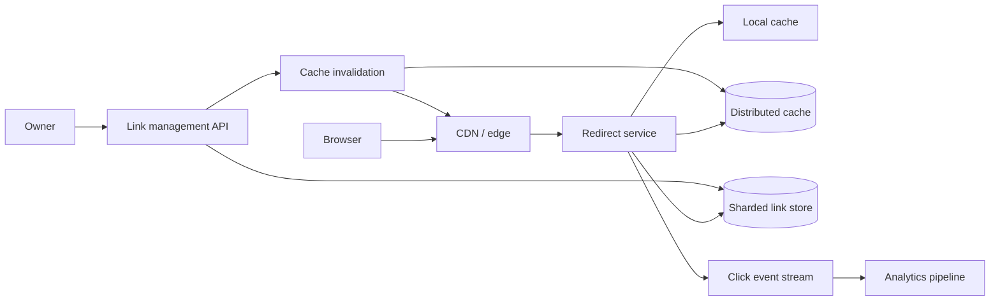

URL Shortener 看起来是一道很小的题：把长网址变成短码，再把短码跳回原地址。正因为业务简单，它特别适合训练完整的系统设计思路：先把最小版本做对，再让容量、热点和可用性一步步逼出架构。

这道题最重要的不是背 `Base62 + Redis + NoSQL`。真正要回答的是：**短码如何保证唯一，重定向如何保持低延迟，链接被删除、过期或突然爆红时，系统又怎样保持正确。**

> 配套实验：[打开 URL Shortener Lab](https://lab.zichaoyang.com/system-design/url-shortener/)。先保持单 Region 和低热点，再提高 hot-link 占比；看到缓存压力以后再考虑分片。

## 从第一条链接开始

用户提交：

```text
https://example.com/articles/system-design?campaign=summer
```

系统返回：

```text
https://sho.rt/aZ3k9Q
```

之后浏览器访问 `/aZ3k9Q`，服务返回：

```http
HTTP/1.1 302 Found
Location: https://example.com/articles/system-design?campaign=summer
```

这条主路径只有两件事：

```text
create:   long URL -> code
resolve:  code -> long URL
```

但要先定一个产品语义：同一个长 URL 创建两次，是返回同一短码，还是允许创建两个短码？

多数产品应允许多个。不同用户、campaign、过期时间和权限可能都不同。强制按 long URL 去重，会把本应独立管理的链接绑在一起。

## 先把 301 和 302 讲清楚

`301 Moved Permanently` 会鼓励浏览器和 CDN 长期缓存重定向。它更省服务器流量，但链接目标修改、禁用和点击统计会变得更难及时生效。

`302 Found` 或 `307 Temporary Redirect` 更容易让请求持续经过服务端，便于过期、治理和统计。二者的 HTTP method 语义略有差异；普通 GET 短链常用 302。

面试里不需要争论唯一正确答案。先说明产品是否允许修改 target、是否需要实时统计，再选 cache 语义。

## 题目边界

核心功能：

1. 创建短链，可选自定义 alias 和过期时间；
2. 访问短码时重定向；
3. Owner 可以禁用或查看链接状态；
4. 点击事件异步进入统计系统；
5. 恶意链接可以被封禁。

第一版不做完整广告归因、二维码编辑器和复杂团队协作。

非功能目标：

- Resolve p99 例如低于 50ms；
- 读远多于写，热点链接能承受突发流量；
- 已确认创建的短码不能指向错误 URL；
- 禁用和安全封锁要快速生效；
- 短码难以被顺序枚举；
- 点击统计丢少量事件不影响 redirect 可用性。

## 第一版：Postgres 自增 ID 加 Base62

第一版只需一台应用服务器和 Postgres。

```sql
CREATE TABLE short_links (
  id             BIGSERIAL PRIMARY KEY,
  code           VARCHAR(12) UNIQUE,
  owner_id       BIGINT NOT NULL,
  long_url       TEXT NOT NULL,
  state          VARCHAR(16) NOT NULL,
  expires_at     TIMESTAMPTZ,
  created_at     TIMESTAMPTZ NOT NULL DEFAULT now()
);
```

创建流程：

1. 校验 URL scheme，只允许 `http` / `https`；
2. 插入一行拿到自增 `id`；
3. 把 `id` 编成 Base62；
4. 更新 `code`；
5. 返回短链。

Base62 使用数字、大小写字母，共 62 个字符。若 code 长 7：

```text
62^7 ≈ 3.5 trillion combinations
```

容量很大，但“容量够”不等于“安全”。顺序 ID 的 Base62 仍然可预测：知道一个 code 后可能枚举相邻链接。第一版可以先工作，公开产品再加入随机置换或直接生成随机 code。

### 最小创建 API

```http
POST /v1/links
Idempotency-Key: create-link-91

{
  "longUrl":"https://example.com/articles/system-design",
  "customAlias":null,
  "expiresAt":"2027-01-01T00:00:00Z"
}
```

```json
{
  "linkId":"link-88",
  "code":"aZ3k9Q",
  "shortUrl":"https://sho.rt/aZ3k9Q",
  "state":"ACTIVE"
}
```

创建接口使用 idempotency key，防止客户端 timeout 重试产生多个短码。若产品本来就允许多个短码，幂等只覆盖“同一次创建意图”，不能按 long URL 全局去重。

### 最小重定向

```python
def resolve(code):
    link = database.find_by_code(code)

    if link is None or link.state != "ACTIVE":
        return not_found()

    if link.expires_at and link.expires_at <= now():
        return gone()

    emit_click_event_best_effort(link.id)
    return redirect_302(link.long_url)
```

先 redirect，再异步统计。不要因为 analytics queue 慢，就让用户打不开链接。

## 随机短码与碰撞

生产系统可以用加密安全随机数生成 7–10 位 Base62 code：

```python
for attempt in range(5):
    code = random_base62(length=8)
    if database.insert_if_absent(code, long_url):
        return code
raise CodeSpaceExhausted()
```

唯一索引才是最终裁判。先 `SELECT` 再 `INSERT` 存在 race：两个请求都查到“不存在”，然后同时插入。正确做法是 conditional insert / unique constraint，碰撞后重试。

生日悖论提醒我们，使用量接近 $\sqrt{N}$ 时碰撞就开始明显，而不是等空间用满。8 位 Base62 空间约 $2.18 \times 10^{14}$；创建数达到千万级时仍需认真处理碰撞，但重试成本可控。

自定义 alias 也走同一唯一约束。`news`、`admin` 等保留字提前拒绝，Unicode 需规范化，避免视觉相同但字节不同的 alias。

## 数据模型：管理状态与解析数据分开考虑

```text
ShortLink(
  link_id,
  code UNIQUE,
  owner_id,
  long_url,
  state,
  expires_at,
  version,
  created_at,
  updated_at
)

LinkAuditEvent(
  link_id,
  sequence,
  event_type,
  actor_id,
  old_value_hash,
  new_value_hash,
  created_at
)

ClickEvent(
  event_id,
  link_id,
  event_time,
  referrer,
  coarse_geo,
  user_agent_class
)
```

`ShortLink` 是 redirect 的事实来源。`LinkAuditEvent` 支持调查 target 修改和封禁。`ClickEvent` 是大吞吐 append-only 流，不与 ShortLink 放在同一个 OLTP 事务里。

若允许修改 target，使用 `version` 做 optimistic concurrency：Owner 基于 version 4 更新时，不能覆盖管理员刚在 version 5 做的封禁。

## 容量估算：先算 code 空间，再算读写比和存储

假设每天创建 1 亿条链接，保留 5 年：

```text
100M × 365 × 5 = 182.5B links
```

这个规模已超过 7 位 Base62 空间的安全使用范围，需要更长 code 或更大字符集。8 位有约 218T 组合，仍要监控占用与碰撞。

若每行 metadata 平均 500 bytes：

```text
182.5B × 500B ≈ 91TB raw data
```

加索引、replica 和备份会到数百 TB，必须按 code hash 分片。

假设每个链接平均被访问 10 次，长期读写比约 10:1；实际分布极度倾斜，一个名人短链可能瞬间产生百万 QPS。因此容量不能只按平均 redirect QPS，还要设计热点缓存和 CDN。

## 加缓存：先处理正缓存，再小心负缓存

Resolve 路径变成：

```text
code -> local cache -> distributed cache -> database
```

Cache value 包含 `long_url`、state、expiry 和 version。TTL 可以比链接过期短，并取：

```text
min(normal_cache_ttl, link_expires_at - now)
```

不存在的随机 code 会形成数据库攻击。可以短暂 negative cache，例如 30 秒，但封禁或刚创建的 code 需要正确 invalidation。Negative TTL 不能太长，否则创建一个之前被探测过的 alias 后，用户仍看到 404。

热点链接在 local cache 和 CDN edge 即可吸收大量请求。缓存单个 code 不需要把所有链接都放进内存；让访问分布决定 residency。

## 高层架构：重定向热路径越短越好



Management API 可以做更严格鉴权、风险扫描和事务；Redirect service 保持无状态、读优化，并在超短 timeout 内完成。

统计流、审计和安全扫描都不应同步阻塞 redirect。唯一例外是 authoritative blocklist：已确认恶意链接必须在 redirect 前检查，通常以本地快速规则或高优先级 invalidation 实现。

## 分片：按 code，而不是按 owner

Resolve 只知道 code，因此存储最好按 `hash(code)` 分片。按 owner 分片会让 redirect 先查目录才能找到数据，增加一次网络 hop。

创建随机 code 时，code 已经决定 shard，直接 conditional insert。自增 ID 方案在多 shard 下需要全局 ID service 或预分配范围；这也是随机 code 在分布式系统中更自然的原因之一。

Shard map 由路由层读取并缓存。迁移 shard 时双读或 forwarding，不能因为 rebalancing 让旧链接失效。

## 多 Region：创建一致性与读取可用性的取舍

Redirect 是全球读，适合 edge cache 和本地 replica。创建量相对小，可以选择：

**单写 Region**

所有创建进入一个主 Region，code 唯一性简单；远端创建 latency 较高，主 Region 故障时暂时无法创建，但已有链接仍可从 replica 读取。

**Region 前缀 / 分区 code 空间**

每个 Region 生成带隐含 region bits 的 ID 或拥有独立随机 namespace，再全局复制。创建更可用，但冲突、迁移和 code 分布更复杂。

对短链产品，“已有链接继续打开”通常比“故障期间还能创建新链接”更重要。先说清优先级，再选择写策略。

## 过期、删除和滥用

过期不必在那一秒物理删除。Resolve 根据 `expires_at` 返回 `410 Gone`，后台 TTL job 再清理数据和 cache。

Owner 删除、管理员封禁和自动安全阻断是不同状态：

```text
ACTIVE
DISABLED_BY_OWNER
BLOCKED_FOR_ABUSE
EXPIRED
```

不要统一成 `deleted=true`，否则客服无法解释原因，也难以实施不同恢复政策。

创建时做 URL parsing、scheme allowlist、domain reputation 和 rate limit。安全扫描可能异步，但高风险链接可以先进入 `PENDING_REVIEW`，未通过前不 redirect。

短码不可预测只能降低批量枚举，不能替代访问控制。私密链接需要认证或高熵 capability token，不能把 7 位短码当密码。

## 故障和正确性

**缓存里仍是旧 target**

更新或封禁先写数据库，再发 versioned invalidation。Redirect cache 比较 version；关键封禁还可维护短 TTL 本地 blocklist。

**数据库暂时不可用**

缓存命中继续服务。Miss 是否 fail closed 取决于安全要求；不能拿一个未知 code 随便重定向。

**点击事件系统故障**

Redirect 继续工作，本地缓冲或丢弃低价值 analytics。用户访问不应依赖报表完整性。

**创建响应丢失**

客户端用同一 idempotency key 重试，返回原 link。没有 key 时允许创建新短码，符合产品语义。

**热点打爆单 cache shard**

Local cache/CDN 复制热点 value，避免所有请求进入同一 distributed cache key。热点读数据很小，复制比强行拆一个 key 更简单。

## 延迟预算与观测

50ms p99 示例：

| 阶段 | 预算 |
|---|---:|
| Edge/Gateway | 10 ms |
| Cache lookup | 5 ms |
| Store fallback | 20 ms |
| 组装响应与网络 | 10 ms |
| 余量 | 5 ms |

监控：

- Resolve p50/p95/p99、status code、cache tier hit；
- Database/cache QPS、hot key、eviction、negative-cache hit；
- Create latency、collision retry、custom alias conflict；
- Invalidation lag、blocked-link residual traffic；
- Click event drop、consumer lag；
- 每 Region 复制延迟和旧 version read。

平均 cache hit 很高仍可能有问题：恶意随机 code 全部 miss，会形成独立攻击路径。按 hit/miss、existent/nonexistent 分开看。

## 关键取舍

**短 code** 更易分享，却缩小空间并提高碰撞和枚举风险。

**301 长缓存** 减少服务流量，却让 target 修改、封禁和实时统计更难生效。

**随机 code** 去中心化、难预测，但必须依赖唯一约束处理碰撞；**自增 ID** 简单无碰撞，却暴露规模并需要全局 ID 策略。

**更长 cache TTL** 提高命中，却延长修改和封禁传播时间。安全 invalidation 需要独立快通道。

**全球多写** 提高创建可用性，却把一个原本简单的唯一性问题变成跨 Region 协调。

## 用 Lab 跟着瓶颈走

**实验一：提高读写比**

观察数据库什么时候先被 redirect 读压住。加入 cache，确认创建路径并没有因此变复杂。

**实验二：提高 Hot-link 占比**

看到单 key 热点后，不要先分数据库；先问 CDN 和 local cache 能否复制这几十字节的数据。

**实验三：增加 Region**

分别讨论已有链接读取与新链接创建。选择单写还是多写前，先写出你愿意牺牲哪个语义。

## 面试表达：先把单机版本讲完整

可以这样开场：

> I would start with a relational table keyed by a unique short code and a stateless redirect service. The write path creates the mapping atomically; the read path validates state and expiry, emits analytics asynchronously, and returns a temporary redirect.

然后自然演化：

```text
Postgres + unique code
-> cache for read-heavy traffic
-> random code + conditional insert
-> hash sharding
-> CDN and hot-key replication
-> multi-region reads and explicit write semantics
```

最后提供深入方向：

> I can go deeper into code generation and collision probability, cache invalidation, hot links, or multi-region creation semantics.

这种讲法不炫技，但每一步都有清晰的容量或正确性原因。

## 参考资料

- [RFC 3986: Uniform Resource Identifier Syntax](https://www.rfc-editor.org/rfc/rfc3986)
- [RFC 9110: HTTP Semantics](https://www.rfc-editor.org/rfc/rfc9110)
- [Google Safe Browsing](https://developers.google.com/safe-browsing)
- [Amazon Dynamo: Highly Available Key-value Store](https://www.allthingsdistributed.com/files/amazon-dynamo-sosp2007.pdf)
