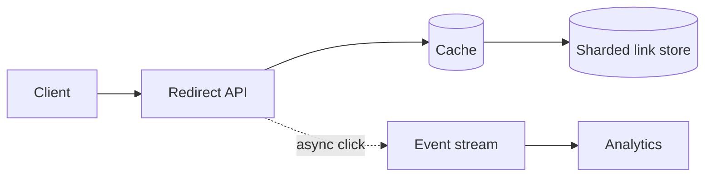

URL Shortener 最容易被讲成“数据库里存一行映射”。这当然没错，但没有解释系统为什么需要演化。真正值得抓住的是：**它是一个读远多于写、访问高度倾斜的 key-value lookup**。

先看最小路径。用户创建短链：

```text
POST /links { longUrl } -> code = aZ3k9
```

另一个用户访问 `aZ3k9`，服务端查到原 URL，返回 `302 Location: ...`。初期一台应用和一张带唯一索引的表就够了。只有当读流量、热门链接或 key 数量越过单机边界，缓存和分片才有理由出现。

> 对应实验：[打开 URL Shortener Lab](https://lab.zichaoyang.com/system-design/url-shortener/)。先切换 Hot-link 占比和 Region 数，再回来读架构取舍。

## 需求边界（Requirements）

功能上支持创建、跳转、可选过期和拥有者删除；首版不做全文搜索与复杂分析。非功能优先级是 redirect p99、mapping durability 和 code 唯一性；创建稍慢可以接受，错误跳转不可接受。

## 0. 先搭一个能工作的版本（MVP Scaffold）

第一版只做两件事：创建短链、按 short code 跳转。先明确不做自定义 alias、过期时间、点击报表和多 region。部署形态是一台应用加一个 PostgreSQL；只要它能正确处理重复请求、code 碰撞和不存在的链接，就已经是合格基线。

手把手搭建顺序如下：

1. 建 `links` 表，并给 `short_code` 加唯一索引。
2. 实现 create endpoint：校验 URL，生成 code，插入数据库。
3. 实现 redirect endpoint：按 code 点查，返回 `302`。
4. 给 create 请求加 idempotency key，避免客户端超时重试时创建两个链接。
5. 记录 redirect 的应用指标，但先不记录每次点击明细。

## 1. API：先把产品语义定下来

```http
POST /v1/links
Idempotency-Key: create-7f21
Content-Type: application/json

{"longUrl":"https://example.com/a","expiresAt":null}

201 Created
{"code":"aZ3k9","shortUrl":"https://sho.rt/aZ3k9"}
```

```http
GET /aZ3k9

302 Found
Location: https://example.com/a
Cache-Control: public, max-age=300
```

创建失败要区分非法 URL、idempotency key 冲突和 code 空间耗尽。Redirect 对不存在或过期 code 返回 `404/410`，不要把数据库错误伪装成不存在。

## 2. 数据模型（Data Model）

```sql
CREATE TABLE links (
  short_code   VARCHAR(12) PRIMARY KEY,
  long_url     TEXT NOT NULL,
  owner_id     BIGINT,
  created_at   TIMESTAMPTZ NOT NULL,
  expires_at   TIMESTAMPTZ,
  version      BIGINT NOT NULL DEFAULT 1
);

CREATE TABLE idempotency_keys (
  owner_id      BIGINT NOT NULL,
  request_key   TEXT NOT NULL,
  request_hash  TEXT NOT NULL,
  short_code    VARCHAR(12) NOT NULL,
  PRIMARY KEY (owner_id, request_key)
);
```

Redirect 的 access pattern 只有 `short_code -> long_url`，所以 primary key 正好服务主查询。不要为了“以后可能搜索”先建立很多二级索引，它们会放大写入和存储。

## 3. 单机端到端流程

Create 在一个事务中检查 idempotency key、生成 code、插入 link、保存响应映射。若唯一约束冲突就重新生成；同一个 idempotency key 携带不同 URL 时返回 `409`。Redirect 只执行一次主键查询，检查过期时间后返回 Location。此时先测出单机基线，再谈扩展。

## 4. 容量估算：让数字暴露瓶颈

假设每天创建 1000 万条、读写比 `100:1`、平均 URL 500 bytes：写入约 `116/s`，redirect 平均约 `11.6k/s`，峰值按 5 倍约 `58k/s`。五年约 182 亿条映射，裸 URL 数据接近 9TB，算上索引、副本和 metadata 会更高。

这组数字推出两个结论：先被压垮的是 redirect 读取和热门 key，不是 create API；长期 storage 才要求分片。容量估算必须导向组件，否则只是算术表演。

## 5. Latency Budget：100ms 花在哪里

目标可设 redirect p99 小于 100ms：edge/TLS 40ms，应用路由 5ms，cache 5ms，数据库 fallback 20ms，余量 30ms。若每次同步记录 analytics 再花 30ms，主路径已经失去余量，所以点击明细必须旁路异步发送。

## 6. Correctness and Reliability

数据库是 mapping 的 source of truth。Cache miss 可以回源，cache 故障时系统应降级为数据库读取并限流；数据库不可用时不能返回错误目标。创建路径依赖唯一约束，而不是只相信概率。删除或改目标时递增 version 并失效 cache，防止旧值长期存在。

## 7. 关键 Trade-offs

- `301` 缓存更强，但修改和统计更困难；`302` 控制力更强，origin 压力更高。
- 随机 code 无中心协调，但有碰撞重试；sequence 编码无碰撞，却暴露规模并引入 ID 分配。
- 完整 edge replication 读最快，但失效复杂；只缓存 hot set 更便宜，却有回源延迟。

## 先讲清三个概念

- **Short code**：长 URL 的短 key。6 位 base62 有 `62^6` 种组合，但“空间够大”不等于“生成时绝不碰撞”。
- **Redirect semantics**：`301` 容易被浏览器和 CDN 长期缓存；`302` 更利于修改目标和记录点击。产品语义决定缓存策略。
- **Hot link**：极少数链接吃掉大部分访问。它不是坏事，反而意味着一个不大的 cache 可以吸收大量读取。

## 架构如何被约束推着走



1. **单机阶段**：应用写数据库，redirect 按 `code` 做索引查询。不要提前上 Kafka 和分片。
2. **热门链接阶段**：使用 cache-aside。命中时直接 redirect；未命中才读数据库并回填。短链映射通常很稳定，适合较长 TTL。
3. **高写入阶段**：唯一 code 的生成变成协调问题。可选数据库 sequence 加 base62、预分配 ID 段，或随机 code 加唯一约束和碰撞重试。
4. **数十亿链接阶段**：按 short code hash 分片。这个查询没有 range scan，hash sharding 比按创建时间分片自然。
5. **全球低延迟阶段**：把热门或完整映射复制到 edge；创建仍走少数写 region，避免全球同步写带来的复杂度。

点击分析不能阻塞 redirect。跳转成功后异步写事件流；analytics 暂时延迟，不应让主路径失败。

## 常见难点

| 难点 | 容易犯的错 | 更好的判断 |
|---|---|---|
| code 生成 | 只说“随机字符串” | 说明碰撞检测、重试和容量边界 |
| cache 一致性 | 假设永不修改 | 目标可编辑时使用失效消息或版本化 key |
| 热点 | 只靠加 shard | 热点读优先靠 cache/CDN，分片解决总量而非倾斜 |
| analytics | 同步写数据库 | 旁路事件化，保护 redirect 的可用性和 p99 |

## 面试时怎么讲

先用一句话定性：

> The hard part is not storing one mapping. It is serving a read-heavy, highly skewed lookup with low redirect latency.

然后给主链路：`Client -> Redirect API -> Cache -> Sharded KV Store`。接着解释三个转折：hot link 推出 cache，keyspace 和写入推出 ID strategy，全球延迟推出 edge replication。最后让面试官选择深入 code generation、缓存一致性或 multi-region。

如果你的架构里出现了一个组件，却说不出是哪条约束逼它出现的，就先删掉它。
