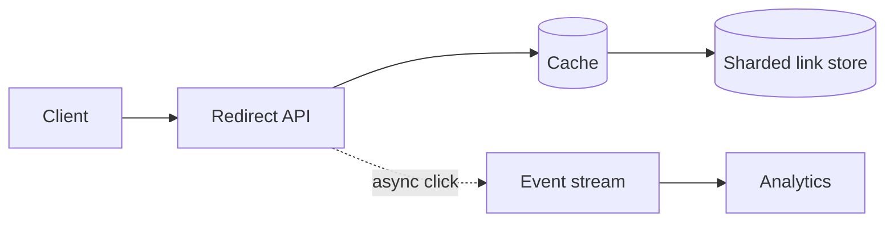

URL Shortener 最容易被讲成“数据库里存一行映射”。这当然没错，但没有解释系统为什么需要演化。真正值得抓住的是：**它是一个读远多于写、访问高度倾斜的 key-value lookup**。

先看最小路径。用户创建短链：

```text
POST /links { longUrl } -> code = aZ3k9
```

另一个用户访问 `aZ3k9`，服务端查到原 URL，返回 `302 Location: ...`。初期一台应用和一张带唯一索引的表就够了。只有当读流量、热门链接或 key 数量越过单机边界，缓存和分片才有理由出现。

> 对应实验：[打开 URL Shortener Lab](https://lab.zichaoyang.com/system-design/url-shortener/)。先切换 Hot-link 占比和 Region 数，再回来读架构取舍。

## 先讲清三个概念

- **Short code**：长 URL 的短 key。6 位 base62 有 `62^6` 种组合，但“空间够大”不等于“生成时绝不碰撞”。
- **Redirect semantics**：`301` 容易被浏览器和 CDN 长期缓存；`302` 更利于修改目标和记录点击。产品语义决定缓存策略。
- **Hot link**：极少数链接吃掉大部分访问。它不是坏事，反而意味着一个不大的 cache 可以吸收大量读取。

## 架构如何被约束推着走



1. **单机阶段**：应用写数据库，redirect 按 `code` 做索引查询。不要提前上 Kafka 和分片。
2. **热门链接阶段**：使用 cache-aside。命中时直接 redirect；未命中才读数据库并回填。短链映射通常很稳定，适合较长 TTL。
3. **高写入阶段**：唯一 code 的生成变成协调问题。可选数据库 sequence 加 base62、预分配 ID 段，或随机 code 加唯一约束和碰撞重试。
4. **数十亿链接阶段**：按 short code hash 分片。这个查询没有 range scan，hash sharding 比按创建时间分片自然。
5. **全球低延迟阶段**：把热门或完整映射复制到 edge；创建仍走少数写 region，避免全球同步写带来的复杂度。

点击分析不能阻塞 redirect。跳转成功后异步写事件流；analytics 暂时延迟，不应让主路径失败。

## 常见难点

| 难点 | 容易犯的错 | 更好的判断 |
|---|---|---|
| code 生成 | 只说“随机字符串” | 说明碰撞检测、重试和容量边界 |
| cache 一致性 | 假设永不修改 | 目标可编辑时使用失效消息或版本化 key |
| 热点 | 只靠加 shard | 热点读优先靠 cache/CDN，分片解决总量而非倾斜 |
| analytics | 同步写数据库 | 旁路事件化，保护 redirect 的可用性和 p99 |

## 面试时怎么讲

先用一句话定性：

> The hard part is not storing one mapping. It is serving a read-heavy, highly skewed lookup with low redirect latency.

然后给主链路：`Client -> Redirect API -> Cache -> Sharded KV Store`。接着解释三个转折：hot link 推出 cache，keyspace 和写入推出 ID strategy，全球延迟推出 edge replication。最后让面试官选择深入 code generation、缓存一致性或 multi-region。

如果你的架构里出现了一个组件，却说不出是哪条约束逼它出现的，就先删掉它。
