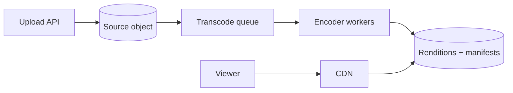

视频平台不是一条请求链，而是两套完全不同的系统：**写侧的计算密集型转码 pipeline**，以及**读侧的带宽密集型全球分发**。

一个 10 分钟源视频上传后，可能要生成 240p、480p、720p、1080p 多个 rendition，再切成 2 到 6 秒的小 segment。一个上传因此 fan-out 成许多计算任务；而播放时，千万观众只是在反复读取这些不可变 segment。

> 对应实验：[打开 Video Streaming Lab](https://lab.zichaoyang.com/system-design/video-streaming/)。分别增加上传量、并发观众、rendition 数和直播开关，观察瓶颈如何从计算切到分发。

## 先讲清 ABR

**Adaptive bitrate streaming (ABR)** 会把同一视频编码成多个码率。播放器持续估算网络状况，并在 segment 边界切换档位。网络变差时不用重新建立整段视频连接，只需请求下一段的低码率版本。

## 两条主路径

Upload API 完成分片上传并登记 metadata 后就可以返回 processing 状态。queue 吸收峰值，worker 按 profile 编码。播放端先拿 manifest，再从 CDN 请求 segment；origin 只处理 cache miss。

## 约束如何推导组件

1. 小 clip、小流量时 inline transcode 可行，架构最简单。
2. 观众增长先压垮的是出口带宽，所以 CDN 比扩应用服务器更有效。
3. 上传峰值和多 rendition 让编码时长不可预测，queue 与 worker autoscaling 隔离 ingest。
4. catalog 变大后，视频字节进 object storage，标题、状态和权限进 metadata DB。
5. 全球与直播要求 multi-CDN 和就近 ingest；直播不能等待完整文件完成，必须持续编码、打包和分发。

## 常见难点

- **热门视频**：CDN 命中率高反而容易扩展；长尾 cache miss 才持续打 origin。
- **处理幂等**：转码 job 重试时用 `(video_id, profile, version)` 做稳定 key，避免生成重复产物。
- **删除与权限**：object 已被 CDN 缓存，删除需要 purge 或短 TTL 加授权 token。
- **直播延迟**：segment 越长压缩效率越好，但玻璃到玻璃延迟越高。

## 面试表达

> I would separate the asynchronous upload-and-transcode plane from the read-heavy playback plane. Object storage is the source of truth, while a CDN serves immutable segments close to viewers.

高层图只要把两条路径画清楚。然后选择深挖 transcode scheduling、CDN/origin protection、ABR 或 live streaming。不要把所有视频请求都画成经过应用服务器，那会错过这题最基本的经济账。
