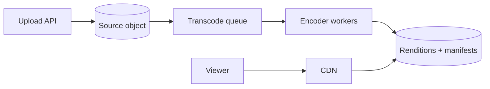

视频平台不是一条请求链，而是两套完全不同的系统：**写侧的计算密集型转码 pipeline**，以及**读侧的带宽密集型全球分发**。

一个 10 分钟源视频上传后，可能要生成 240p、480p、720p、1080p 多个 rendition，再切成 2 到 6 秒的小 segment。一个上传因此 fan-out 成许多计算任务；而播放时，千万观众只是在反复读取这些不可变 segment。

> 对应实验：[打开 Video Streaming Lab](https://lab.zichaoyang.com/system-design/video-streaming/)。分别增加上传量、并发观众、rendition 数和直播开关，观察瓶颈如何从计算切到分发。

## 需求边界（Requirements）

功能上支持可恢复上传、异步转码、点播和播放状态；直播后置。非功能上源文件不可丢、播放首帧约 2 秒、热门内容必须承受巨大带宽，并允许转码以分钟级异步完成。

## 0. 先搭单文件上传与播放 MVP Scaffold

第一版只支持 MP4 上传、一个固定 720p 转码和点播。API 创建 upload session，客户端把源文件直接传 object storage；后台 worker 转码并写回；metadata 状态从 `uploading -> processing -> ready/failed`；播放器拿一个签名 URL 播放。先不做 ABR、CDN 和直播。

## 1. API：上传必须可恢复

```http
POST /v1/videos
{"title":"demo","contentType":"video/mp4","sizeBytes":104857600}

201 Created
{"videoId":"v-1","uploadId":"u-9","partUrls":[...]}

POST /v1/videos/v-1/uploads/u-9/complete
GET /v1/videos/v-1/playback
```

大文件用 multipart upload，客户端可重试单个 part。Complete 只说明源文件完整，不说明视频已可播放；processing 状态通过 polling 或通知更新。

## 2. 数据模型（Data Model）

```text
Video(video_id PK, owner_id, title, state, source_object, duration, created_at)
Rendition(video_id, profile, codec, bitrate, object_prefix, manifest_url, state)
TranscodeJob(job_id PK, video_id, profile, state, attempts, lease_until)
UploadSession(upload_id PK, video_id, object_key, checksum, state)
```

视频字节不进关系数据库。Metadata 保存状态和 object key；manifest 列出 segment 与码率。

## 3. 单机端到端流程

上传完成后 API 校验 object checksum，在事务中把 Video 设为 processing 并创建 TranscodeJob。Worker lease job，下载源文件、编码到临时 prefix、校验输出，再原子发布 rendition manifest 并设 ready。失败重试使用 `(video_id, profile, source_version)` 幂等目录。

## 4. 容量估算：上传算 compute，播放算 bandwidth

假设每天上传 100 万小时源视频，每小时源文件 5GB，入口约 5PB/天；每个视频生成 5 个 rendition，转码计算按 5 倍实时约 500 万 GPU/CPU 小时/天。若 1000 万并发观众平均 3Mbps，出口约 30Tbps，显然必须由 CDN 承担。

这两组数说明 ingest worker 和 playback CDN 沿不同轴扩展，不能画成一组“video servers”。

## 5. Latency Budget：播放首帧与转码完成是两类 SLO

点播 startup p99 可设 2 秒：metadata 100ms，manifest 200ms，首 segment CDN 获取 1 秒，解码余量。Transcode 可以分钟级，但要监控 queue age。直播则把 segment 生成、上传和 CDN propagation 都纳入 glass-to-glass latency。

## 6. Correctness and Reliability

源文件与 rendition 不可变，发布靠 versioned manifest。Worker crash 后 job lease 重试，不覆盖已验证产物。CDN/origin 故障时 multi-CDN 或 stale segment 可降级；权限撤销通过短期 signed URL、manifest auth 和 purge 配合完成。

## 7. Trade-offs：质量、成本与等待

- Rendition 越多适配越好，但转码和存储线性增长。
- Segment 越短启动和直播延迟越低，但请求数与编码开销更高。
- CDN TTL 长降低 origin 成本，却让删除和权限变更传播更慢。

## 先讲清 ABR

**Adaptive bitrate streaming (ABR)** 会把同一视频编码成多个码率。播放器持续估算网络状况，并在 segment 边界切换档位。网络变差时不用重新建立整段视频连接，只需请求下一段的低码率版本。

## 两条主路径



Upload API 完成分片上传并登记 metadata 后就可以返回 processing 状态。queue 吸收峰值，worker 按 profile 编码。播放端先拿 manifest，再从 CDN 请求 segment；origin 只处理 cache miss。

## 约束如何推导组件

1. 小 clip、小流量时 inline transcode 可行，架构最简单。
2. 观众增长先压垮的是出口带宽，所以 CDN 比扩应用服务器更有效。
3. 上传峰值和多 rendition 让编码时长不可预测，queue 与 worker autoscaling 隔离 ingest。
4. catalog 变大后，视频字节进 object storage，标题、状态和权限进 metadata DB。
5. 全球与直播要求 multi-CDN 和就近 ingest；直播不能等待完整文件完成，必须持续编码、打包和分发。

## 常见难点

- **热门视频**：CDN 命中率高反而容易扩展；长尾 cache miss 才持续打 origin。
- **处理幂等**：转码 job 重试时用 `(video_id, profile, version)` 做稳定 key，避免生成重复产物。
- **删除与权限**：object 已被 CDN 缓存，删除需要 purge 或短 TTL 加授权 token。
- **直播延迟**：segment 越长压缩效率越好，但玻璃到玻璃延迟越高。

## 面试表达

> I would separate the asynchronous upload-and-transcode plane from the read-heavy playback plane. Object storage is the source of truth, while a CDN serves immutable segments close to viewers.

高层图只要把两条路径画清楚。然后选择深挖 transcode scheduling、CDN/origin protection、ABR 或 live streaming。不要把所有视频请求都画成经过应用服务器，那会错过这题最基本的经济账。
