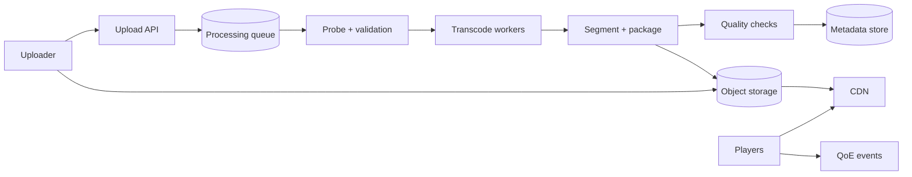

把一个 MP4 放进 object storage，再返回下载链接，可以完成最早的 demo。它无法解决真实播放环境：用户网络会不断变化，手机不需要下载 4K，拖动到第 30 分钟不应先下载前 29 分钟，一个热门直播也不能让几百万观众同时打到源站。

视频平台的核心不是“存大文件”，而是：**把原始媒体异步处理成多种码率的小分片，由 manifest 描述播放顺序，再通过 CDN 和自适应码率让客户端根据网络持续选择。**

> 配套实验：[打开 Video Streaming Lab](https://lab.zichaoyang.com/system-design/video-streaming/)。先增加上传量和 rendition 数，观察转码；再增加并发观众，观察瓶颈如何转到 CDN egress。

## 为什么一个视频要保存很多份

上传一个 4K 视频，平台可能生成：

```text
2160p 12 Mbps
1080p  5 Mbps
720p   2.5 Mbps
480p   1 Mbps
360p   0.5 Mbps
audio  128 Kbps
```

每个 rendition 又切成例如 2–6 秒的 segments。播放器先下载 manifest，然后根据当前带宽和 buffer 选择下一段的码率。

如果网络从 20Mbps 突然掉到 2Mbps，播放器无需重开整个文件，只在下一个 segment 切到 720p/480p。这个机制叫 adaptive bitrate streaming（ABR）。

它增加转码和存储，却显著降低卡顿，并适配不同屏幕和网络。后面所有架构都围绕这条内容准备与分发链路展开。

## 先讲清 Source、Rendition、Segment 和 Manifest

**Source asset**

用户上传的原始媒体。它是最高质量事实来源，通常长期保留或按策略归档。

**Rendition**

某种分辨率、码率、codec 和音频组合的转码结果。

**Segment**

几秒钟的媒体块。播放器可以独立请求、缓存和切换码率。

**Manifest / playlist**

描述有哪些 rendition、每个 segment 的 URL、时长、codec 和加密信息。HLS 常见 `.m3u8`，DASH 常见 MPD。

**Origin 与 CDN**

Origin 保存媒体对象；CDN 在全球 edge 缓存 segment。绝大多数播放流量应停在 edge，而不是回源。

## 题目边界

核心功能：

1. 断点上传视频；
2. 校验、转码、切片、生成缩略图和 manifest；
3. 发布/下架视频；
4. 点播播放、seek 和 ABR；
5. CDN 分发和访问授权；
6. 记录 playback/QoE 事件；
7. 支持直播作为后续演化。

第一版不设计推荐、评论、完整 DRM license server 和内容审核模型。审核作为发布 gate。

非功能目标：

- 上传可续传，完成后原始文件不损坏；
- 处理 pipeline 可重试、可观察；
- 播放首帧快、rebuffer 少；
- 热门内容不冲垮 origin；
- 已下架内容快速停止新播放；
- 多租户/地域版权与访问控制正确；
- 媒体和 metadata 有明确 retention、复制与删除。

## 第一版：一个 MP4 的 Multipart Upload

客户端先创建 asset：

```http
POST /v1/videos

{
  "title":"System Design Lesson",
  "contentType":"video/mp4",
  "size":10737418240
}
```

返回 `video_id` 和 multipart upload session。客户端把 10GB 文件分块直传 object storage，失败只重传某些 parts。

完成：

```http
POST /v1/videos/v-9/uploads/up-81:complete

{
  "parts":[
    {"partNumber":1,"etag":"..."},
    {"partNumber":2,"etag":"..."}
  ],
  "contentHash":"sha256:..."
}
```

服务端验证 size/hash，原子把 asset 从 UPLOADING 改为 PROCESSING，并写 outbox。半上传 object 位于 staging，不对播放器可见。

第一版转码可以只输出一个 720p MP4，支持 HTTP range。它先验证 upload、状态机、权限和 CDN；ABR 是下一步，而不是一开始搭十种 codec。

## 数据模型：处理状态与发布状态分开

```text
Video(
  video_id,
  owner_id,
  title,
  visibility,
  processing_state,
  publishing_state,
  source_asset_id,
  active_package_id,
  version,
  created_at,
  published_at
)

MediaAsset(
  asset_id,
  video_id,
  type,
  object_uri,
  size,
  content_hash,
  codec,
  width,
  height,
  duration_ms,
  state
)

MediaPackage(
  package_id,
  video_id,
  pipeline_version,
  manifest_uri,
  renditions,
  state,
  created_at
)

ProcessingJob(
  job_id,
  video_id,
  stage,
  input_artifact_hash,
  attempt,
  state,
  output_ref,
  failure_reason
)
```

一个视频可重新转码生成新 package；active pointer 切换后，新播放使用新 package，已开始的 session 可继续旧 manifest。不要原地覆盖 segments，CDN cache 会混入新旧内容。

## 处理 Pipeline：每个 Stage 都应幂等

```text
validate / probe
-> malware / policy scan
-> transcode renditions
-> segment + package
-> thumbnails / captions
-> quality validation
-> publish
```

每个 stage 的 output key 由 source hash、pipeline version、rendition config 决定。Worker 重试相同输入时复用完整产物或写 attempt 临时路径，最后通过 manifest commit 发布。



Orchestrator 传 URI 和 metadata，不搬运视频 bytes。Transcode worker 尽量读取本地/同 Region source，输出直接写 object storage。

## Rendition Ladder：不是分辨率越多越好

每多一个 rendition，都增加转码计算、存储和 packaging。固定 ladder 简单，但动画、体育、访谈对 bitrate 的需求不同。

可以先用固定 ladder，再根据 source resolution、帧率和复杂度做 per-title encoding。质量指标如 VMAF 帮助选择在目标质量下更低的 bitrate。

关键约束：相邻 rendition 的 keyframe/segment 边界对齐。否则播放器切码率时可能无法无缝解码。

Codec 也是取舍：新 codec 带宽更省，但编码更贵、设备支持不完整。Manifest 根据客户端 capability 提供兼容组合，不能只生成最先进 codec。

## 播放 API 和授权

```http
POST /v1/videos/v-9/playback-sessions

{"device":{"codecs":["h264","hevc"],"maxHeight":1080}}
```

```json
{
  "sessionId":"ps-88",
  "manifestUrl":"https://cdn.example.com/.../master.m3u8?token=...",
  "expiresAt":"2026-07-13T18:00:00Z",
  "heartbeatIntervalSeconds":30
}
```

Token 绑定 video/package、用户权限、地区、expiry 和可选 device。CDN edge 验证签名，避免每个 segment 都回源鉴权服务。

对公开视频，manifest/segments 可长缓存；私有/付费视频用短期 token、signed cookie/url。下架时停止签发新 session，并通过 CDN purge/短 manifest TTL 缩短残余窗口。

## CDN：命中率和回源保护

Segment URL immutable，包含 package/version/hash：

```text
/videos/v-9/packages/pkg-17/1080p/segment-0042.m4s
```

这样可以设置很长 cache TTL。新转码产生新 URL，不需要覆盖旧对象。

Manifest 更易变化，TTL 较短；VOD 发布后也可 immutable。Live manifest 持续更新，必须短 TTL 或 no-cache/revalidation。

热门新视频发布时，许多 edge 同时 miss 会冲击 origin。使用：

- Origin shield / mid-tier cache；
- Request coalescing，同一 segment 只回源一次；
- 热门内容预热；
- Origin per-key rate limit 和 autoscale；
- Multi-origin/replication。

Cache hit 要按 bytes 而不只 requests 计算。一个 4K segment miss 比一个小 manifest miss 贵得多。

## ABR：播放器决定下一段，不是服务器强推

播放器持续估计：

```text
network throughput
buffer seconds
recent download time
device decode capacity
viewport
```

选择能在 segment 播放前下载完成的最高 rendition。启动时通常保守选择较低码率，积累 buffer 后再升，减少首帧时间。

系统端提供对齐的 segments、准确 bitrate metadata 和多码率；具体 ABR 算法在 client。服务端 QoE 事件用来评估：startup time、rebuffer、bitrate、switch 和 fatal error。

不要只优化平均 bitrate。高码率但频繁卡顿通常比稳定较低画质更差。

## 容量估算：分发 Egress 远大于上传

假设 10M 并发观众，平均播放 bitrate 3Mbps：

```text
10M × 3Mbps = 30Tbps egress
```

这不可能由单一 origin 提供，CDN 是架构核心而非优化项。

若 CDN byte hit 98%，origin 仍需：

```text
30Tbps × 2% = 600Gbps
```

Origin shield 和多 Region 仍然重要。

上传假设每天 1M 小时 source，平均 10Mbps：

```text
1M hours × 10Mbps ≈ 4.5PB source/day
```

若平均生成 6 个 rendition，总输出可能是 source 的数倍。Transcode 计算以 video minutes × ladder × codec 估算，按 queue age 和 deadline 调度。

Storage 不只 source + renditions，还包括 thumbnails、captions、DRM metadata 和旧 package retention。热门冷门分层到不同 storage class。

## 转码调度：短视频不能排在电影后面一整天

Job metadata 包含 duration、resolution、codec、priority 和 publish deadline。Scheduler 可把长视频按 time range 切成多个 parallel segments 转码，再做边界一致的 packaging。

优先级：

- Live/near-live 最高，必须跟上输入；
- 用户刚发布短视频，低等待；
- Library backfill/新 codec 转码可低优先级、可抢占。

GPU/ASIC encoder 提升吞吐，但某些 quality preset 仍需 CPU。Resource profile 通过 benchmark，不按“一个视频一个 worker”猜。

Backpressure 时 API 仍可接收上传，但明确预计处理时间；超出存储/队列上限则拒绝新大任务，不能无限积压。

## Live Streaming：相同分发，不同时间边界

Live source 持续 ingest：

```text
encoder -> ingest edge -> transcoder -> segmenter -> live manifest -> CDN
```

VOD 可以等整个文件上传后重试某段；Live 必须在 segment deadline 前完成，错过就无法回到过去。Pipeline latency 大致：

```text
capture + encode + upload + transcode + segment + CDN + player buffer
```

6 秒 segment、播放器等 3 段就天然增加十几秒。Low-latency HLS/DASH 使用 partial segments、更小 buffer 和持续传输，代价是请求更多、CDN/cache 效率下降、卡顿容忍更低。

Live origin/encoder 故障可切备用 ingest。Manifest 中 discontinuity 明确处理时间线变化。直播结束后将 segments 和 manifest finalize 成 VOD package。

## QoE 事件：服务端 200 不代表用户看到了

Player 上报：

```text
playback_start
first_frame
segment_download
rebuffer_start/end
bitrate_switch
decode_error
playback_end
```

事件带 session ID、package/rendition、CDN POP、网络类型和时间。批量异步上报，不阻塞播放。

关键指标：

- Video start time；
- Rebuffer ratio / count；
- Average bitrate 和 switch；
- Playback failure；
- CDN byte hit、origin egress、segment p95；
- 按 ISP/device/codec/Region 切片。

平均成功率会掩盖某款电视 decoder 或某个 ISP 的严重问题。

## 故障与正确性

**Multipart upload 中断**

客户端查询已完成 parts，继续上传。过期 session 的 staging parts 后台清理。

**Transcode worker 崩溃**

Stage 按 source hash + config 幂等重试。临时 output 不进入 active package。

**某个 Rendition 失败**

如果最低可用 ladder 已完整，可以降级发布并标记 missing rendition；4K 失败不必阻止 720p。Audio/关键基础 rendition 失败则不发布。

**Package 部分上传**

Manifest 最后写并原子 publish。播放器不会看到引用缺失 segment 的 package。

**CDN 回源风暴**

Shield、coalescing、stale-if-error 和 per-object protection。Origin 失败时可短暂服务已缓存 immutable segment。

**下架**

Metadata 先改不可播放，停止签发 session；purge manifest/segments 按风险执行。已签 token 的残余窗口是明确产品语义。

## 关键取舍

**更多 Rendition** 改善 ABR 选择，也增加转码、存储和 manifest 复杂度。

**更短 Segment** 提高切码率和 seek 粒度、降低直播 latency，却增加请求数、header 开销和 CDN 压力。

**新 Codec** 降带宽，但编码成本和设备兼容性更差。

**更长 CDN TTL** 提高命中，适合 immutable segment；权限/manifest 更新需要 versioned URL 或 purge。

**更大 Player buffer** 减少卡顿，却增加 startup/live latency。

**Origin 多 Region** 提高可用性和回源容量，也增加复制、成本和一致性管理。

## 用 Lab 看瓶颈怎样迁移

**实验一：增加上传与 Rendition**

保持观众不变，观察 transcode queue 和 storage。决定固定 ladder 何时值得做 per-title 优化。

**实验二：增加并发观众**

观察 CDN egress 和 byte hit，确认增加 transcode worker无助于播放热点。

**实验三：打开 Live**

比较 VOD 的可重试 batch pipeline 与 live deadline。缩短 segment 后，记录 latency 和 CDN 请求放大。

## 面试表达：先把媒体准备与分发分开

可以这样开场：

> I would separate the asynchronous media-processing path from the playback path. Uploads create immutable source assets; workers generate aligned bitrate renditions and segments; an immutable manifest is published only after validation; CDN edges then serve almost all playback traffic.

演化顺序：

```text
multipart source upload
-> one validated rendition
-> multi-bitrate segments + manifest
-> CDN and origin shield
-> QoE-driven ABR tuning
-> live ingest and low-latency packaging
```

最后给深入入口：

> I can go deeper into transcoding orchestration, CDN cache behavior, adaptive bitrate and QoE, or low-latency live streaming.

这样讲，视频系统不再是一张 `S3 -> CDN` 图，而是一条有完整 publish 边界的媒体供应链。

## 参考资料

- [RFC 8216: HTTP Live Streaming](https://www.rfc-editor.org/rfc/rfc8216)
- [MPEG-DASH Overview](https://dashif.org/docs/DASH-IF-IOP-v4.3.pdf)
- [Netflix VMAF: Perceptual Video Quality Assessment](https://github.com/Netflix/vmaf)
- [AWS S3 Multipart Upload Overview](https://docs.aws.amazon.com/AmazonS3/latest/userguide/mpuoverview.html)
