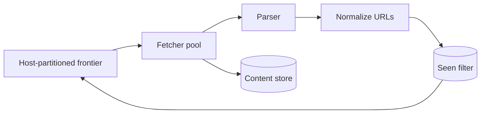

Crawler 的核心矛盾是：你想并发抓得很快，但不能反复抓同一 URL，也不能把某个网站打挂。换句话说，**throughput 必须服从 dedup 和 politeness**。

先看一个最小 crawler：取出 URL，下载页面，解析链接，再把新链接放回队列。顺序执行时，大部分时间都在等网络。加 1000 个 worker 能提高吞吐，却可能同时向同一个域名发 1000 个请求。

> 对应实验：[打开 Web Crawler Lab](https://lab.zichaoyang.com/system-design/web-crawler/)。增加 worker、domain 数和目标 crawl rate，观察 politeness 何时成为真正上限。

## 需求边界（Requirements）

功能上从 seed 发现、抓取、去重、保存并周期重抓页面。非功能重点不是单页 p99，而是吞吐、recrawl freshness、可恢复性，以及严格遵守 robots/per-host politeness，系统规模不能转化为对外部站点的伤害。

## 0. 先搭一个单进程 Crawler MVP Scaffold

输入一组 seed URL，用一个 FIFO queue 循环：取 URL、检查 robots、下载、保存正文、解析链接、normalize、去重后入队。先限制只抓一个 domain、最大深度和最大页面数，避免第一个版本就失控爬完整个 Web。

实现顺序是 URL canonicalizer、seen hash set、fetch timeout、HTML parser、内容存储、per-host delay、checkpoint。先保证重启不从头抓，再增加 worker pool。

## 1. API：Crawler 是 job，不是同步请求

```http
POST /v1/crawl-jobs
{"seeds":["https://example.com"],"maxPages":10000,"allowedHosts":["example.com"]}

202 Accepted
{"jobId":"crawl-9"}

GET /v1/crawl-jobs/crawl-9
```

内部 frontier task 至少包含 normalized URL、host、priority、depth、next_fetch_at、attempt 和 lease owner。外部 API 管 job；worker 不直接接收用户同步请求。

## 2. 数据模型（Data Model）

```text
CrawlJob(job_id, seeds, scope, status, created_at)
Frontier(url_hash PK, normalized_url, host, priority, next_fetch_at, lease_until, attempts)
Page(url_hash, fetched_at, status_code, content_hash, object_url, metadata)
HostState(host PK, robots_version, crawl_delay, next_allowed_at, error_backoff)
```

正文进 object storage，metadata 进可查询 store。Seen URL 与 content hash 分开：前者避免重复调度，后者识别不同 URL 的重复正文。

## 3. 单机端到端流程

Scheduler 只挑 `next_fetch_at <= now` 且 host 已解禁的 URL，给 task lease。Fetcher 解析 DNS、发 HTTP、限制 body 大小，写 page 后才 ack task。Parser 产生链接，经 canonicalize 和 scope check，再用 seen set 判重入队。Crash 后 lease 到期，任务重新可见。

## 4. 容量估算：网络等待决定 worker 数

目标 10 万页/秒、平均 fetch latency 500ms，Little's Law 给出约 5 万个并发 in-flight request。平均页面 500KB 时入口带宽约 50GB/s，每天 raw content 约 4.3PB；这立刻说明需要压缩、内容过滤、生命周期和大规模 object storage。

若只有 1000 个 domain、每域 politeness 限制 1 req/s，理论上最多 1000 页/秒，再加 worker 也没用。

## 5. Latency Budget：这里关心吞吐和 recrawl lag

单页 latency 可以是秒级；真正 SLO 是 frontier age、每秒成功页数和目标页面多久被重新抓取。DNS、connect、TLS、TTFB 和 download 分开计时，才能知道是网络慢、host 限速还是 worker 不够。

## 6. Correctness and Reliability

Frontier 用 lease 实现 at-least-once；Page 写入按 URL/version 幂等。Robots 结果缓存但有 TTL，失败时默认保守。对 `429/503` 按 host 指数退避；`404` 不无限重试。Checkpoint 保存 frontier、seen filter version 和 host schedule。

## 7. Trade-offs：覆盖率、成本与礼貌

- Exact seen set 不漏抓但占空间；Bloom filter 省内存，却会因 false positive 漏少量页面。
- 更多并发提高吞吐，但不应突破 per-host politeness。
- 高频 recrawl 提高新鲜度，却挤占新页面发现和带宽预算。

## 三个基础概念

- **URL frontier**：尚待抓取 URL 的调度队列，不是普通 FIFO；它要同时表达优先级和“某域名下一次何时允许访问”。
- **Politeness**：遵守 robots.txt，并限制每个 host 的抓取频率。
- **Seen set**：判断 URL 是否已处理。数十亿 URL 时，精确 hash set 可能撑爆内存，因此常用 Bloom filter 以小概率误判换空间。

## 主链路



URL 必须先 canonicalize，例如去 fragment、统一 host 大小写、处理默认端口，否则同一页面会以多个字符串重复出现。抓到的内容写 object storage，metadata 和链接图写独立 store。

## 架构演化

1. 单 worker 证明流程正确，但网络等待浪费吞吐。
2. worker pool 提高并发，同时迫使 frontier 实现 per-host 调度。
3. 当 worker 更多也不再提速时，上限可能是 `domain 数 × 每域许可速率`，不是机器数。
4. seen set 超出内存后用 Bloom filter；false positive 会漏抓少量页面，这是明确的质量取舍。
5. Web 规模下按 host hash 分区 frontier，让同一 host 由一个调度 owner 管理，天然执行 politeness。

## URL 去重不等于内容去重

不同 URL 可能返回相同正文，例如 tracking 参数、镜像站和打印页。URL dedup 防止重复调度；content fingerprint 则在下载后识别重复或近重复内容，减少索引和存储浪费。两者处在不同阶段，不能混为一谈。

失败恢复也很关键。worker crash 后任务应因 lease 到期重新出现；DNS 和 HTTP 失败要分类退避；永久 `404` 与临时 `503` 的重试策略不同。

## 面试表达

> The crawler is I/O-bound, but unlimited concurrency is unsafe. I would partition a scheduling frontier by host so we can scale fetchers while enforcing robots rules and per-host politeness.

画完 frontier、fetcher、parser、seen set、store 后就够高层设计。接下来让面试官选择 frontier scheduling、dedup memory、failure retry 或 incremental recrawl。
