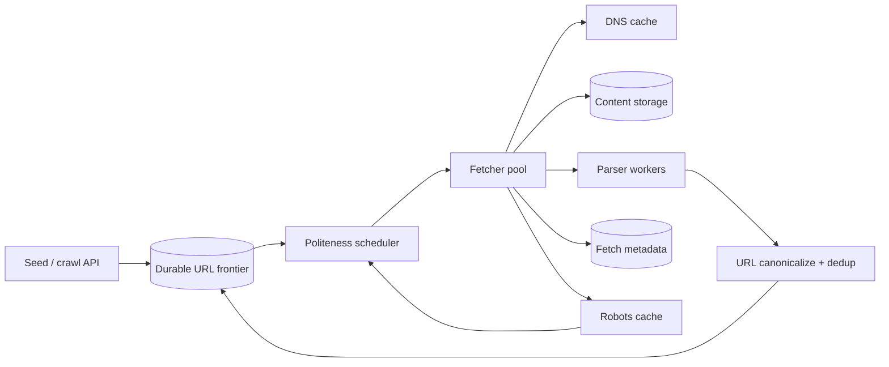

Crawler 的目标不是“尽可能快地下载网页”。如果 1,000 个 worker 同时请求同一个小网站，技术上吞吐很高，实际上是在攻击对方。与此同时，开放 Web 有无限日历、session 参数、重复镜像和动态页面，一个没有边界的 crawler 会把全部资源耗在少数 crawl traps 上。

这道题的核心是：**在全局高吞吐和单站点礼貌之间做调度，同时识别重复 URL/内容，让有限预算覆盖尽可能有价值的网页。**

> 配套实验：[打开 Web Crawler Lab](https://lab.zichaoyang.com/system-design/web-crawler/)。先固定 domain 数增加 worker，观察为什么吞吐不再上升；再增加 domain 和目标 crawl rate，观察 frontier 如何并行。

## 为什么一个普通 FIFO Queue 不够

Frontier 里依次出现：

```text
https://small.example/a
https://small.example/b
https://small.example/c
...
https://small.example/z
https://other.example/page
```

100 个 worker 从 FIFO 取任务，会同时打 `small.example`。要遵守每 host 1 秒一次，99 个 worker 只能等待；若不等待，就违反 politeness。

更合理的结构是每 host 一条队列，再有一个按“下次允许抓取时间”排序的 scheduler：

```text
small.example -> [a,b,c...] next_allowed=12:00:01
other.example -> [page...]  next_allowed=12:00:00
```

Worker 选择当前已经 eligible 的 host，而不是盲取全局 FIFO。这是 crawler 最重要的数据结构。

## 先讲清 Frontier、Seen Set 和 Politeness

**URL frontier**

所有待抓 URL 的有序集合。它不仅是一条 queue，还包含优先级、host ownership、next fetch time、retry 和 recrawl schedule。

**Seen URL set**

记录已发现/已抓过的规范化 URL，避免图遍历无限重复。

**Content dedup**

不同 URL 可能返回相同或近似相同正文。URL 去重和内容去重是两层问题。

**Politeness**

遵守 robots.txt、per-host crawl delay/速率、错误 backoff 和资源限制。Crawler 的 capacity 由站点允许的并行总和决定，而不只是 worker 数。

**Crawl budget**

每个 domain、path 或整个 job 能消耗多少页面/带宽/时间。它是抵御 trap 和控制覆盖率的硬边界。

## 题目边界

核心功能：

1. 接收 seed URL 与抓取政策；
2. 规范化 URL、检查 robots 和 allow/deny scope；
3. 礼貌调度 HTTP fetch；
4. 解析页面、保存内容与 metadata；
5. 抽取新 links 并去重入队；
6. Retry transient failure，避免 crawl trap；
7. 支持 priority 和 periodic recrawl；
8. 水平扩展到很多 domains。

第一版只处理 HTTP/HTTPS HTML，不执行任意 JavaScript，不抓登录内容，不设计搜索索引。

非功能目标：

- 绝不越过配置 scope 与 robots policy；
- 对单 host 严格控制并发和请求间隔；
- 全局吞吐能随独立 domains 增长；
- 同 URL/内容不重复浪费资源；
- Fetch/parser 失败可重试且有上限；
- Frontier durable，进程崩溃后不丢大批工作；
- 内容与抓取来源可审计，支持删除/不再抓取。

## 第一版：单线程 BFS

```python
from collections import deque

frontier = deque(seed_urls)
seen = set()

while frontier and len(seen) < max_pages:
    raw_url = frontier.popleft()
    url = canonicalize(raw_url)

    if url in seen or not allowed_scope(url):
        continue

    seen.add(url)

    if not robots_allows(url):
        continue

    response = fetch(url, timeout=10)
    page = store(url, response)

    for link in extract_links(page):
        frontier.append(resolve_relative(url, link))
```

这个版本先验证：URL 解析、relative link、redirect、robots、timeout、content type 和 max pages。它每次只发一个请求，因此天然礼貌但很慢。

不要在第一版就加 1,000 threads。先让 URL identity 和 scope 正确，否则只会更快地抓错东西。

## URL Canonicalization：太弱会重复，太强会误合并

安全的规范化通常包括：

- scheme/host 小写；
- 移除默认端口；
- 解析 `.`、`..` path；
- 去掉 fragment，因为它不发给服务器；
- 标准化百分号编码；
- 按明确规则处理 trailing slash；
- IDN 转换与验证。

Query 参数很危险。排序参数可以合并：

```text
?b=2&a=1 -> ?a=1&b=2
```

但删除 `session`、`utm` 或任意参数可能改变页面内容。规则应按 domain 配置并保留 raw URL。Canonical URL 不是“把所有看起来没用的东西删掉”。

Server 的 `<link rel="canonical">` 是信号，不是无条件命令；恶意页面可以指向其他站点。

## Robots 与 Host Policy

首次抓一个 host 前获取：

```text
https://host/robots.txt
```

缓存：

```text
RobotsPolicy(
  host,
  fetched_at,
  expires_at,
  status,
  rules,
  etag,
  last_modified
)
```

处理 fetch failure 要有明确 policy。对公共搜索 crawler，robots 暂时不可用时通常保守 backoff 或使用仍有效缓存；不能把 timeout 等价为“全部允许”。

Host key 不一定只是 hostname。`www.example.com` 和 `api.example.com` 可能共享同一 origin/IP，也可能独立。Politeness 可以按 registrable domain、host 和 IP 多层限制，避免许多子域绕过总限额。

## 第二版：Per-host Queue + Delay Scheduler

```text
HostFrontier(
  host_key,
  next_allowed_at,
  in_flight,
  max_concurrency,
  min_delay_ms,
  failure_backoff,
  priority,
  queued_urls
)
```

全局 scheduler 使用最小堆/时间轮：

```python
while True:
    host = eligible_hosts.pop_min_next_allowed()
    if host.next_allowed_at > now():
        sleep_until(host.next_allowed_at)

    url = host.queue.pop_highest_priority()
    dispatch(url, host.lease_id)
    host.in_flight += 1
```

Fetcher 完成后汇报 status、bytes、latency，scheduler 更新 next time 和 backoff。429/503/timeout 增加 delay；稳定快速响应可以在政策上限内恢复。

这套设计让 10,000 个 domains 并行，又不会让同一 host 被 worker 数乘法放大。

## Job API 和数据模型

```http
POST /v1/crawl-jobs

{
  "seeds":["https://example.com/docs/"],
  "scope":{"allowedHosts":["example.com"],"pathPrefix":"/docs/"},
  "limits":{"maxPages":100000,"maxBytes":10737418240,"maxDepth":20},
  "priority":"NORMAL"
}
```

```http
202 Accepted

{"jobId":"crawl-81","state":"RUNNING"}
```

核心记录：

```text
CrawlJob(
  job_id,
  policy_version,
  scope,
  limits,
  state,
  pages_fetched,
  bytes_fetched,
  created_at
)

UrlRecord(
  url_hash,
  canonical_url,
  host_key,
  first_discovered_at,
  last_fetch_at,
  fetch_state,
  retry_count,
  next_fetch_at,
  content_id,
  http_status
)

FetchRecord(
  fetch_id,
  url_hash,
  attempt,
  started_at,
  completed_at,
  status,
  response_headers_ref,
  content_hash,
  bytes
)

ContentObject(
  content_id,
  object_uri,
  content_hash,
  mime_type,
  charset,
  size,
  fetched_at
)
```

Frontier 是运行状态，UrlRecord/FetchRecord 保留历史。页面正文放 object storage，不塞进 frontier database。

## Seen Set：Hash Set 到 Bloom Filter

精确 set 保存 100B URLs 很贵。假设每 hash + overhead 32 bytes：

```text
100B × 32B = 3.2TB memory
```

Bloom filter 用 bit array 和多个 hash，以很小空间判断“可能见过”：

- 返回 definitely not seen：可以入队；
- 返回 possibly seen：再查精确 durable set，或在允许漏抓时直接跳过。

Bloom false positive 会让一小部分新 URL 被误认为见过。搜索全覆盖场景可用 Bloom 作为前置 cache，再查 disk KV；非关键分析 crawler 可接受极小漏抓率省成本。

Seen key 包含 crawl scope/version 吗？一次全站 recrawl 需要重新 fetch 已见 URL，因此“发现去重”和“抓取调度”分开：URL identity 永久，fetch schedule 按 job/recrawl policy 更新。

## 内容去重与 Near-duplicate

不同 URL：

```text
/article?id=9
/article/9
/print/article/9
```

可能返回相同正文。完整 byte hash 可精确去重；去掉模板/导航后做 SimHash/MinHash 可检测近似重复。

Content dedup 不意味着丢 URL metadata。搜索仍需知道 canonical、redirect 和 link graph，只是正文 object 可以复用，索引可选一个主版本。

解压前后 hash 语义要固定。HTTP gzip、动态广告和时间戳会改变 bytes；正文 extraction pipeline version 也要记录。

## Crawl Trap：如何给“无限网站”设边界

典型 trap：

```text
/calendar/2026/07/13
/calendar/2026/07/14
... forever

/products?sort=a&color=b&page=1...
session IDs generating new URLs
```

防线：

- 每 job/domain/path prefix page/byte/time budget；
- 最大 URL 长度、query 参数数、path depth；
- 相似 URL pattern 的 cardinality rate；
- 连续低价值/重复内容降低 priority；
- Calendar/date 参数识别；
- 每个 parent 页面抽取 link 上限；
- 人工/domain rule。

Budget 达到后状态标记 `BUDGET_EXHAUSTED`，不是简单 FAILED。Crawler 必须能解释为什么没继续抓。

## Fetcher：防止 SSRF 和资源炸弹

Crawler 本质上会访问不可信 URL。Fetcher 必须：

- 只允许 http/https；
- DNS 解析后拒绝 loopback、link-local、内网和 metadata IP；
- Redirect 每一跳重新验证，并限制次数；
- 限制 headers、compressed/uncompressed bytes；
- Streaming download，超限立即停止；
- Content-type allowlist，不执行下载内容；
- 每请求/host deadline；
- Sandbox parser，防恶意 HTML/压缩炸弹。

DNS rebinding 要在连接时校验实际 IP，不能只验证 URL 字符串。Fetcher 与内部生产网络隔离，使用专用 egress。

## 高层架构



Scheduler owns host rate state；Fetcher 只执行有 lease 的单次下载；Parser 与网络隔离，可独立扩容。

下载完成事件至少一次传给 parser。Parser 输出 links 按 source URL/job policy 验证后进入 dedup/frontier。

## 分布式 Ownership：同一个 Host 必须只有一个调度者

按 `hash(host_key)` 把 host 分给 scheduler shard。该 shard 拥有 per-host queue、next_allowed 和 in-flight。这样 100 个 fetcher 仍受一个 host policy 控制。

Shard map 带 epoch/lease。Scheduler 故障时新 owner 恢复 durable frontier；旧 lease 的 fetch completion 可以记录，但旧 owner不能继续 dispatch。

Rebalance 按 host 移动，而不是按单 URL，否则同 host 分到多个 scheduler，会破坏 politeness。

Fetcher pool 可以全局共享，但任务携带 host lease 和 deadline。Scheduler 对每 host 保留有限 in-flight token。

## DNS 是隐藏瓶颈

若每个页面都做外部 DNS lookup，百万 fetch/s 会产生巨大 DNS 负载和延迟。缓存按 TTL，支持 negative cache 和 resolver rate limit。

但不能无视 DNS 变化。TTL 到期重新解析；每次连接仍做私网 IP 安全检查。Many hosts 解析到同一 IP 时，增加 per-IP concurrency limit，避免从子域名绕过。

DNS failure 按 host backoff，不让 retry storm 冲击 resolver。

## 容量估算：Politeness 决定有效并行度

目标每天抓 10B 页面：

```text
10B / 86,400 ≈ 116K pages/s average
```

峰值/重试按 3 倍准备约 350K fetch/s。

平均页面 200KB：

```text
10B × 200KB = 2PB/day downloaded
```

若只保留压缩正文 25%，仍是 500TB/day 级别。Bandwidth 和 storage 比 task queue QPS 更可能是成本核心。

要达到 116K/s，若每 host 平均只允许 1 request/s，就至少需要 116K 个同时 eligible hosts。只有 1,000 个 domains 时，再加 worker也无法达到目标。这是 Lab 中最重要的容量结论。

Frontier 假设平均积压 100B URLs，每条压缩 metadata 100 bytes，就是 10TB，必须分片并将冷 scheduled URLs 放磁盘/对象存储，近期待抓部分进内存时间轮。

## Priority 与 Recrawl

Priority 信号：

```text
page importance / link score
source trust
change frequency
freshness requirement
depth from seed
content value
historical failure/duplicate rate
```

新闻首页分钟级 recrawl，静态文档可以数周。根据 `Last-Modified`、ETag、历史内容 hash 变化学习 next fetch interval。

使用 conditional GET：

```http
If-None-Match: "etag"
If-Modified-Since: ...
```

304 节省 bytes，但仍消耗 host request budget。Recrawl scheduler 在 freshness 和 politeness之间平衡。

新 seed/high-priority 不能永久饿死普通 frontier；使用 weighted fair queues 和 per-domain budget。

## 故障与恢复

**Fetcher timeout**

记录 attempt，按 status 分类 retry。Timeout/5xx backoff；4xx 多数不重试；429 尊重 Retry-After。

**Worker 下载完成后崩溃**

任务 lease 到期重发。Content 以 fetch ID/hash 幂等写；重复 fetch metadata 保留一个逻辑 attempt 或明确记录。

**Parser crash / 恶意页面**

Sandbox、CPU/memory/time limit。原始内容已保存，可用修复后的 parser 重放。

**Frontier shard 故障**

从 replicated log/state 恢复 host queues 和 next_allowed。保守延长 delay，不能重启后所有 host 立即 eligible 造成 burst。

**Seen set 暂时不可用**

本地 Bloom 阻挡明显重复，待 durable set 恢复；宁可短暂少抓，也不要无限重复把 frontier 填满。

**Robots 更新**

新 policy 生效后取消尚未 dispatch 的 disallowed URLs。已存内容按 policy/删除请求处理。

## 观测

- Fetch pages/s、bytes/s、status、latency；
- Frontier size、oldest age、eligible hosts、priority distribution；
- Per-host/IP request interval 和 politeness violation（必须为 0）；
- Robots fetch/cache/error、disallow count；
- DNS latency、cache hit、resolver error；
- URL seen hit、Bloom false-positive estimate、content duplicate；
- Parse latency/error、links extracted；
- Crawl-trap budget exhaustion、depth/parameter anomalies；
- Recrawl freshness、304 ratio、content change rate；
- Shard skew、host ownership migration。

全局 throughput 高不代表 crawler 健康。如果 90% 带宽都在重复页面或一个 trap 上，覆盖率很差。

## 关键取舍

**更多 worker** 只在有足够独立 eligible hosts 时提高吞吐；politeness 是硬上限。

**更严格 URL canonicalization** 减少重复，也可能把语义不同页面错误合并。

**Bloom filter** 节省 seen-set 内存，却有 false positive；是否能漏抓取决于产品。

**更激进 recrawl** 提高 freshness，也占用 host budget、带宽和存储。

**执行 JavaScript** 能看到 SPA 内容，却大幅增加 CPU、安全和延迟；只对必要站点使用 browser renderer 队列。

**按 Host 分片** 守住 politeness，但 host 大小倾斜；超级 host 仍由单 scheduler 管速率，fetch 可有限并发。

## 用 Lab 理解“快”不是唯一目标

**实验一：固定 Domain 增加 Worker**

观察 throughput 在 per-host limit 后不再上升。新增 worker 只增加等待。

**实验二：增加 Domain 数**

看到 eligible hosts 增加后，全局并行度才增长。这说明 frontier 调度比 worker pool 大小更重要。

**实验三：提高 Crawl rate 与 Seen Set**

计算 URL metadata、DNS 与存储。加入 Bloom 前先明确 false positive 是否可接受。

## 面试表达：先画 Per-host Frontier

可以这样开场：

> I would not use one global FIFO queue, because that can either overload one host or leave workers blocked behind it. I would maintain per-host URL queues and schedule hosts by their next-allowed fetch time, so global throughput scales across domains while politeness remains locally enforced.

演化顺序：

```text
single-thread BFS
-> canonicalization + robots
-> per-host delay queues
-> fetch/parse separation
-> durable seen set + content dedup
-> host-sharded schedulers and recrawl policy
```

最后给深入入口：

> I can go deeper into frontier scheduling, URL and content deduplication, crawl-trap defenses, or distributed host ownership and recovery.

这条主线把 crawler 讲成一个受外部资源约束的调度系统，而不是一个无限扩线程的下载器。

## 参考资料

- [Mercator: A Scalable, Extensible Web Crawler](https://www.cse.iitd.ac.in/~cs5090259/mercator.pdf)
- [UbiCrawler: A Scalable Fully Distributed Web Crawler](https://vigna.di.unimi.it/ftp/papers/UbiCrawler.pdf)
- [RFC 9309: Robots Exclusion Protocol](https://www.rfc-editor.org/rfc/rfc9309)
- [Space/Time Trade-offs in Hash Coding with Allowable Errors](https://dl.acm.org/doi/10.1145/362686.362692)
