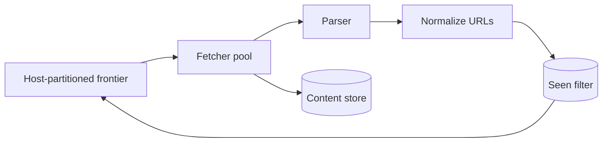

Crawler 的核心矛盾是：你想并发抓得很快，但不能反复抓同一 URL，也不能把某个网站打挂。换句话说，**throughput 必须服从 dedup 和 politeness**。

先看一个最小 crawler：取出 URL，下载页面，解析链接，再把新链接放回队列。顺序执行时，大部分时间都在等网络。加 1000 个 worker 能提高吞吐，却可能同时向同一个域名发 1000 个请求。

> 对应实验：[打开 Web Crawler Lab](https://lab.zichaoyang.com/system-design/web-crawler/)。增加 worker、domain 数和目标 crawl rate，观察 politeness 何时成为真正上限。

## 三个基础概念

- **URL frontier**：尚待抓取 URL 的调度队列，不是普通 FIFO；它要同时表达优先级和“某域名下一次何时允许访问”。
- **Politeness**：遵守 robots.txt，并限制每个 host 的抓取频率。
- **Seen set**：判断 URL 是否已处理。数十亿 URL 时，精确 hash set 可能撑爆内存，因此常用 Bloom filter 以小概率误判换空间。

## 主链路

URL 必须先 canonicalize，例如去 fragment、统一 host 大小写、处理默认端口，否则同一页面会以多个字符串重复出现。抓到的内容写 object storage，metadata 和链接图写独立 store。

## 架构演化

1. 单 worker 证明流程正确，但网络等待浪费吞吐。
2. worker pool 提高并发，同时迫使 frontier 实现 per-host 调度。
3. 当 worker 更多也不再提速时，上限可能是 `domain 数 × 每域许可速率`，不是机器数。
4. seen set 超出内存后用 Bloom filter；false positive 会漏抓少量页面，这是明确的质量取舍。
5. Web 规模下按 host hash 分区 frontier，让同一 host 由一个调度 owner 管理，天然执行 politeness。

## URL 去重不等于内容去重

不同 URL 可能返回相同正文，例如 tracking 参数、镜像站和打印页。URL dedup 防止重复调度；content fingerprint 则在下载后识别重复或近重复内容，减少索引和存储浪费。两者处在不同阶段，不能混为一谈。

失败恢复也很关键。worker crash 后任务应因 lease 到期重新出现；DNS 和 HTTP 失败要分类退避；永久 `404` 与临时 `503` 的重试策略不同。

## 面试表达

> The crawler is I/O-bound, but unlimited concurrency is unsafe. I would partition a scheduling frontier by host so we can scale fetchers while enforcing robots rules and per-host politeness.

画完 frontier、fetcher、parser、seen set、store 后就够高层设计。接下来让面试官选择 frontier scheduling、dedup memory、failure retry 或 incremental recrawl。
