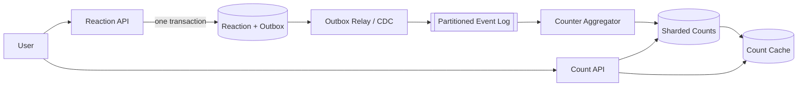

> 配套实验：[打开 YouTube Like Counter Lab](https://lab.zichaoyang.com/system-design/youtube-like-counter/)。先观察重复请求为什么会破坏 blind counter，再提高热门视频写入比例，比较单行 counter、sharded counter 和异步聚合的边界。

这道题看起来像 Hit Counter：用户点一次 Like，计数加一；取消 Like，计数减一。但如果把它真的实现成 `INCR` / `DECR`，系统很快就会算错。

Hit Counter 统计的是事件：请求发生一次，就多一个 hit。YouTube Like Counter 统计的是状态：同一个用户对同一个视频最多贡献一个当前 reaction。

```text
Hit Counter
  = count(all accepted events)

YouTube Like Counter
  = count(users whose current reaction is LIKE)
```

这道题应该抓住一条主线：

> **Like 不是一条可以盲目累加的事件，而是 `(user_id, video_id)` 上的一次状态转换。用户 reaction 是 source of truth，公开 count 是从它派生出来的聚合结果。**

所有 special cases 都从这句话产生：重复 Like、请求重试、Unlike、Like 到 Dislike 的切换、多设备并发、热门视频 hot key、异步消息重复，以及 aggregate drift。

## 题目的核心特征

假设 Alice 连续发送两次 Like：

```text
Alice: NONE -> LIKE     like_count +1
Alice: LIKE -> LIKE     no-op
```

如果第二次请求也执行 `like_count++`，Alice 一个人会贡献两个 Like。

再假设 Alice 从 Like 切换到 Dislike：

```text
Alice: LIKE -> DISLIKE  like_count -1, dislike_count +1
```

所以每次写入都必须先确定：

```text
previous reaction
desired reaction
transition version
```

这让 Like Counter 与普通 Hit Counter 出现四个本质区别：

1. **需要去重身份。** 同一个 `(user_id, video_id)` 只能有一个当前状态；
2. **写入不是单向递增。** Like、Unlike、Dislike 会形成状态机；
3. **重试必须幂等。** 网络超时后的重复请求不能再次修改 count；
4. **aggregate 不是唯一事实。** Counter 漂移时，系统必须能从用户 reaction 重算。

## Requirements

### Functional Requirements

1. **用户可以设置自己的 reaction。** 第一版支持 `LIKE`、`DISLIKE` 和 `NONE`；
2. **用户可以读取自己的当前 reaction。** 页面刷新后仍能显示正确按钮状态；
3. **用户可以读取视频的聚合计数。** 返回当前 Like 和 Dislike 数量；
4. **重复提交相同 reaction 是 no-op。** 请求重试不能重复计数；
5. **用户可以切换 reaction。** `LIKE -> DISLIKE` 必须原子地应用两个 delta；
6. **视频删除或不可用后拒绝新 reaction。** 删除后的清理可以异步完成。

> “For the first version, I’ll focus on setting a user’s reaction, reading it back, and serving the aggregate counts for a video.”

### Non-Functional Requirements

1. **Correctness:** 一个 user-video pair 最多贡献一个 reaction；count 不能因为 retry 重复增加；
2. **Low write latency:** Reaction API 的 p95 目标低于 100ms；
3. **Read-your-writes:** 用户自己的 reaction 应在成功响应后立即可见；
4. **Bounded count freshness:** 公开 aggregate 可以最终一致，例如 1–5 秒内收敛；
5. **High read availability:** Count read 不应因为异步 aggregator 暂停而不可用；
6. **Hot-video scalability:** 一个爆款视频不能把所有写入串行化到单个 counter key；
7. **Repairability:** 可以从 reaction source of truth 重建 aggregate；
8. **Multi-region clarity:** 同一个 user-video pair 的并发更新必须有确定顺序。

### Out of Scope

- 视频上传、转码和播放；
- 推荐与排序；
- 评论系统；
- 反作弊模型和 bot detection；
- 向用户展示完整的点赞者列表；
- 数据仓库中的历史趋势分析。

把 scope 收窄后，设计只有两条核心路径：

```text
Write path: set user reaction safely
Read path:  serve public aggregate cheaply
```

## 先用 API 定义语义

| API | 访问模式 | 正确性要求 |
|---|---|---|
| `PUT /videos/{videoId}/reaction` | 按 user + video 设置目标状态 | 幂等、原子 transition |
| `GET /videos/{videoId}/reaction/me` | 按 user + video 精确读取 | read-your-writes |
| `GET /videos/{videoId}/reaction-counts` | 按 video 读取 aggregate | 高 QPS、允许有界陈旧 |

### Set Reaction API

```http
PUT /v1/videos/video-123/reaction
Content-Type: application/json

{
  "reaction": "LIKE"
}
```

认证信息提供 `user_id`，客户端不应该替别人设置 reaction。

响应可以同时返回用户状态与当前可见 count：

```json
{
  "reaction": "LIKE",
  "version": 42,
  "counts": {
    "likes": 1823041,
    "dislikes": 9132,
    "asOf": "2026-07-17T08:10:03Z"
  }
}
```

`counts` 可以稍旧，但 `reaction` 必须是这次写入后的状态。把两者的 consistency 语义分开，比假装整个响应都强一致更诚实。

取消 reaction 可以继续使用同一个 API：

```json
{ "reaction": "NONE" }
```

也可以提供 `DELETE /reaction`，内部仍然转换为 desired state `NONE`。

### 为什么不用 Toggle API

下面的 API 很自然，却对重试不安全：

```http
POST /videos/video-123/toggle-like
```

假设服务端已经成功处理第一次请求，但响应在网络中丢失。客户端重试一次，第二次 toggle 会取消刚刚成功的 Like。

```text
initial state: NONE
request 1: toggle -> LIKE   // committed, response lost
request 2: toggle -> NONE   // retry reverses intent
```

`PUT desired state` 表达“最终应该是什么”，重复执行仍得到相同结果：

```text
set LIKE
set LIKE again
=> still LIKE, one contribution
```

这就是 API 层面的幂等。即使底层还需要 transaction 和 version，它已经先消除了一大类 ambiguity。

## Data Model：事实与聚合分开

### UserVideoReaction：权威状态

```text
UserVideoReaction {
  video_id       [PK PART 1, ACCESS: reactions for one video]
  user_id        [PK PART 2, ACCESS: this user's reaction]
  reaction       [LIKE | DISLIKE]
  version        [MONOTONIC PER USER-VIDEO KEY]
  updated_at
}

PRIMARY KEY (video_id, user_id)
```

`NONE` 可以不保存 row。没有 row 就表示用户当前没有 reaction，这能减少长期存储；如果审计要求保留取消历史，则另写 append-only event log，不要把当前状态表变成无限历史表。

复合主键保证一个 user-video pair 最多只有一条当前状态。`version` 用于并发控制、事件顺序和异步消费者去重。

### VideoReactionCount：派生聚合

```text
VideoReactionCount {
  video_id
  counter_shard
  like_count
  dislike_count
  updated_at

  PRIMARY KEY (video_id, counter_shard)
}
```

第一版可以让 `counter_shard = 0`，也就是每个视频只有一行。出现热门视频 hot row 后，再增加 shard 数量。

聚合不是 source of truth。它的职责是让：

```text
GET /reaction-counts
```

不必扫描该视频的所有 reaction rows。

### ReactionChanged：可重放的状态变化

只有引入异步 aggregate 后才需要这个模型：

```text
ReactionChanged {
  event_id
  video_id
  user_id
  previous_reaction
  desired_reaction
  version
  committed_at
}
```

事件必须表达 transition，而不只是 `LIKE +1`。`event_id` 支持 delivery dedup，`version` 阻止旧事件覆盖新状态，同一个 user-video key 的事件进入同一个 stream partition 以保持顺序。

## 状态转换表就是 correctness contract

| Previous | Desired | Like delta | Dislike delta |
|---|---|---:|---:|
| `NONE` | `NONE` | 0 | 0 |
| `NONE` | `LIKE` | +1 | 0 |
| `NONE` | `DISLIKE` | 0 | +1 |
| `LIKE` | `NONE` | -1 | 0 |
| `LIKE` | `LIKE` | 0 | 0 |
| `LIKE` | `DISLIKE` | -1 | +1 |
| `DISLIKE` | `NONE` | 0 | -1 |
| `DISLIKE` | `LIKE` | +1 | -1 |
| `DISLIKE` | `DISLIKE` | 0 | 0 |

每次更新都执行同一个纯函数：

```text
delta = transition(previous_reaction, desired_reaction)
```

不要分别维护 `like()`、`unlike()`、`dislike()` 三套互相独立的分支。把所有路径收敛到同一张 transition table，更容易测试，也更容易让同步写入与异步 consumer 使用完全相同的规则。

三个 invariant 必须一直成立：

```text
like_count >= 0
dislike_count >= 0
one (user_id, video_id) contributes to at most one counter
```

## 第一版：PostgreSQL Transaction

第一版只需要 PostgreSQL，不需要 Kafka、Redis 或分布式 counter service。

一次 `setReaction` 的逻辑是：

```text
BEGIN

1. verify video is active
2. lock or conditionally upsert (video_id, user_id)
3. read previous reaction and version
4. if previous == desired: return success without counter change
5. compute like_delta and dislike_delta
6. upsert/delete UserVideoReaction
7. atomically update VideoReactionCount shard 0

COMMIT
```

Reaction row 与 counter row 在同一个 transaction 中修改。成功响应意味着用户状态和 aggregate 一起提交；失败则一起回滚。

`PRIMARY KEY(video_id, user_id)` 不是性能装饰，而是业务 invariant。即使两个请求同时尝试创建 Alice 对同一个视频的第一条 reaction，也只能有一个 row 胜出。应用可以使用 `INSERT ... ON CONFLICT`、row lock 或 optimistic version retry 实现 transition，但不能依赖“两个请求应该不会同时发生”。

### 并发时真正要原子保护什么

同一个用户在手机和浏览器上同时发送：

```text
request A: NONE -> LIKE
request B: NONE -> DISLIKE
```

如果两个请求都读到 `NONE`，然后分别更新 counter，最终可能保存 `DISLIKE`，却让 Like 和 Dislike 都加一。

必须把下面四步变成一个 serialization unit：

```text
read previous state
choose the winning desired state
apply both counter deltas
store new state/version
```

并发控制粒度应该是 `(user_id, video_id)`，不是全局锁。不同用户、不同视频不应互相阻塞。

### 为什么不在查询时 COUNT 所有 rows

一种最简单但无法扩展的实现是：

```sql
SELECT COUNT(*)
FROM user_video_reaction
WHERE video_id = :video_id
  AND reaction = 'LIKE';
```

它非常适合 reconciliation，却不适合作为每次视频播放的在线 read path。一个热门视频可能有几千万个 reaction rows，而 count read QPS 又接近播放 QPS。即使有 index，反复统计整个范围也会把读成本与粉丝数绑定。

在线路径维护 materialized count；后台或运维修复路径才扫描 source rows。

## 容量估算：先找真正的乘法项

下面是一组面试用假设，不是 YouTube 的公开生产数据：

```text
500M reaction changes / day
average write QPS = 500M / 86,400 ≈ 5.8k/s
peak factor = 8
peak write QPS ≈ 46k/s

2B video detail loads / day
average count-read QPS ≈ 23k/s
peak count-read QPS ≈ 180k/s
```

总 QPS 不一定是最危险的数字。假设一个爆款直播视频短时间拿到 20% reaction writes：

```text
hot video writes = 46k/s × 20%
                 ≈ 9.2k/s
```

如果所有 transition 都更新同一行 `VideoReactionCount(video_id, 0)`，这个视频会把 9.2k writes/s 串行化在一个 row/key 上。系统整体还有大量空闲机器，也解决不了这个 hot key。

因此容量模型必须同时看：

```text
global reaction write QPS
hottest-video write percentage
per-counter-shard write QPS
count read QPS after cache
aggregate freshness budget
```

平均流量会隐藏这道题最重要的 skew。

## 第二版：把热门视频 Counter 分片

当单个 counter row 开始锁竞争，把同一个视频拆成多个 counter shards：

```text
counter_shard = hash(user_id) % shard_count

(video_id, 0)  -> likes, dislikes
(video_id, 1)  -> likes, dislikes
...
(video_id, 63) -> likes, dislikes
```

同一个 user-video pair 永远映射到同一个 shard，所以它的 Like、Unlike 和 reaction switch 都修改同一份 shard state。

如果热门视频有 9.2k writes/s，64 个 shard 的理想平均值是：

```text
9,200 / 64 ≈ 144 writes/s per shard
```

写入竞争大幅下降。代价是 count read 需要求和：

```text
SELECT SUM(like_count), SUM(dislike_count)
FROM video_reaction_count
WHERE video_id = :video_id;
```

64 行求和通常远比扫描几千万 user reactions 便宜，但如果 count read QPS 极高，仍然应该把求和结果 materialize 或 cache。

### Shard 数量不是越多越好

更多 shards 会降低单 shard 写入压力，却增加：

- count read 的 fan-out；
- cache refresh 的聚合工作；
- rebalance 和 shard-count migration 的复杂度；
- 监控、reconciliation 和 storage overhead。

可以按视频热度分级：普通视频保持 1 个 shard，热门视频提升到 16、64 或 256。`shard_count` 需要版本化；迁移期间不能让同一个用户随机落到新旧两套 shard，否则一次 Unlike 可能减错位置。

## 第三版：把公开 Count 改成异步派生

同步 sharded counter 仍然要求 Reaction API 在返回前同时提交：

```text
user reaction state
counter shard
```

当 write QPS、跨分区 transaction 或可用性要求继续提高时，可以把两种一致性拆开：

```text
User's own reaction
  -> synchronous source-of-truth write
  -> read-your-writes

Public aggregate count
  -> asynchronous projection
  -> eventually consistent within freshness SLO
```

写路径变为：



Reaction API 只在 source-of-truth transaction 成功后返回。Outbox row 与 UserVideoReaction 一起 commit，避免下面的脆弱双写：

```text
write reaction DB succeeds
publish event fails
=> aggregate never learns about the change
```

Outbox / CDC 捕获已提交变化；Event Log 缓冲、重试和 replay；Aggregator 使用同一张 transition table 更新 counter shards。

### 消息至少一次投递时，怎样不重复计数

Queue 可能重复投递 `ReactionChanged`。如果 consumer 每收到一次就执行 delta，Like count 又会增加两次。

Consumer 至少需要一种保护：

1. 按 `event_id` 保存处理记录并去重；
2. 在每个 user-video projection 中保存 `last_applied_version`，只接受更高版本；
3. 使用带 transaction 的 stream-processing state store，让 offset 与 state update 一起提交；
4. 定期从 source of truth reconciliation，修复极端 failure 中的 drift。

仅有“producer 开启 idempotence”还不够。它可以减少 producer retry 造成的 log duplicate，却不能替代业务层对 event replay 和 consumer retry 的处理。

### 为什么要按 User-Video Key 保序

Alice 快速执行：

```text
version 10: NONE -> LIKE
version 11: LIKE -> NONE
```

如果第二条先到，第一条后到，naive consumer 可能最后又把 Like 加回去。把同一个 `(video_id, user_id)` 映射到同一 event partition，并在 consumer 端检查 version，才能得到确定结果。

全局顺序既不需要，也无法经济地提供。真正需要的只是 per-entity order。

## Count Read Path：Cache 很合适，但不是事实来源

Count read 常常远多于 reaction write，而且同一个热门视频会被反复读取，所以它比 Job Board 的 long-tail search 更适合 cache。

```text
key = video-reaction-counts:{video_id}
value = { likes, dislikes, version, as_of }
TTL = a few seconds or event-driven refresh
```

读取路径：

```text
Count API
  -> cache hit: return visible aggregate
  -> cache miss: sum counter shards, populate cache, return
```

Cache 的 freshness 必须计入公开 SLO：

```text
visible staleness
  <= event backlog
   + aggregation time
   + cache refresh / TTL
```

如果 aggregate pipeline 可能落后 2 秒，而 cache TTL 是 5 秒，那么最坏可见陈旧不是 2 秒，而接近 7 秒。

不要让 Reaction API 直接对 count cache 做 `INCR`，再把 cache 当 source of truth。客户端 retry、cache eviction、failover 和 reaction switch 都会让它漂移。Cache 只保存已经投影好的 aggregate。

### Stampede 与热门视频

一个热门视频的 count cache 同时过期时，大量请求可能一起读取所有 shards。可以使用：

- request coalescing / single-flight；
- soft TTL + 后台 refresh；
- stale-while-revalidate；
- aggregator 主动 push 新 snapshot；
- 对热门 key 使用轻微 TTL jitter。

允许返回几秒前的 count，通常比让所有读请求同时打穿后端更符合产品价值。

## Partitioning：不要把所有问题都按 Video ID 分片

按 `video_id` 分片看起来很自然，因为 count read 是 video-scoped。但一个爆款视频会把所有 reaction writes 放在同一 data shard，正好制造最坏热点。

更稳的拆分是：

```text
Reaction state partition:
  hash(video_id, user_id)

Event-log partition:
  hash(video_id, user_id)
  // preserve per-user-video order

Counter partition:
  hash(video_id, counter_shard)

Count cache:
  video_id
```

不同数据模型服务不同 access pattern，不必共享同一个 partition key。

代价是同步 transaction 难以跨所有分片保持便宜，这也是系统规模变大后把 public aggregate 改成异步 projection 的原因。

## Multi-Region：状态顺序比 Counter 合并更难

如果一个用户的手机请求落到 Region A，浏览器请求同时落到 Region B：

```text
Region A: set LIKE
Region B: set DISLIKE
```

不能让两个 region 各自盲目应用 delta，再靠相加得到答案。系统必须先定义哪个 desired state 胜出。

常见选择：

1. **Home region / key ownership:** 同一个 user-video key 路由到一个写 region；
2. **Versioned conditional write:** 使用全局可比较 version，只接受 winning update；
3. **Last-write-wins:** 使用服务端逻辑时间或 sequence，而不是信任客户端时钟；
4. **Single-writer stream:** 所有该 key 的更新进入同一 ordered partition。

一旦用户状态有了确定顺序，counter aggregate 可以从 winning transitions 异步重建。不要先尝试合并 counter，再猜用户最后想要什么。

## Failure、监控和 Reconciliation

这道题不能只监控 API error rate。还要监控派生状态是否正在漂移：

```text
Reaction API p95 / error rate
duplicate no-op ratio
optimistic conflict / transaction retry rate
hottest video writes per second
counter-shard skew
event log consumer lag
aggregate freshness seconds
count cache hit rate
negative-counter invariant violations
reconciliation mismatch rate
```

Reconciliation job 可以按 video 或 counter shard 分批执行：

```text
authoritative count
  = GROUP BY reaction over UserVideoReaction

materialized count
  = SUM(VideoReactionCount shards)

if mismatch:
  emit metric
  repair shard snapshot
  preserve audit record
```

不要等用户发现 count 变成负数才知道 projection 出错。Aggregate 既然是 derived data，就必须设计重建和校验路径。

## 架构演进由什么触发

| 阶段 | 结构 | 触发条件 | 新代价 |
|---|---|---|---|
| 1 | PostgreSQL reaction + 单 counter row | 低流量、无明显热点 | 热门视频会锁竞争 |
| 2 | 同步 sharded counters | 单视频写入成为 hot key | count read 要 sum shards |
| 3 | Outbox + Event Log + Aggregator | 写入需要解耦，允许 count 有界陈旧 | 消息去重、顺序和 lag |
| 4 | Count cache | Count read QPS 高且热点复用明显 | cache freshness 与 stampede |
| 5 | Multi-region key ownership | 跨 region latency / availability 要求 | 路由、failover 和冲突处理 |

这里没有一个固定的“超过 1M QPS 就上 Kafka”规则。真正的判断公式是：

```text
hot-video writes per counter shard
vs
safe serialized update capacity
```

再结合：

```text
public count freshness budget
read QPS after cache
cross-partition transaction cost
replay and repair requirements
```

## 常见错误

### 1. 把每次 Like 当成独立 Hit

错误：

```text
like request -> INCR(video_id)
unlike request -> DECR(video_id)
```

它无法判断 duplicate、retry 和 switch。`INCR` 本身可以原子，但业务 transition 仍然不正确。

### 2. 使用 Toggle 作为公开 API

Toggle 把请求语义绑定到服务端当前状态，超时重试会反转用户意图。使用 desired-state API。

### 3. 只保存 Counter，不保存 User Reaction

系统无法回答用户当前有没有 Like，也无法从 drift 中恢复。Counter 是 projection，不是 source of truth。

### 4. 为了强一致，把所有热门写入锁到一行

这会让单视频热点决定整个系统容量。先 shard，再判断公开 count 是否可以最终一致。

### 5. 上了 Queue 就假设 Exactly Once

Producer retry、consumer retry、replay 和 recovery 都可能让事件再次出现。业务 consumer 仍需 event ID、version 或 transactional state。

### 6. Cache 直接做 Truth

Cache eviction 和 failover 会丢状态；多个 reaction transitions 也不是单纯 `INCR`。Cache 只服务公开 aggregate read。

## 关键取舍

| 选择 | 好处 | 代价 |
|---|---|---|
| Desired-state API | 重试天然幂等 | 服务端必须读取 previous state |
| 同步单 counter | 简单、count 立即一致 | 热门视频形成 hot row |
| 同步 sharded counters | 保持精确并分散写入 | 读放大、迁移复杂 |
| 异步 aggregate | Reaction write 与 count serving 解耦 | Count 最终一致，需处理重复和乱序 |
| 按 video 分区 reaction | 视频内查询集中 | 爆款视频形成 data hot shard |
| 按 user-video hash 分区 | 写入更均匀 | aggregate 必须跨分区派生 |
| Count cache | 大幅降低热门读压力 | 可见 freshness 增加，需防 stampede |

最重要的 trade-off 是：

> 为了让用户 reaction 保持正确，系统把 `(user_id, video_id)` 状态作为同步事实；为了让热门视频的公开计数可扩展，系统允许 aggregate 成为可以重放、可以修复、短暂落后的派生数据。

## 面试表达：用一条主线讲完整

开场先说明它为什么不是 Hit Counter：

> “This looks like a hit counter, but the semantics are different. A hit counter counts every event; a like counter counts each user’s current state for a video.”

用 API 锁定幂等语义：

> “I’ll expose a set-reaction API rather than toggle. Retrying `set LIKE` is a no-op, while retrying toggle could reverse the user’s intent.”

用数据模型解释 source of truth：

> “The `(video_id, user_id)` reaction row is the source of truth. The public video count is a materialized aggregate, so it must be rebuildable.”

从第一版演进，不要一开始就画 Kafka：

> “I’ll start with one PostgreSQL transaction that updates the reaction row and a per-video counter. If a popular video makes that row hot, I’ll shard the counter by user hash.”

解释最终一致边界：

> “At larger scale, I’ll commit the user reaction synchronously and update the public count through an outbox and partitioned event log. The user gets read-your-writes for their own reaction; the public count may lag by a few seconds.”

一套 45 分钟结构：

1. Requirements 与 consistency boundary；
2. Desired-state API 与 toggle retry failure；
3. UserVideoReaction、VideoReactionCount、ReactionChanged；
4. Transition table 与 PostgreSQL transaction；
5. Capacity estimation，找 hottest-video hot row；
6. Counter sharding；
7. Outbox、Event Log、Aggregator 的 duplicate/order/freshness；
8. Count cache、multi-region 与 reconciliation；
9. 总结 source of truth 和 derived count 的 trade-off。

如果面试官把题目限制在 data-structure coding，只实现两张 HashMap 和 transition function；如果要求 system design，就沿着 hot key、sharding、async projection 和 repair 继续展开。两种题目的核心 invariant 完全相同。

## 最后的判断

这道题确实以 Hit Counter 为原型，但增加了一个决定性的 special case：

> **同一个用户的下一次操作不是新的独立 hit，而是在修改已有 reaction 状态。**

从这里自然推导出完整设计：

```text
blind counter
  -> user-video source of truth
  -> idempotent desired-state API
  -> atomic transition deltas
  -> sharded hot counters
  -> asynchronous materialized aggregate
  -> count cache
  -> versioned ordering and reconciliation
```

真正成熟的 Like Counter，不是一个更快的 `count++`，而是一套能说明“谁贡献了这个 count、这次更新是否已经处理、公开数字有多新、漂移后怎样恢复”的状态投影系统。

## 参考资料

- [PostgreSQL: Constraints](https://www.postgresql.org/docs/current/ddl-constraints.html)
- [PostgreSQL: INSERT and ON CONFLICT](https://www.postgresql.org/docs/current/sql-insert.html)
- [PostgreSQL: Explicit Locking](https://www.postgresql.org/docs/current/explicit-locking.html)
- [Redis: INCR](https://redis.io/docs/latest/commands/incr/)
- [Apache Kafka: Introduction and ordering within a partition](https://kafka.apache.org/documentation/)
- [Debezium: Outbox Event Router](https://debezium.io/documentation/reference/stable/transformations/outbox-event-router.html)
